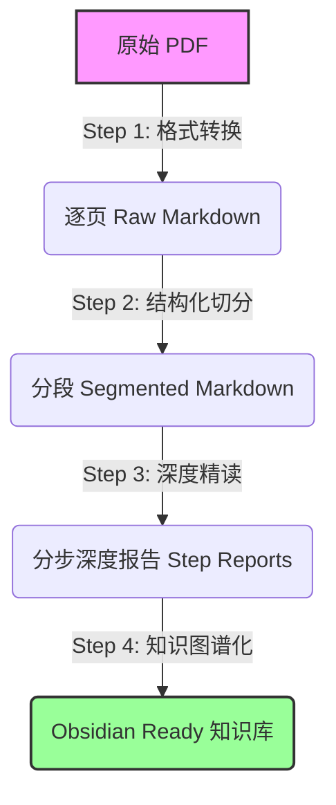

# Deep Reading Agent System

这是一个专为学术论文深度精读设计的自动化 Agent 系统。它模拟了顶级计量经济学家的阅读与分析流程，将一篇 PDF 论文转化为结构化、深度解析且适合 Obsidian 知识管理的 Markdown 报告。

## 核心工作流 (Pipeline)

整个系统由四个核心步骤（Skills）串联而成：



### 1. 格式转换 (PDF to Raw Markdown)
- **目标**: 将 PDF 转换为大模型可读的纯文本，同时保留页码信息以便定位。
- **工具**: `anthropic-pdf-extract` (基于 `pdfplumber`/`pypdf`)
- **输出**: `*_raw.md`
  - 特征：每页以 `## Page N` 开头，保留原始布局的文本流。

### 2. 结构化切分 (Structure Segmentation)
- **目标**: 从杂乱的逐页文本中还原论文的逻辑结构（Introduction, Data, Model 等），而非机械地按页切分。
- **工具**: `kimi-pdf-raw-segmenter` (基于 Kimi 长文本模型)
- **逻辑**:
  1. 调用 Kimi 浏览全文，提取论文实际的**顶级章节标题**（如 "1. Introduction", "3. Identification Strategy"）。
  2. 让 Kimi 返回这些标题在原文中的**精确起始文本标记**。
  3. Python 脚本根据标记在 Raw Markdown 中定位并物理切分。
- **输出**: `*_segmented.md` (包含清晰的一级标题结构)

### 3. 深度精读 (Deep Reading & Analysis)
- **目标**: 像 Daron Acemoglu 级别的审稿人一样，对论文进行批判性分析，而非简单的摘要。
- **工具**: `deep-reading-expert` (基于 DeepSeek Reasoner)
- **逻辑**: 采用 **分步处理 (Chain of Analysis)** 模式，针对不同章节调用不同的 System Prompt：
  - **Step 1 全景扫描**: 读引言/结论 -> 提炼核心贡献与重要性。
  - **Step 2 理论与假说**: 读文献/理论 -> 梳理理论脉络与 $H_1, H_2$。
  - **Step 3 数据考古**: 读数据章节 -> 检查数据来源、清洗过程与潜在偏差（DGP）。
  - **Step 4 变量与测量**: 读变量定义 -> 明确 $X, Y$ 的构建方式与控制变量逻辑。
  - **Step 5 识别策略**: 读实证模型 -> 绘制 **机制图谱 (Mermaid)**，剖析因果识别的挑战与对策（IV/DID）。
  - **Step 6 结果解读**: 读回归表格 -> 解读系数显著性与经济含义。
  - **Step 7 专家批判**: 综合全文 -> 指出“致命伤”（如排他性约束失效）并提出未来选题。
- **输出**: `Final_Deep_Reading_Report.md` 及各分步报告。

### 4. 知识图谱化 (Obsidian Integration)
- **目标**: 将生成的报告无缝接入 Obsidian 个人知识库，实现元数据检索与双向链接跳转。
- **工具**: `obsidian-metadata-injector`
- **逻辑**:
  1. **元数据提取**: 读取 Raw MD 前两页，智能提取 `Title`, `Authors`, `Journal`, `Year`。
  2. **Frontmatter 注入**: 将元数据以 YAML 格式写入所有报告头部。
  3. **双链构建**: 自动生成总报告与分步报告之间的双向链接 (`[[wikilinks]]`)，形成导航网络。
- **输出**: 包含 YAML 头和导航链接的 Markdown 文件群。

## 快速开始

### 环境准备

```powershell
# 1. 安装依赖
pip install -r requirements.txt

# 2. 配置 .env
OPENAI_API_KEY=sk-xxxx      # 用于 DeepSeek/Kimi
OPENAI_BASE_URL=https://... # 对应服务商地址
```

### 运行完整流程

```powershell
# 1. PDF 转 Raw MD (需自备 PDF 提取脚本或 Skill)
# (假设已有 pdf_raw_md/paper_raw.md)

# 2. 结构化切分
.\run_kimi_segment_raw_md.ps1 -RawMdPath "pdf_raw_md/paper_raw.md" -OutDir "pdf_segmented_md"

# 3. 深度精读
.\run_deep_reading_pipeline.ps1 -SegmentedMdPath "pdf_segmented_md/paper_segmented.md" -OutDir "deep_reading_results"

# 4. Obsidian 注入
.\run_obsidian_injector.ps1 -SourceMd "pdf_segmented_md/paper_segmented.md" -TargetDir "deep_reading_results" -RawMd "pdf_raw_md/paper_raw.md"
```

## 目录结构

```
.
├── .trae/skills/               # Skill 定义文档
├── pdf_raw_md/                 # Step 1 产物
├── pdf_segmented_md/           # Step 2 产物
├── deep_reading_results/       # Step 3 & 4 产物 (最终报告)
├── deep_reading_steps/         # 精读子任务 Python 脚本
├── *.py / *.ps1                # 各步骤主控脚本
└── requirements.txt
```
