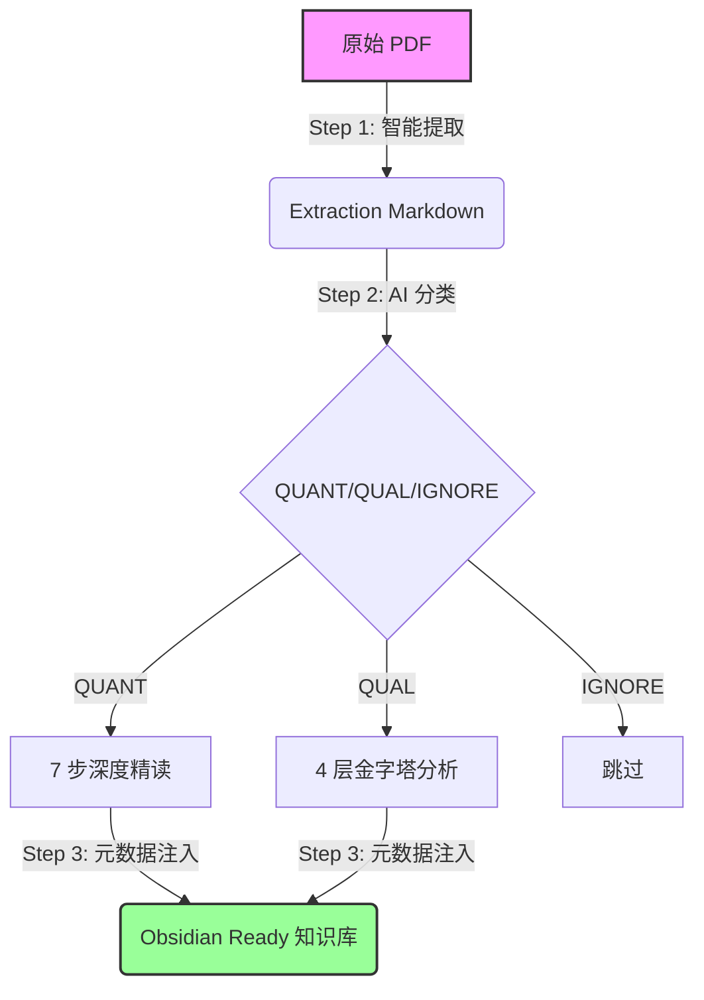

# Deep Reading Agent System

这是一个专为学术论文深度精读设计的自动化 Agent 系统。它模拟了顶级计量经济学家的阅读与分析流程，将一篇 PDF 论文转化为结构化、深度解析且适合 Obsidian 知识管理的 Markdown 报告。

## 核心工作流 (Pipeline)

整个系统由四个核心步骤串联而成（无需手动分段，提取后直接分析）：



**图形界面**：推荐使用 GUI，详见 [GUI 使用手册](README_GUI.md)。双击 `start.bat` 即可一键启动。

### 1. 智能提取 (PDF to Extraction Markdown)
- **目标**: 将 PDF 转换为结构化 Markdown，保留表格、公式、版面结构。
- **工具**: `paddleocr_pipeline.py`（推荐，3层回退：远程API → 本地GPU → pdfplumber）
- **输出**: `paddleocr_md/{filename}_paddleocr.md`

> 💡 无需手动分段，提取后的 Markdown 直接传入分析器。`common.load_md_sections()` 会自动解析 `#` 和 `##` 标题层级。

### 2. 深度精读 (Deep Reading & Analysis)
- **目标**: 像 Daron Acemoglu 级别的审稿人一样，对论文进行批判性分析。
- **工具**: `deep_read_pipeline.py`
- **逻辑**: 分步处理（全景扫描 → 理论 → 数据 → 变量 → 识别 → 结果 → 批判）。
- **输出**: `deep_reading_results/{paper_name}/Final_Deep_Reading_Report.md` 及各分步报告。

### 3. 知识图谱化 (Obsidian Integration)
- **目标**: 无缝接入 Obsidian，实现元数据检索与双向链接。
- **工具**: `inject_obsidian_meta.py` & `inject_dataview_summaries.py`
- **PDF 视觉提取**: 配置 `QWEN_API_KEY` 后，自动从 PDF 前 3 页上半部分截图中提取标题、作者、期刊、年份（页眉信息）。
- **输出**: 包含 YAML 头（含内容摘要）和导航链接的 Markdown 文件群。

### 4. 社科文献深度阅读 (Social Science Scholar)
- **目标**: 针对管理学/社会学文献，采用"四层金字塔"模型（背景-理论-逻辑-价值）进行深度情报提取。
- **工具**: `social_science_analyzer_v2.py`
- **特点**: 4+1 输出结构（4分层MD + 1全景MD），强制中文输出，支持文档间双向跳转。

### 5. 智能科研助理 (Smart Scholar)
- **目标**: 自动识别论文类型，智能路由至最佳分析引擎。
- **入口**: `run_batch_pipeline.py` / `smart_scholar_lib.py`
- **逻辑**:
  - **定量 (Quant)** → 路由至 Deep Reading Expert (Acemoglu Mode)。
  - **定性 (Qual)** → 路由至 Social Science Scholar (4-Layer Model)。包括文献综述 (Reviews)、理论文章等。
  - **忽略 (Ignore)** → 自动跳过非研究性文档（如卷首语、书评、目录等）。
- **默认策略**: 当分类不确定或失败时，默认回退到 **QUAL** 模式（对综述和理论文章更友好）。

### 6. 状态管理与去重 (State Manager)
- **目标**: 提供基于内容哈希的持久化去重能力，解决文件名变更或移动导致的重复处理问题。
- **机制**:
  - **MD5 内容哈希**: 无论文件名如何变化，只要内容不变，系统就能识别。
  - **持久化账本**: 状态记录在 `processed_papers.json` 中。
  - **递归搜索**: `run_batch_pipeline.py` 支持递归扫描子目录。

### 7. 智能文献筛选 (Smart Literature Filter)
- **目标**: 在精读之前，从海量文献列表（WoS/CNKI）中利用 AI 智能筛选出高价值论文。
- **入口**: GUI Tab 1「论文筛选」或命令行 `smart_literature_filter.py`
- **支持格式**:
  - **Web of Science (WoS)**: `savedrecs.txt`
  - **CNKI (知网)**: 导出的 Refworks/NoteFirst 格式文本
- **AI 评估模式**:
  - **Explorer**: 入门模式，寻找开创性（Seminal）经典文献。
  - **Reviewer**: 综述模式，寻找具有理论贡献和综述价值的文献。
  - **Empiricist**: 实证模式，严格筛选因果识别严谨的实证研究（Acemoglu 风格）。
- **提示词编辑**: GUI 支持查看和编辑各模式的评估提示词（保存到 `prompts/literature_filter/`）。
- **自适应输出**:
  - **英文文献**: 自动翻译标题并生成中文详细摘要。
  - **中文文献**: 自动提炼标题关键词并生成 <20 字的一句话极简摘要。

### 附加能力：参考文献抽取与引用追踪 (References & Citation Tracing)
- **目标**: 从论文原文中抽取“参考文献列表”，并在正文中反向定位每条参考文献的引用位置。
- **入口脚本**:
  - 参考文献抽取：`extract_references.py` / `run_reference_extractor.ps1`
  - 引用追踪：`citation_tracer.py` / `run_citation_tracer.ps1`
- **输出**（位于 `references/`，通常不提交 Git）:
  - `*_references.xlsx`：结构化参考文献表
  - `*_references_with_citations.xlsx`：在参考文献表上追加引用次数与上下文
  - `*_references_citation_trace.md`：按参考文献序号输出的可读追踪日志

## 快速开始

**推荐使用图形界面**，详见 [GUI 使用手册](README_GUI.md)。双击 `start.bat` 即可启动。

### 核心命令速查

```powershell
# 1. 启动图形界面（推荐）
.\start.bat
# 或手动启动
.\venv\Scripts\Activate.ps1
python app.py

# 2. 单篇全流程精读（命令行）
python run_full_pipeline.py "paper.pdf" --use-paddleocr

# 3. 批量全流程精读（智能分类 + 跳过已读）
python run_batch_pipeline.py "path/to/pdfs"

# 4. 智能文献筛选（从 WoS/CNKI 导出筛选高价值论文）
python smart_literature_filter.py "savedrecs.txt" --ai_mode reviewer --topic "研究主题" --output "screened.xlsx"

# 5. 单独提取 PDF（不分析）
python paddleocr_pipeline.py "paper.pdf" --out_dir "paddleocr_md"
```

## 目录结构

```
.
├── app.py                      # Gradio 图形界面入口
├── start.bat                   # Windows 一键启动脚本
├── paddleocr_pipeline.py       # PDF → Markdown 提取（3层回退）
├── deep_read_pipeline.py       # QUANT 7步深度精读
├── social_science_analyzer_v2.py  # QUAL 4层金字塔分析
├── smart_scholar_lib.py        # 论文分类 + 提取调度
├── run_batch_pipeline.py       # 批量处理主控脚本
├── run_full_pipeline.py        # 单文件全流程脚本
├── smart_literature_filter.py  # WoS/CNKI 文献筛选
├── inject_obsidian_meta.py     # Obsidian 元数据注入
├── deep_reading_steps/         # 精读子任务 Python 脚本
├── qual_metadata_extractor/    # QUAL 元数据提取模块
├── prompts/                    # 提示词配置目录
│   └── literature_filter/      # 文献筛选各模式提示词
├── paddleocr_md/               # 提取输出目录 (gitignored)
├── deep_reading_results/       # QUANT 分析结果 (gitignored)
├── social_science_results_v2/  # QUAL 分析结果 (gitignored)
├── processed_papers.json       # 批量处理状态账本 (gitignored)
├── README_GUI.md               # GUI 使用手册
└── requirements.txt
```
