# Deep Reading Agent System

这是一个专为学术论文深度精读设计的自动化 Agent 系统。它模拟了顶级计量经济学家的阅读与分析流程，将一篇 PDF 论文转化为结构化、深度解析且适合 Obsidian 知识管理的 Markdown 报告。

## 核心工作流 (Pipeline)

整个系统由五个核心步骤（Skills）串联而成：

```mermaid
graph TD
    A[原始 PDF] -->|Step 1: 格式转换| B(逐页 Raw Markdown)
    B -->|Step 2: 批量分析| F(Excel 汇总表)
    B -->|Step 3: 结构化切分| C(分段 Segmented Markdown)
    C -->|Step 4: 深度精读| D(分步深度报告 Step Reports)
    D -->|Step 5: 知识图谱化| E(Obsidian Ready 知识库)
    C -->|可选: 参考文献抽取| R(References Excel)
    R -->|可选: 引用追踪| T(Citation Trace MD/Excel)

    style A fill:#f9f,stroke:#333,stroke-width:2px
    style F fill:#ff9,stroke:#333,stroke-width:2px
    style E fill:#9f9,stroke:#333,stroke-width:2px
```



### 1. 格式转换 (PDF to Raw Markdown)
- **目标**: 将 PDF 转换为大模型可读的纯文本，同时保留页码信息以便定位。
- **工具**: `anthropic-pdf-extract` (基于 `pdfplumber`/`pypdf`)
- **输出**: `*_raw.md`

### 2. 批量分析与制表 (Batch Analysis)
- **目标**: 快速扫描文件夹，提取核心信息（主题、变量、结论、Stata代码）生成 Excel 对比表。
- **工具**: `academic-pdf-analyzer` (LLM-Enhanced)
- **输出**: `analysis_results.xlsx` 及 Markdown 简报。

### 3. 结构化切分 (Structure Segmentation)
- **目标**: 还原论文逻辑结构（Introduction, Data, Model 等）。
- **工具**: `deepseek-segment` (推荐) / `kimi-pdf-raw-segmenter`
- **模式选择**:
  - **边界检测模式**（默认，推荐）: LLM 返回边界 → 本地切片，自动骨架优化，稳定快速
  - **直接分片模式** (`--direct`): LLM 直接返回完整章节，适合小文件（<50页）
- **输出**: `*_segmented.md`

> 💡 **使用建议**: 默认模式已经过验证，准确率 95%+，适合大多数场景。仅在处理小文件或需要最高精度时使用 `--direct` 模式。

### 4. 深度精读 (Deep Reading & Analysis)
- **目标**: 像 Daron Acemoglu 级别的审稿人一样，对论文进行批判性分析。
- **工具**: `deep-reading-expert`
- **逻辑**: 分步处理（全景扫描 -> 理论 -> 数据 -> 变量 -> 识别 -> 结果 -> 批判）。
- **输出**: `Final_Deep_Reading_Report.md` 及各分步报告。

### 5. 知识图谱化 (Obsidian Integration)
- **目标**: 无缝接入 Obsidian，实现元数据检索与双向链接。
- **工具**: `obsidian-metadata-injector` & `obsidian-dataview-summarizer`
- **输出**: 包含 YAML 头（含内容摘要）和导航链接的 Markdown 文件群。

### 6. 社科文献深度阅读 (Social Science Scholar)
- **目标**: 针对管理学/社会学文献，采用“四层金字塔”模型（背景-理论-逻辑-价值）进行深度情报提取。
- **工具**: `social_science_analyzer.py`
- **特点**: 4+1+1 输出结构（4分层MD + 1全景MD + 1汇总Excel），强制中文输出，支持文档间双向跳转。

### 7. 智能科研助理 (Smart Scholar) - **New!**
- **目标**: 自动识别论文类型，智能路由至最佳分析引擎。
- **入口**: `smart_scholar.py` / `smart_scholar_lib.py`
- **逻辑**: 
  - **定量 (Quant)** -> 路由至 Deep Reading Expert (Acemoglu Mode)。
  - **定性 (Qual)** -> 路由至 Social Science Scholar (4-Layer Model)。包括文献综述 (Reviews)、理论文章等。
  - **忽略 (Ignore)** -> 自动跳过非研究性文档（如卷首语、书评、目录等）。
- **默认策略**: 当分类不确定或失败时，默认回退到 **QUAL** 模式（对综述和理论文章更友好）。

### 8. 状态管理与去重 (State Manager) - **New!**
- **目标**: 提供基于内容哈希的持久化去重能力，解决文件名变更或移动导致的重复处理问题。
- **机制**: 
  - **MD5 内容哈希**: 无论文件名如何变化，只要内容不变，系统就能识别。
  - **持久化账本**: 状态记录在 `processed_papers.json` 中。
  - **递归搜索**: `run_batch_pipeline.py` 支持递归扫描子目录。

### 附加能力：参考文献抽取与引用追踪 (References & Citation Tracing)
- **目标**: 从论文原文中抽取“参考文献列表”，并在正文中反向定位每条参考文献的引用位置。
- **入口脚本**:
  - 参考文献抽取：`extract_references.py` / `run_reference_extractor.ps1`
  - 引用追踪：`citation_tracer.py` / `run_citation_tracer.ps1`
- **输出**（位于 `references/`，通常不提交 Git）:
  - `*_references.xlsx`：结构化参考文献表
  - `*_references_with_citations.xlsx`：在参考文献表上追加引用次数与上下文
  - `*_references_citation_trace.md`：按参考文献序号输出的可读追踪日志

## 快速开始

详细的使用指南和命令说明，请参阅 **[工作流手册 (Workflow Guide)](README_WORKFLOW.md)**。

### 核心命令速查

```powershell
# 1. 批量分析制表
.\run_analyzer.ps1 -InputPath "path/to/pdfs" -Output "results.xlsx"

# 2. 单篇全流程精读
python run_full_pipeline.py "paper.pdf"

# 3. 批量全流程精读 (跳过已读)
.\run_batch_pipeline.ps1 "path/to/pdfs"

# 4. 结构化分段（推荐使用默认边界检测模式）
python deepseek_segment_raw_md.py "pdf_raw_md/paper_raw.md"
# 或使用直接分片模式（小文件）
python deepseek_segment_raw_md.py "pdf_raw_md/paper_raw.md" --direct

# 5. (可选) 抽取参考文献（基于 segmented md）
.\run_reference_extractor.ps1 "pdf_segmented_md\paper_segmented.md"

# 6. (可选) 引用追踪：从 references.xlsx 反向定位正文引用位置
.\run_citation_tracer.ps1 "pdf_segmented_md\paper_segmented.md" "references\paper_references.xlsx"
```

## 目录结构

```
.
├── .trae/skills/               # Skill 定义文档
├── pdf_raw_md/                 # Step 1 产物
├── pdf_segmented_md/           # Step 3 产物
├── deep_reading_results/       # Step 4 & 5 产物 (最终报告)
├── deep_reading_steps/         # 精读子任务 Python 脚本
├── references/                 # (可选) 参考文献抽取/引用追踪产物
├── *.py / *.ps1                # 各步骤主控脚本
├── README_WORKFLOW.md          # 详细使用手册
└── requirements.txt
```
