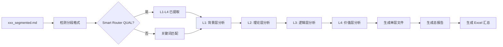

# 社科类论文四步精读法完整说明

**创建时间**: 2026-02-03
**版本**: v2.0
**状态**: ✅ 生产就绪

---

## 目录

1. [四层金字塔模型概述](#四层金字塔模型概述)
2. [L1: 背景层 (Context Layer)](#l1-背景层-context-layer)
3. [L2: 理论层 (Theory Layer)](#l2-理论层-theory-layer)
4. [L3: 逻辑层 (Logic Layer)](#l3-逻辑层-logic-layer)
5. [L4: 价值层 (Value Layer)](#l4-价值层-value-layer)
6. [LLM 提示词详解](#llm-提示词详解)
7. [输出格式说明](#输出格式说明)
8. [工作流程](#工作流程)
9. [代码实现](#代码实现)

---

## 四层金字塔模型概述

### 模型设计理念

社科类论文采用**四层金字塔精读法**，从宏观到微观、从描述到批判，逐层深入剖析论文的学术价值。

```
                ┌─────────────────────────────────────┐
                │      L4: 价值层                │
                │  (Value & Implications)         │
                │  - 研究贡献                        │
                │  - 实践启示                        │
                │  - 政策建议                        │
                └────────────┬──────────────────────────┘
                             │
                ┌────────────┴──────────────────────────┐
                │     L3: 逻辑层                  │
                │  (Logic & Mechanism)             │
                │  - 核心机制/路径                    │
                │  - 案例描述                        │
                │  - 实证发现                        │
                └────────────┬──────────────────────────┘
                             │
                ┌────────────┴──────────────────────────┐
                │    L2: 理论层                  │
                │  (Theoretical Foundation)           │
                │  - 文献综述                        │
                │  - 核心构念                        │
                │  - 理论框架                        │
                └────────────┬──────────────────────────┘
                             │
                ┌────────────┴──────────────────────────┐
                │   L1: 背景层                   │
                │  (Context & Metadata)           │
                │  - 基本元数据                      │
                │  - 政策背景                        │
                │  - 现状数据                        │
                └───────────────────────────────────────┘
```

### 4 层 vs 7 步对比

| 维度 | QUANT (计量经济学) | QUAL (社会科学) |
|------|-------------------|----------------|
| **分层逻辑** | 线性 7 步骤（研究流程） | 金字塔 4 层（抽象层次）|
| **L1 对应** | 1. Overview (全景扫描) | L1: Context (背景层) |
| **L2 对应** | 2. Theory (理论与假说) | L2: Theory (理论层) |
| **L3 对应** | 3-5. Data, Variables, Identification (数据/变量/识别) | L3: Logic (逻辑层) |
| **L4 对应** | 6-7. Results, Critique (结果/批判) | L4: Value (价值层) |
| **核心任务** | 因果识别、实证分析 | 框架构建、价值提取 |
| **输出长度** | 每步 300-500 词 | 每层 300-500 词 |
| **分析深度** | 定量：回归系数、显著性、稳健性 | 定性：理论脉络、机制路径、贡献缺口 |

---

## L1: 背景层 (Context Layer)

### 精读目标

**目标**: 建立论文的基础背景、政策环境和研究现状

**关键问题**:
1. 这篇论文研究了什么问题？（研究主题）
2. 研究发生在什么政策背景下？（政策背景）
3. 当前的现状数据是什么？（现状数据）
4. 这属于哪一类社会科学研究？（体裁分类）

### 精读内容

#### 1.1 基本元数据 (Metadata)

提取的元数据字段：
- **title**: 论文完整标题
- **authors**: 作者列表
- **year**: 发表年份
- **journal**: 发表期刊
- **genre**: 研究体裁（详见下文）

#### 1.2 政策背景 (Policy Context)

提取的关键政策文件：
- 政策名称（Name）
- 发布年份（Year）
- 政策层级（Central/Local）
- 核心内容（Core Content）

**要求**: "List ALL specific policy documents mentioned. Be precise."

#### 1.3 现状数据 (Status Data)

提取的关键统计数据：
- 数据项（Item）
- 数值（Value）
- 单位（Unit）
- 背景说明（Context）

**要求**: "Extract key statistical data describing the status quo (e.g., GEP value, investment amount)."

#### 1.4 研究体裁分类 (Genre Classification)

将论文分类为以下 5 类之一：

| 体裁 | 特征 | 示例 |
|------|------|------|
| **Case Study** | 案例研究 | 单个案例的深入分析 |
| **QCA** | 定性比较分析 | 多案例条件组合分析 |
| **Review** | 文献综述 | 梳理现有研究进展 |
| **Quantitative** | 定量研究 | 虽分类为 QUAL，但有实证数据 |
| **Theoretical** | 理论构建 | 提出新理论框架或模型 |

#### 1.5 详细分析 (Detailed Analysis)

**字数要求**: 约 300 词

**内容结构**:
- 开篇：简要介绍研究主题
- 中段：政策背景 + 现状数据的综合解读
- 结尾：研究问题的提出

---

## L2: 理论层 (Theory Layer)

### 精读目标

**目标**: 梳理论文的理论基础、核心构念和理论框架

**关键问题**:
1. 论文回顾了哪些经典理论？（经典理论）
2. 提出了哪些核心概念/构念？（关键构念）
3. 这些构念之间是什么关系？（构念关系）
4. 构建了什么理论框架？（理论框架）

### 精读内容

#### 2.1 经典理论回顾 (Past Theories)

提取的经典理论：
- 理论名称（Name）
- 理论摘要（Summary）

**要求**: "Summarize classic theories reviewed (e.g., Externalities)."

#### 2.2 关键构念 (Key Constructs)

提取的核心概念：
- 构念名称（Name）
- 构念定义（Definition）

**要求**: "List core concepts and their EXACT definitions from the text."

#### 2.3 构念关系 (Relationships)

提取的构念间关系：
- 从构念（From）
- 到构念（To）
- 作用机制（Mechanism）

**要求**: "Describe how constructs interact (hypothesized relationships)."

#### 2.4 理论框架 (Framework Description)

**内容要求**: 描述论文构建的理论框架

- 框架的逻辑结构
- 构念如何整合
- 与经典理论的关系

#### 2.5 详细分析 (Detailed Analysis)

**字数要求**: 约 400 词

**内容结构**:
- 文献综述：回顾的理论及其与本文的关联
- 构念解析：核心概念的深入解读
- 框架说明：理论框架的构建逻辑

---

## L3: 逻辑层 (Logic Layer)

### 精读目标

**目标**: 揭示论文的核心机制或路径，展示实证/案例分析过程

**关键问题**:
1. 论文的核心机制是什么？（核心机制）
2. 机制有哪些阶段或组成部分？（机制组成）
3. 每个阶段/部分如何实现？（实现方式）
4. 有什么证据支持？（证据支撑）

### 精读内容

#### 3.1 机制类型 (Mechanism Type)

根据体裁区分：

| 体裁 | 机制类型 |
|------|---------|
| **Case Study** | "Case Study Logic" |
| **QCA** | "QCA Logic" |
| **Quantitative** | "Quantitative Logic" |
| **Review** | "Review Logic" |
| **Theoretical** | "Theoretical Logic" |

#### 3.2 机制组成 (Mechanism Components)

提取的机制阶段或组成部分：
- 阶段/路径名称（Phase_or_Path）
- 描述（Description）
- 证据（Evidence）

**要求**:
- **Case Study**: 提取 Process Model (Phases, Events, Strategies)
- **QCA/Quant**: 提取 Causal Paths/Configurations or Hypothesis Results
- **Review**: 提取 Integrated Framework or Evolution Map

#### 3.3 详细分析 (Detailed Analysis)

**字数要求**: 约 500 词

**内容要求**: "A 500-word detailed narrative of core mechanism/findings in Chinese. Be very specific."

**内容结构**:
- 机制总述：核心逻辑的宏观描述
- 分阶段/分部分：每个阶段的详细说明
- 证据链：从事实到结论的逻辑链条

---

## L4: 价值层 (Value Layer)

### 精读目标

**目标**: 提炼论文的学术贡献、研究缺口和实践启示

**关键问题**:
1. 前人研究有哪些不足？（研究缺口）
2. 这篇论文做出了什么贡献？（学术贡献）
3. 对政策制定者有什么建议？（实践启示）

### 精读内容

#### 4.1 研究缺口 (Gaps)

提取的前人研究局限：
- 缺口描述（具体文本）

**要求**: "Specific limitations of previous studies mentioned."

#### 4.2 学术贡献 (Contributions)

提取的论文贡献：
- 贡献描述（具体文本）

**要求**: "How this paper advances theory/practice."

#### 4.3 实践启示 (Implications)

提取的实践建议：
- 启示描述（具体文本）

**要求**: "Actionable advice for policymakers/practitioners."

#### 4.4 详细分析 (Detailed Analysis)

**字数要求**: 约 300 词

**内容结构**:
- 贡献总结：学术层面的核心贡献
- 缺口分析：指出的研究空白
- 启示提炼：政策/实践的具体建议

---

## LLM 提示词详解

### System Prompt (所有层通用)

```
You are a Social Science [Layer] Analyst. [Layer-specific task].
Focus on "[Section Names]" sections.
IMPORTANT: ALL OUTPUT MUST BE IN CHINESE (SIMPLIFIED).
```

**说明**:
- **角色定位**: Social Science [Layer] Analyst
- **输出语言**: 简体中文
- **关注章节**: 每层关注的特定章节

---

### L1: 背景层提示词

**完整 Prompt**:

```
You are a Social Science Context Analyst. Extract Metadata, Policy Context, and Status Data.
Focus on "Introduction" and "Background" sections.
IMPORTANT: ALL OUTPUT MUST BE IN CHINESE (SIMPLIFIED).

REQUIREMENTS:
1. **Genre**: Classify as 'Case Study', 'QCA', 'Review', 'Quantitative', or 'Theoretical'.
2. **Policies**: List ALL specific policy documents mentioned (Name, Year, Level, Core Content). Be precise.
3. **Status Data**: Extract key statistical data describing the status quo (e.g., GEP value, investment amount).

Output JSON:
{
    "metadata": {
        "title": "...",
        "authors": "...",
        "year": "...",
        "journal": "...",
        "genre": "..."
    },
    "policy_context": [
        {"name": "...", "year": "...", "level": "Central/Local", "content": "..."}
    ],
    "status_data": [
        {"item": "...", "value": "...", "unit": "...", "context": "..."}
    ],
    "detailed_analysis": "A 300-word detailed narrative of context and background in Chinese."
}
```

**关键字段说明**:

| 字段 | 类型 | 说明 | 示例 |
|------|------|------|------|
| **genre** | 枚举 | Case Study / QCA / Review / Quantitative / Theoretical | "Case Study" |
| **policy_context[].name** | 字符串 | 政策文件名称 | "党的二十大报告" |
| **policy_context[].year** | 字符串 | 政策发布年份 | "2022" |
| **policy_context[].level** | 字符串 | 政策层级 | "Central" / "Local" |
| **policy_context[].content** | 字符串 | 政策核心内容 | "精细化服务" |
| **status_data[].item** | 字符串 | 统计数据项名称 | "ChatGPT月活跃用户数" |
| **status_data[].value** | 字符串 | 数值 | "破亿" |
| **status_data[].unit** | 字符串 | 单位 | "用户数" |
| **status_data[].context** | 字符串 | 背景说明 | "推出仅两个月后达到" |

---

### L2: 理论层提示词

**完整 Prompt**:

```
You are a Social Science Theory Analyst. Extract Theoretical Foundations and Constructs.
Focus on "Literature Review" and "Theoretical Framework" sections.
IMPORTANT: ALL OUTPUT MUST BE IN CHINESE (SIMPLIFIED).

REQUIREMENTS:
1. **Past Theories**: Summarize classic theories reviewed (e.g., Externalities).
2. **Key Constructs**: List core concepts and their EXACT definitions from the text.
3. **Relationships**: Describe how constructs interact (hypothesized relationships).
4. **Framework**: Describe the theoretical framework built in this paper.

Output JSON:
{
    "past_theories": [
        {"name": "...", "summary": "..."}
    ],
    "key_constructs": [
        {"name": "...", "definition": "..."}
    ],
    "relationships": [
        {"from": "...", "to": "...", "mechanism": "..."}
    ],
    "framework_desc": "...",
    "detailed_analysis": "A 400-word deep dive into theoretical logic and construct definitions in Chinese."
}
```

**关键字段说明**:

| 字段 | 类型 | 说明 | 示例 |
|------|------|------|------|
| **past_theories[].name** | 字符串 | 经典理论名称 | "外部性理论" |
| **past_theories[].summary** | 字符串 | 理论摘要 | "市场交易中的外部性效应" |
| **key_constructs[].name** | 字符串 | 核心构念名称 | "精细化服务" |
| **key_constructs[].definition** | 字符串 | 构念定义（来自原文） | "政府提供精准、智能和定制化的服务" |
| **relationships[].from** | 字符串 | 起始构念 | "精细化服务" |
| **relationships[].to** | 字符串 | 目标构念 | "农民个性化、多样化需求" |
| **relationships[].mechanism** | 字符串 | 作用机制 | "通过技术中介减少资源配置低效率" |
| **framework_desc** | 字符串 | 理论框架描述 | "本文构建了一个辩证的分析框架..." |

---

### L3: 逻辑层提示词

**完整 Prompt** (动态体裁):

```
You are a Social Science Logic Analyst. Extract Core Mechanism or Path.
The paper genre is: {genre}.
Focus on "Methodology", "Case Description", and "Results" sections.
IMPORTANT: ALL OUTPUT MUST BE IN CHINESE (SIMPLIFIED).

REQUIREMENTS based on genre:
- If **Case Study**: Extract "Process Model" (Phases, Events, Strategies).
- If **QCA/Quant**: Extract "Causal Paths/Configurations" or "Hypothesis Results".
- If **Review**: Extract "Integrated Framework" or "Evolution Map".

Output JSON:
{
    "core_mechanism": {
        "type": "{genre} Logic",
        "components": [
            {"phase_or_path": "...", "description": "...", "evidence": "..."}
        ]
    },
    "detailed_analysis": "A 500-word detailed narrative of core mechanism/findings in Chinese. Be very specific."
}
```

**关键字段说明**:

| 字段 | 类型 | 说明 | 示例 |
|------|------|------|------|
| **core_mechanism.type** | 字符串 | 机制类型（根据体裁动态生成） | "Case Study Logic" / "QCA Logic" |
| **core_mechanism.components[].phase_or_path** | 字符串 | 阶段/路径名称 | "基础支撑阶段" / "主体赋能阶段" / "技术创新与融合阶段" |
| **core_mechanism.components[].description** | 字符串 | 阶段描述 | "强调数字基建与数字人才队伍的协同建设" |
| **core_mechanism.components[].evidence** | 字符串 | 证据支撑 | "证据显示，政府需优先投资基础设施..." |

---

### L4: 价值层提示词

**完整 Prompt**:

```
You are a Social Science Value Analyst. Extract Gaps, Contributions, and Implications.
Focus on "Discussion" and "Conclusion" sections.
IMPORTANT: ALL OUTPUT MUST BE IN CHINESE (SIMPLIFIED).

REQUIREMENTS:
1. **Gaps**: Specific limitations of previous studies mentioned.
2. **Contributions**: How this paper advances theory/practice.
3. **Implications**: Actionable advice for policymakers/practitioners.

Output JSON:
{
    "gaps": ["..."],
    "contributions": ["..."],
    "implications": ["..."],
    "detailed_analysis": "A 300-word summary of paper's value proposition in Chinese."
}
```

**关键字段说明**:

| 字段 | 类型 | 说明 | 示例 |
|------|------|------|------|
| **gaps** | 字符串数组 | 研究缺口列表 | ["数字基础设施不足", "技术接受度低", "数据质量缺失"] |
| **contributions** | 字符串数组 | 学术贡献列表 | ["提出人工智能技术在乡村文化振兴中的应用前景", "从多个维度探讨赋能路径"] |
| **implications** | 字符串数组 | 实践启示列表 | ["相关部门应从顶层设计、社会治理、技术发展和制度建设四个维度完善"] |

---

## 输出格式说明

### 单层文件格式

每个层级生成独立 Markdown 文件：`{basename}_L{1-4}_{Layer}.md`

#### YAML Frontmatter 结构

```yaml
---
title: "论文标题"
authors:
  - 作者1
  - 作者2
journal: "期刊名称"
year: "2024"
tags:
  - SocialScience
  - deep-reading
  - LayerReport
  - {Genre}          # Case Study / QCA / Review / Quantitative / Theoretical
  - L{X}_{Layer}      # L1_Context / L2_Theory / L3_Logic / L4_Value

# L1 专用字段
genre: "Case Study"
key_policies:
  - "政策名称"
status_summary: "摘要数据: xxx; xxx"

# L2 专用字段
theories:
  - "理论1"
  - "理论2"
key_constructs:
  - "构念1"
  - "构念2"

# L3 专用字段
mechanism_type: "Case Study Logic"
core_components:
  - "阶段1"
  - "阶段2"

# L4 专用字段
gaps:
  - "缺口1"
  - "缺口2"
contributions:
  - "贡献1"
  - "贡献2"

# 提取信息（保留）
source_pdf: "原始PDF.pdf"
extractor: "paddleocr"
extract_mode: "remote_layout"
extract_date: "2026-02-03 11:50:13.386992"
abstract: "摘要内容..."
---
```

#### 正文结构

```markdown
# L{X}: {Layer} (English)

## Detailed Analysis

[300-500 词的详细分析文本]

## Key Elements

# L1 专用
### Metadata
- **title**: ...
- **authors**: ...
- **year**: ...
- **journal**: ...
- **genre**: ...

### Policy Context
- **{政策名}** ({年份}) [{层级}]
  - {核心内容}

### Status Data
- **{数据项}**: {数值} {单位}
  - Context: {背景}

# L2 专用
### Past Theories
- **{理论名}**: {摘要}

### Key Constructs
- **{构念名}**: {定义}

### Relationships
- **{构念A}** -> **{构念B}**: {机制}

### Framework Description
{理论框架描述}

# L3 专用
### Mechanism Type: {机制类型}
- **{阶段/路径}**
  - Description: {描述}
  - Evidence: {证据}

# L4 专用
### Gaps
- {缺口1}
- {缺口2}

### Contributions
- {贡献1}
- {贡献2}

### Implications
- {启示1}
- {启示2}

## 导航

**其他层级：**
- [[L2_Theory]]
- [[L3_Logic]]
- [[L4_Value]]

**返回总报告：** [[{basename}_Full_Report|Full Report]]
```

---

### 总报告文件格式

生成文件：`{basename}_Full_Report.md`

```markdown
---
title: "论文标题"
authors:
  - 作者1
  - 作者2
journal: "期刊名称"
year: "2024"
tags: #SocialScience #{Genre} #DeepReading
date: {生成日期}
---

# 深度阅读报告：{论文标题}

## 1. 基础情报

[L1 层的详细分析]

### 关键政策
- **{政策名}** ({年份}): {核心内容}

## 2. 理论探讨

[L2 层的详细分析]

### 关键构念
- **{构念名}**: {定义}

## 3. 核心逻辑

[L3 层的详细分析]

### {机制类型}
- **{阶段/路径}**: {描述}

## 4. 价值升华

[L4 层的详细分析]

### 实践启示
- {启示}

## 导航

**分层分析文档：**
- [[{basename}_L1_Context|Context]]
- [[{basename}_L2_Theory|Theory]]
- [[{basename}_L3_Logic|Logic]]
- [[{basename}_L4_Value|Value]]
```

---

## 工作流程

### 输入要求

```
pdf_segmented_md/
└── xxx_segmented.md    # Smart Router 分段后的 MD 文件
```

### 处理流程



### 步骤详解

**Step 1: 加载分段文件** (`load_segmented_md`)

```python
# 输入: xxx_segmented.md
sections = {
    "L1. L1_Context (背景层)": "【原文：0引言】...",
    "L2. L2_Theory (理论层)": "【原文：一、文献综述】...",
    "L3. L3_Logic (逻辑层)": "【原文：二、案例分析】...",
    "L4. L4_Value (价值层)": "【原文：三、讨论与结论】..."
}
```

**检测逻辑** (第 330-331 行):
```python
is_smart_router_qual = "- Mode: qual" in content
```

**分支处理**:
- **Smart Router 格式**: 直接使用 `L1_Context`, `L2_Theory`, `L3_Logic`, `L4_Value` 作为章节键
- **传统格式**: 使用关键词匹配组合章节

**传统格式关键词** (第 427-439 行):

| 层级 | 关键词集合 | 目标 |
|------|-----------|------|
| **L1** | abstract, introduction, background, 摘要, 引言, 背景, 绪论, 问题提出 | 引言/摘要/背景 |
| **L2** | literature, theory, theoretical, 文献, 综述, 理论, 基础, 研究现状 | 文献/理论/综述 |
| **L3** | method, result, finding, case, analysis, 方法, 设计, 案例, 结果, 分析, 实证, 模型, 路径, 机制 | 方法/案例/结果/分析 |
| **L4** | discussion, conclusion, implication, 讨论, 结论, 启示, 展望, 建议, 结语 | 讨论/结论/启示 |

**Fallback 逻辑** (第 430-435 行):
```python
# 如果 L1 空白或过短，使用前 1-2 个章节
if len(text_l1) < 200:
    keys = list(sections.keys())
    if keys:
        text_l1 = sections[keys[0]]
        if len(keys) > 1:
            text_l1 += "\n" + sections[keys[1]]
```

---

**Step 2: 执行 4 层分析** (第 442-447 行)

```python
# L1: 提取元数据 + 政策背景 + 现状数据
l1_res = analyzer.analyze_l1_context(text_l1)

# L1 结果获取体裁，用于 L3 的提示词
genre = l1_res.get("metadata", {}).get("genre", "Case Study")

# L2: 提取经典理论 + 关键构念 + 理论框架
l2_res = analyzer.analyze_l2_theory(text_l2)

# L3: 提取核心机制（传入体裁）
l3_res = analyzer.analyze_l3_logic(text_l3, genre)

# L4: 提取研究缺口 + 学术贡献 + 实践启示
l4_res = analyzer.analyze_l4_value(text_l4)
```

---

**Step 3: 生成单层文件** (`generate_markdown`)

调用 4 次 (第 458-461 行):
```python
analyzer.generate_markdown(l1_res, "L1_Context", basename, paper_out_dir, metadata=common_meta)
analyzer.generate_markdown(l2_res, "L2_Theory", basename, paper_out_dir, metadata=common_meta)
analyzer.generate_markdown(l3_res, "L3_Logic", basename, paper_out_dir, metadata=common_meta)
analyzer.generate_markdown(l4_res, "L4_Value", basename, paper_out_dir, metadata=common_meta)
```

**元数据传递**: `common_meta = l1_res.get("metadata", {})` (第 456 行)

---

**Step 4: 生成总报告** (`generate_full_report`)

合并 4 层的详细分析 (第 248-294 行):
```python
lines = [
    "## 1. 基础情报",
    l1.get("detailed_analysis", ""),
    "\n### 关键政策",
    for p in l1.get("policy_context", []): f"- **{p['name']}** ({p['year']}): {p['content']}",
    
    "## 2. 理论探讨",
    l2.get("detailed_analysis", ""),
    "\n### 关键构念",
    for c in l2.get("key_constructs", []): f"- **{c['name']}**: {c['definition']}",
    
    "## 3. 核心逻辑",
    l3.get("detailed_analysis", ""),
    f"### {l3.get('core_mechanism', {}).get('type', 'Mechanism')}",
    for c in l3.get("core_mechanism", {}).get("components", []): f"- **{c['phase_or_path']}**: {c['description']}",
    
    "## 4. 价值升华",
    l4.get("detailed_analysis", ""),
    "\n### 实践启示",
    for i in l4.get("implications", []): f"- {i}",
]
```

---

**Step 5: 生成 Excel 汇总** (`flatten_for_excel`)

创建 `Social_Science_Analysis_4Layer.xlsx` (第 296-316 行):
```python
df = pd.DataFrame([
    {
        "Filename": basename,
        "Title": l1.get("metadata", {}).get("title"),
        "Genre": l1.get("metadata", {}).get("genre"),
        "Key Policies": "; ".join([p["name"] for p in l1.get("policy_context", [])]),
        "Key Constructs": "; ".join([c["name"] for c in l2.get("key_constructs", [])]),
        "Core Mechanism Type": l3.get("core_mechanism", {}).get("type"),
        "Theoretical Contributions": "; ".join(l4.get("contributions", [])),
        "Practical Implications": "; ".join(l4.get("implications", []))
    }
    for each processed paper
])
```

---

## 代码实现

### 核心类：SocialScienceAnalyzer

**文件**: `social_science_analyzer.py`

**初始化** (第 18-24 行):
```python
class SocialScienceAnalyzer:
    def __init__(self, model_name="deepseek-chat", base_url="https://api.deepseek.com"):
        self.api_key = os.getenv("DEEPSEEK_API_KEY")
        self.client = OpenAI(api_key=self.api_key, base_url=base_url)
        self.model_name = model_name
```

**参数说明**:
- `model_name`: 默认 "deepseek-chat"
- `base_url`: 默认 "https://api.deepseek.com"
- 环境变量: `DEEPSEEK_API_KEY`

---

### LLM 调用方法 (`_call_llm`)

**代码** (第 26-42 行):
```python
def _call_llm(self, system_prompt: str, user_content: str) -> dict:
    response = self.client.chat.completions.create(
        model=self.model_name,
        messages=[
            {"role": "system", "content": system_prompt},
            {"role": "user", "content": user_content}
        ],
        temperature=0.1,          # 低温度保证输出稳定
        response_format={"type": "json_object"},  # 强制 JSON 格式
        max_tokens=4000           # 最大输出长度
    )
    content = response.choices[0].message.content
    return json_repair.repair_json(content, return_objects=True)
```

**设计要点**:
- **Temperature**: 0.1（低温度，追求事实性）
- **Response Format**: JSON object（结构化输出）
- **Max Tokens**: 4000（足够 500 词中文输出）
- **JSON Repair**: 处理 LLM 输出的轻微格式错误

---

### L1 分析方法 (`analyze_l1_context`)

**代码** (第 44-69 行):
```python
def analyze_l1_context(self, text_segment: str) -> dict:
    prompt = """
    You are a Social Science Context Analyst. Extract Metadata, Policy Context, and Status Data.
    ...
    """
    return self._call_llm(prompt, text_segment)
```

**输出字段**:
- `metadata`: {title, authors, year, journal, genre}
- `policy_context`: [{name, year, level, content}]
- `status_data`: [{item, value, unit, context}]
- `detailed_analysis`: 300 字叙述

---

### L2 分析方法 (`analyze_l2_theory`)

**代码** (第 71-92 行):
```python
def analyze_l2_theory(self, text_segment: str) -> dict:
    prompt = """
    You are a Social Science Theory Analyst. Extract Theoretical Foundations and Constructs.
    ...
    """
    return self._call_llm(prompt, text_segment)
```

**输出字段**:
- `past_theories`: [{name, summary}]
- `key_constructs`: [{name, definition}]
- `relationships`: [{from, to, mechanism}]
- `framework_desc`: 字符串
- `detailed_analysis`: 400 字叙述

---

### L3 分析方法 (`analyze_l3_logic`)

**代码** (第 94-117 行):
```python
def analyze_l3_logic(self, text_segment: str, genre: str) -> dict:
    prompt = f"""
    You are a Social Science Logic Analyst. Extract Core Mechanism or Path.
    The paper genre is: {genre}.
    ...
    """
    return self._call_llm(prompt, text_segment)
```

**动态提示词**: 根据 `genre` 调整要求

| Genre | 提取目标 |
|-------|---------|
| Case Study | Process Model (Phases, Events, Strategies) |
| QCA/Quant | Causal Paths/Configurations or Hypothesis Results |
| Review | Integrated Framework or Evolution Map |

**输出字段**:
- `core_mechanism`: {type, components: [{phase_or_path, description, evidence}]}
- `detailed_analysis`: 500 字叙述

---

### L4 分析方法 (`analyze_l4_value`)

**代码** (第 119-138 行):
```python
def analyze_l4_value(self, text_segment: str) -> dict:
    prompt = """
    You are a Social Science Value Analyst. Extract Gaps, Contributions, and Implications.
    ...
    """
    return self._call_llm(prompt, text_segment)
```

**输出字段**:
- `gaps`: [字符串数组]
- `contributions`: [字符串数组]
- `implications`: [字符串数组]
- `detailed_analysis`: 300 字叙述

---

### 元数据注入流程

#### 单层文件注入

**调用** (第 458-461 行):
```python
analyzer.generate_markdown(l1_res, "L1_Context", basename, paper_out_dir, metadata=common_meta)
```

**注入逻辑** (第 140-176 行):

1. **Frontmatter 准备** (第 144-154 行):
```python
frontmatter = {}
if metadata:
    frontmatter["title"] = metadata.get("title", basename)
    frontmatter["authors"] = metadata.get("authors", "")
    frontmatter["journal"] = metadata.get("journal", "")
    frontmatter["year"] = metadata.get("year", "")
    frontmatter["tags"] = ["SocialScience", metadata.get("genre", "Paper"), "LayerReport", layer]
```

2. **层级专用字段** (第 155-176 行):
```python
# L1
if layer == "L1_Context":
    frontmatter.update({
        "genre": data.get("metadata", {}).get("genre"),
        "key_policies": [p["name"] for p in data.get("policy_context", [])[:5]],
        "status_summary": "; ".join([f"{d['item']}: {d['value']}" for d in data.get("status_data", [])[:3]])
    })

# L2
elif layer == "L2_Theory":
    frontmatter.update({
        "theories": [t["name"] for t in data.get("past_theories", [])[:5]],
        "key_constructs": [c["name"] for c in data.get("key_constructs", [])[:5]]
    })

# L3
elif layer == "L3_Logic":
    mech = data.get("core_mechanism", {})
    frontmatter.update({
        "mechanism_type": mech.get("type"),
        "core_components": [c["phase_or_path"] for c in mech.get("components", [])[:5]]
    })

# L4
elif layer == "L4_Value":
    frontmatter.update({
        "gaps": data.get("gaps", [])[:3],
        "contributions": data.get("contributions", [])[:3]
    })
```

3. **Markdown 构建** (第 178-245 行):
```python
# 1. Frontmatter
lines = ["---"]
for k, v in frontmatter.items():
    lines.append(f"{k}: {json.dumps(v, ensure_ascii=False)}")
lines.append("---")
lines.append(f"\n# {layer.replace('_', ': ')}")

# 2. Detailed Analysis
lines.append(f"\n## Detailed Analysis")
lines.append(data.get("detailed_analysis", "No analysis provided."))

# 3. Key Elements
lines.append("\n## Key Elements")

# 根据层级添加结构化数据
if layer == "L1_Context":
    # Metadata
    lines.append("\n### Metadata")
    for k, v in meta.items():
        lines.append(f"- **{k}**: {v}")
    # Policy Context
    lines.append("\n### Policy Context")
    for p in data.get("policy_context", []):
        lines.append(f"- **{p.get('name')}** ({p.get('year')}) [{p.get('level')}]")
        lines.append(f"  - {p.get('content')}")
    # Status Data
    lines.append("\n### Status Data")
    for d in data.get("status_data", []):
        lines.append(f"- **{d.get('item')}**: {d.get('value')} {d.get('unit', '')}")
        if d.get('context'):
            lines.append(f"  - Context: {d.get('context')}")
```

4. **导航链接**（由 `inject_qual_metadata.py` 添加，第 270-428 行）:
```python
def add_qual_navigation_links(content, filename, all_files):
    # L1-L4 文件: 互相链接 + 链接到 Full_Report
    # Full_Report: 链接到所有 L1-L4
    
    links_section = "\n\n## 导航"
    
    if is_full_report:
        links_section += "**分层分析文档：**\n"
        for layer in ["L1_Context", "L2_Theory", "L3_Logic", "L4_Value"]:
            links_section += f"- [[{layer}]]\n"
    else:
        links_section += "**其他层级：**\n"
        for layer in ["L1_Context", "L2_Theory", "L3_Logic", "L4_Value"]:
            links_section += f"- [[{layer}]]\n"
        
        full_report_files = [f for f in all_files if "Full_Report" in f]
        if full_report_files:
            link_name = os.path.splitext(full_report_files[0])[0]
            links_section += f"\n**返回总报告：** [[{link_name}|Full Report]]\n"
```

---

## 输出文件结构

### 单层文件 (L1-L4)

```
social_science_results_v2/
└── {basename}/
    ├── {basename}_L1_Context.md
    ├── {basename}_L2_Theory.md
    ├── {basename}_L3_Logic.md
    ├── {basename}_L4_Value.md
    └── {basename}_Full_Report.md
```

### 汇总文件

```
social_science_results_v2/
└── Social_Science_Analysis_4Layer.xlsx
    # 包含所有论文的元数据汇总
```

---

## 关键特性总结

### 1. 动态体裁识别

L1 自动识别论文体裁（Case Study/QCA/Review/Quantitative/Theoretical），L3 根据体裁调整提示词。

### 2. 双格式兼容

支持两种分段格式：
- **Smart Router QUAL 格式**: 已提取的 L1-L4 章节
- **传统格式**: 基于 `##` 标题的通用分段

### 3. 结构化元数据

每个层级文件包含：
- **YAML Frontmatter**: 元数据 + 标签
- **Detailed Analysis**: 300-500 字叙述
- **Key Elements**: 结构化数据（政策、理论、机制、贡献）

### 4. 导航链接系统

- L1-L4 互相链接
- 每层链接到总报告
- 总报告链接到所有层

### 5. Excel 汇总

批量处理时生成 `Social_Science_Analysis_4Layer.xlsx`，包含：
- 论文标题
- 研究体裁
- 关键政策
- 关键构念
- 核心机制类型
- 理论贡献
- 实践启示

---

## 参数配置

### CLI 参数

```bash
python social_science_analyzer.py <segmented_dir> [options]
```

| 参数 | 必需 | 默认值 | 说明 |
|------|------|---------|------|
| segmented_dir | ✅ 是 | - | 包含 `*_segmented.md` 文件的目录 |
| --out_dir | ❌ 否 | social_science_results_v2 | 输出目录 |
| --filter | ❌ 否 | - | 文件名关键词过滤（批量处理时用） |

### 环境变量

```env
DEEPSEEK_API_KEY=sk-your-deepseek-key
```

---

## 使用示例

### 单篇论文处理

```bash
# 自动检测格式
python social_science_analyzer.py "pdf_segmented_md/xxx_segmented.md"

# 指定输出目录
python social_science_analyzer.py "pdf_segmented_md/xxx_segmented.md" --out_dir "my_output"

# 过滤特定论文
python social_science_analyzer.py "pdf_segmented_md" --filter "ChatGPT"
```

### 批量处理（通过 run_batch_pipeline.py）

```bash
python run_batch_pipeline.py "E:\pdf\001"
```

**自动流程**:
1. PDF → PaddleOCR MD
2. PaddleOCR MD → Segmented MD (Smart Router, mode=qual)
3. Segmented MD → L1-L4 分析
4. L1-L4 分析 → 单层文件 + 总报告
5. **元数据注入**（通过 `inject_qual_metadata.py`）
   - PDF 视觉提取（Qwen-vl-plus）
   - 统一 Tags
   - 添加导航链接

---

## 常见问题

### Q1: 为什么需要动态体裁识别？

**A**: L3（逻辑层）的分析重点因体裁而异：
- **Case Study**: 关注 Process Model (阶段、事件、策略)
- **QCA/Quant**: 关注 Causal Paths (因果路径) 或 Hypothesis Results
- **Review**: 关注 Integrated Framework (整合框架)

### Q2: 如果 L1 提取的 metadata 不完整怎么办？

**A**: `inject_qual_metadata.py` 会用 PDF 视觉提取覆盖：
- title/authors/journal/year 优先使用 Qwen-vl-plus 识别结果
- genre/key_policies/status_summary 保留 L1 分析结果

### Q3: Smart Router 格式和传统格式有什么区别？

**A**: 
- **Smart Router QUAL**: 已将 L1-L4 内容提取到独立的 ` ```text ... ``` 代码块中，直接使用即可
- **传统格式**: 没有 `## L1_Context` 等显式标记，需要通过关键词匹配组合章节

### Q4: 为什么 L1 的体裁要传递给 L3？

**A**: L3 的提示词需要根据体裁调整提取要求：
```python
genre = l1_res.get("metadata", {}).get("genre", "Case Study")
l3_res = analyzer.analyze_l3_logic(text_l3, genre)  # 传入 genre
```

---

## 性能指标

### Token 消耗估算

单篇论文（约 5000 字中文文本）：

| 层级 | 输入 Token | 输出 Token | Temperature | 说明 |
|------|-----------|-----------|-------------|------|
| L1 | ~2500 | ~2000 | 0.1 | 元数据 + 政策 + 现状 |
| L2 | ~2500 | ~2500 | 0.1 | 理论 + 构念 + 关系 |
| L3 | ~2500 | ~3000 | 0.1 | 机制 + 组成 + 证据 |
| L4 | ~2000 | ~2000 | 0.1 | 缺口 + 贡献 + 启示 |
| **总计** | ~9500 | ~9500 | - | 约每篇 1.9万 Token |

**注**: 实际 Token 消耗取决于文本长度和 LLM 输出质量。

---

## 版本历史

### v2.0 (2026-02-03)

**新增功能**:
- ✅ 集成 PDF 视觉元数据提取（通过 `inject_qual_metadata.py`）
- ✅ 统一 Tags 管理
- ✅ QUAL 专用导航链接系统
- ✅ 支持 Smart Router QUAL 格式

**改进**:
- 🔧 优化 LLM 提示词（temperature 降至 0.1）
- 🔧 JSON repair 确保输出稳定性
- 🔧 支持传统分段格式的 Fallback 逻辑

### v1.0 (初始版本)

**核心功能**:
- ✅ 4 层金字塔分析
- ✅ 动态体裁识别
- ✅ Excel 批量汇总
- ✅ 总报告生成

---

**文档结束**

*最后更新: 2026-02-03*
*维护者: Deep Reading Agent Team*
