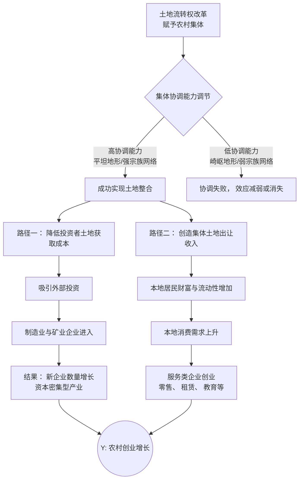

# Deep Reading Report: 1-农业与发展-Solving-coordination-failures--Collective-land-trans_2026_Journal-of-Develop_segmented.md

---
title: 'Solving coordination failures: Collective land transfer rights and rural entrepreneurship'
authors:
- Xin Lin
- Eddie Chi-man Hui
- Zhenglong Cong
- Jianfu Shen
journal: Journal of Development Economics
year: 2026
tags:
- paper
- deep-reading
---

【第一部分：全景扫描】

1.  **研究主题与核心结论**
    本文通过研究中国一项将农村建设用地转让权赋予村集体的土地改革，实证发现集体产权安排能够通过降低土地协调成本和增加居民财富两条渠道，显著促进农村创业与非农就业。

2.  **问题意识**
    本文旨在解决一个具体的发展经济学问题：在土地产权零散的农村地区，高昂的土地整合（协调）成本如何成为阻碍现代企业创立与发展的关键障碍，以及将土地转让权配置给集体（而非个人）这一制度安排能否以及通过何种机制有效缓解这一障碍。

3.  **重要性**
    这个问题至关重要，因为若不解决土地整合的协调难题，零散的土地产权将锁定生产要素配置，使农村土地资产沦为无法转化为生产性资本的“沉睡资本”，从而持续阻碍农村地区产业升级、非农就业创造和贫困问题的根本缓解，造成严重的资源错配和增长潜力损失。

4.  **贡献定位**
    *   **理论贡献**：
        1.  **拓展产权理论视角**：将发展经济学中关于产权与发展的研究焦点，从已被深入探讨的“产权保障”维度，显著推进至“产权可转让性”维度，为理解如何解锁“沉睡资本”提供了直接证据。
        2.  **丰富集体产权理论**：在私有产权通常被认为更具配置效率的主流观点之外，基于中国实践，为“在某些情境下（如存在高昂协调成本时），集体或社区产权可通过集体协商克服‘钉子户’问题，从而更具效率”这一理论论点提供了新的、有力的实证支持。
    *   **实践贡献**：
        1.  **为土地政策设计提供依据**：研究结论表明，在土地零散、协调成本高的地区，将土地转让权配置给适当层级的集体（如村集体），可能是比直接赋予个人更有效的促进农村工业化和创业的政策工具。
        2.  **指明政策实施的条件与局限**：研究揭示了政策效果高度依赖于当地的集体协调能力（如地理条件、宗族网络），并指出改革收益可能在城乡接合部更为集中，这为政策的差异化实施和配套措施（如加强基层治理能力、关注分配公平）提供了具体的指导方向。

## 导航 (Navigation)

**返回总报告：** [[Final_Deep_Reading_Report]]

---
title: 'Solving coordination failures: Collective land transfer rights and rural entrepreneurship'
authors:
- Xin Lin
- Eddie Chi-man Hui
- Zhenglong Cong
- Jianfu Shen
journal: Journal of Development Economics
year: 2026
tags:
- paper
- deep-reading
---

以下是对该论文“理论与假说”部分的专业分析：

### **5. 文献谱系**
本研究的理论基础建立于以下几个关键领域的文献之上：
1.  **协调失败与钉子户问题**：研究承袭了关于土地整合中因产权碎片化导致高昂协调成本（即“钉子户”问题）的文献。关键参考文献包括 Strange (1995) 对产权整合问题的早期阐述，以及 Kominers and Weyl (2012) 从理论层面提出集体决策可作为解决方案的经典研究。
2.  **国家征收的解决方案及其弊端**：研究回顾了以国家征收（Eminent Domain）作为解决钉子户问题的主流方案（如 Miceli and Segerson, 2007; Nosal, 2001），并进一步引用了指出该方案可能引发政治信任危机、抑制投资激励的文献（如 Besley, 1995; Kominers and Weyl, 2012）。
3.  **创业的制度障碍**：研究植根于探讨创业活动所受制度性约束的文献，特别是信贷约束（如 Cagetti and De Nardi, 2006）、市场可达性与聚集经济缺失（如 Asher and Novosad, 2020）对创业的阻碍作用。
4.  **产权与发展的经典理论**：研究的核心框架建立在 Coase (1960)、Demsetz (1967) 等关于产权经济效应的经典理论之上，并衔接了研究产权安全性（Tenure Security）如何影响投资与发展的实证文献（如 Besley, 1995）。

### **6. 理论基础**
本研究的核心理论框架是**产权理论**，并特别聚焦于产权的**可转让性**维度。研究在经典产权理论（强调产权的清晰界定与安全性）的基础上，进一步区分了产权的“安全性”与“可转让性”。其核心论点是：即便产权是安全且清晰界定的，如果其**不可转让**，依然会导致生产要素（此处指土地）被锁定在初始的低效所有者手中，从而造成资源错配，阻碍创业与结构转型。这与 Besley and Ghatak (2010)、Adamopoulos and Restuccia (2020) 等人的理论观点一脉相承。

此外，研究也紧密结合了**协调失败理论**与**集体行动理论**。它借鉴了 Ostrom (1990) 关于公共资源治理中集体行动可以克服“公地悲剧”的洞见，并将其应用于解决土地整合中的“反公地悲剧”（即钉子户问题），论证了赋予村集体转让权可以作为一种有效的集体行动机制。

### **7. 待检验假说**
尽管论文未以标准格式（如H1, H2）明确列出假说，但根据理论与实证分析脉络，可推导出其核心待检验假说如下：
*   **主假说**：赋予农村集体土地转让权，能够通过降低土地整合的协调成本，显著促进农村地区的创业活动（即新企业注册数量增加）。
*   **机制性假说1**：该改革通过引入村集体作为新的土地供应者，与地方政府形成竞争，从而**降低企业的用地成本**，尤其是对土地密集型行业。
*   **机制性假说2**：该改革通过土地交易将非流动性的土地资产转化为农村居民的可支配财富，产生的**正向财富冲击**能够为本地居民提供创业资本，并提升本地消费需求，进而吸引创业投资。
*   **异质性假说**：改革的促进效应在**集体协调能力更强**的地区（如地形平坦、宗族网络密集）更为显著。

### **8. 创新点**
本研究的假说相较于前人文献，其创新之处主要体现在：
1.  **研究维度的转移**：现有关于产权与创业的文献多聚焦于**产权安全性**（如地权确权）的影响（如 Bu and Liao, 2022）。本研究则将焦点转向了产权的**可转让性**，论证了“可转让的权利”本身即是促进资源配置效率和创业的关键制度要素。
2.  **产权主体的创新**：不同于强调赋予个体清晰产权的“确权”改革，本研究关注的是赋予**集体**（而非个体）以转让权。它提出并验证了，在解决土地整合这一涉及多主体的协调问题时，**集体产权**的安排可能比分散的个体产权更具优势，因为它能内部化协调成本。
3.  **解决方案的提出**：针对土地整合中的钉子户问题，既有方案主要围绕国家征收或个体协商。本研究提出并实证检验了一种**新颖的、介于国家与个体之间的“共同体权利”解决方案**——即通过制度设计，授权村集体作为谈判代表和决策主体，为克服协调失败提供了新的制度路径。
4.  **机制联结的深化**：研究不仅验证了改革对创业的宏观影响，更深入地打开了“黑箱”，从**土地市场结构**（竞争导致地价下降）和**居民财富渠道**两个具体微观机制进行了系统检验和分离，深化了对产权改革如何影响经济发展的机制理解。

### **9. 逻辑推演**
假说背后的微观机制推演如下：
1.  **降低用地成本渠道**：
    *   **初始状态**：地方政府是农村非农建设用地的**垄断供应者**。企业获取土地需经政府征收，过程冗长，且政府为最大化土地财政，有动机抬高出让价格。
    *   **改革冲击**：赋予村集体转让权，使其成为土地市场的**新供应者**。村集体可以直接向企业提供已整合好的连片土地。
    *   **市场结构变化**：市场由垄断变为（地方政府与村集体之间的）**双头或多头竞争**。
    *   **结果**：根据产业组织理论（Bloom and Van Reenen, 2007; Stahl, 1988），供应者之间的有效竞争会压低均衡价格。因此，企业（尤其是制造业等土地密集型行业）的用地成本得以下降，固定投资门槛降低，创业活动得以激发。

2.  **财富效应渠道**：
    *   **初始状态**：农民和村集体无法直接从土地的非农化增值中获益，土地财富被“冻结”。
    *   **改革冲击**：村集体可直接与用地企业交易，并获得大部分土地增值收益。这部分收益按规定比例分配给拥有农村户籍的集体成员。
    *   **财富效应传导**：
        *   **直接融资效应**：农民家庭获得一笔额外的现金收入，这缓解了其面临的**流动性约束**（Cagetti and De Nardi, 2006），为本地居民提供了创业的启动资本。
        *   **本地需求效应**：家庭财富增加会提升对本地非贸易品（如零售、教育、餐饮等服务业）的**消费需求**（Lettau and Ludvigson, 2004），这创造了新的市场机会，吸引了服务业创业。
        *   **（潜在的）公共投资效应**：村集体留存的部分收益可能用于改善本地基础设施，优化营商环境，间接吸引投资。但论文的实证发现此效应较弱。

综上，论文的逻辑链条清晰：一项旨在提升产权可转让性的制度改革（A）→ 通过改变土地市场结构和增加居民财富两个核心渠道 → 最终促进了农村创业（B）。这一推演紧密结合了中国独特的土地制度背景，具有坚实的理论和现实基础。

## 导航 (Navigation)

**返回总报告：** [[Final_Deep_Reading_Report]]

以下是根据您提供的论文章节内容，就数据来源、获取与清洗、以及数据生成过程（DGP）中可能存在的系统性偏差进行的“数据考古”分析。

### **第三部分：数据考古**

**10. 数据来源**
本文构建了一个多源综合数据集，其数据来源可区分为**公开行政/商业数据**与**独家调研数据**。

1.  **公开行政与商业数据**：
    *   **政策议程数据**：来自中国政府官方网站的公开政策文件与公告。
    *   **企业注册数据**：核心数据来源于“国家企业信用信息公示系统”，这是一个涵盖中国几乎所有合法注册商业实体的官方公开数据库。
    *   **土地交易数据**：来自中国土地市场网的官方公开交易记录。
    *   **社会经济属性数据**：涉及多个公开数据库，如国家地球系统科学数据中心（地形崎岖度）、哈佛Dataverse（夜间灯光）、LandScan（人口密度）、OpenStreetMap（道路密度）以及百度地图的兴趣点数据。

2.  **独家调研数据**：
    *   **家庭微观数据**：来自“中国家庭金融调查”。该调查由西南财经大学等机构执行，是一个全国性、大样本的纵向追踪调查，数据需通过申请获取，属于学术界广泛使用的独家微观调研数据。

**11. 获取与清洗**

*   **公开数据**：
    *   **企业注册数据**：
        1.  **获取**：从“国家企业信用信息公示系统”获取包含企业名称、地址、注册日期等字段的原始记录。
        2.  **地理编码与聚合**：基于企业地址获取地理坐标，并将其匹配到2021年版的中国乡镇行政区划图上，以构建“乡镇-年份”层面的新注册企业数量面板数据。
        3.  **缺失值处理**：针对约45%的企业行业信息缺失，开发了一套机器学习流程：利用存在行业信息的子集，训练一个基于TF-IDF向量化和多项式朴素贝叶斯算法的分类器，用以预测缺失企业的行业。
        4.  **变量构造**：使用基于朴素贝叶斯分类器的开源工具，根据企业家中文姓名预测其性别。
        5.  **异常值处理**：对每个“乡镇-年份”单元的新注册企业数量进行**顶部1%的缩尾处理**，以减轻异常值影响。
    *   **样本构建（改革议程）**：
        1.  **初始名单**：从两项全国性改革试点（新型城镇化综合试点、农村改革试验区）中，选取2014-2015年及2012-2014年公布的试点县，共750个县。
        2.  **样本排除**：
            *   排除23个仅允许辖区内个别乡镇进行试点的县（政策实施单位不一致）。
            *   排除61个已完全城市化、没有乡镇建制（因此无注册的农村企业）的县。
        3.  **最终样本**：得到包含666个县的样本，其中33个被定义为处理组（土地流转权改革县），其余633个作为控制组（其他两项改革的试点县）。

*   **调研数据**：
    *   **抽样框与样本量**：中国家庭金融调查采用分层、三阶段与人口规模成比例的概率抽样设计，覆盖全国。论文使用了2011年至2019年间的全部五轮调查数据，形成了一个不平衡面板。具体样本量在文中未明确给出，但该调查每轮样本量约为3-4万户，是中国最大的家庭微观调查之一。
    *   **代表性保证**：该调查通过科学的概率抽样设计、严格的调查执行与权重调整，旨在保证其样本对全国及城乡的代表性。作者通过将调查数据与县级改革信息进行匹配，构建用于机制分析的个人或家庭层面样本。

**12. 数据生成的微观结构与系统性偏差**
数据生成过程存在以下几类潜在的系统性偏差，作者通过研究设计或检验部分应对了这些挑战：

1.  **测量误差与覆盖偏差**：
    *   **创业活动的测量偏差**：核心变量“农村创业”仅使用在工商部门**正式注册的企业**数量来衡量。这**排除了大量未注册的电子商务、非正规的家庭作坊或个体经营**（无论农业或非农）。因此，该指标可能系统性地低估了农村地区真实的创业活跃度，尤其是非正规经济部分。
    *   **数据时效性与生存者偏差**：企业注册数据中的“经营状态”信息截至于2022年，用于区分存活与注销企业。在分析历史时期（2009-2019年）的创业活动时，这引入了**生存者偏差**——即只能观测到截至2022年仍存活或已正式注销的企业，而那些在期间消亡却未及时办理注销手续的“僵尸企业”可能被错误分类，导致对创业成功或生存率的估计有偏。
    *   **行业信息预测误差**：使用企业名称预测行业的方法必然存在误分类误差，可能影响按行业分类分析的准确性。

2.  **样本选择与损耗偏差**：
    *   **控制组构造的“准实验”逻辑**：作者有意识地选择其他国家级改革试点县作为控制组，其理由是这些县同为“候选者”，与处理组在改革意愿、基础条件上更具可比性。这旨在缓解因试点选择非随机带来的**选择性偏差**。平衡性检验（表1）显示，除耕地比例外，处理组与对照组在多数可观测特征上无系统差异，支持了该设计的合理性。
    *   **数据缺失的非随机性**：县级统计年鉴数据存在高达40%的缺失率。作者虽检验了缺失与处理状态是否相关（附录表B-6），但若缺失机制与其他不可观测因素相关，仍可能导致分析样本存在**样本选择偏差**。

3.  **调研数据的匹配与面板损耗**：
    *   CHFS数据与县级改革信息的匹配依赖于受访者的居住地。若居住地变更（如迁移）与改革政策相关，则匹配可能不准确，引入误差。
    *   使用多轮调查数据合并成不平衡面板，个体在不同时期的进出（损耗）若非随机，也可能影响估计结果的有效性。

**总结**：本研究的数据工作细致且具有创新性，通过巧妙的控制组设计和多源数据融合来识别因果效应。然而，其核心结论建立在“正式注册企业”这一度量之上，对非正规经济的排除是主要的测量局限。此外，企业数据的生存者偏差和部分辅助数据的缺失问题，是潜在的内生性来源，作者通过平衡性检验和稳健性分析部分地回应了这些关切。

## **第四部分：变量与测量**

本文旨在评估中国农村集体经营性建设用地入市改革（即土地流转改革）对农村创业活动的影响。研究采用严谨的计量经济学方法，核心是构建一个多期双重差分模型。以下对模型中的关键变量及其测量方式进行详细阐述。

### **13. 核心变量定义**

*   **被解释变量 ：**
    *   **企业创业活动**：论文的核心被解释变量是农村地区的创业活力，具体操作化为 **“乡镇-年度层面新注册企业的数量”**。在部分稳健性检验中，该变量被取其自然对数（`Log(Number of Newly Registered Firms)`）以缓解分布偏态问题，或直接使用原始计数并采用泊松回归模型进行估计（见表B-2）。此外，研究还从异质性角度将企业按**所有制**（国有企业 vs. 非国有企业）和**行业**（农业、制造业、服务业）进行了细分分析（见表B-4及附录C-5），以考察改革影响的异质性。

*   **核心解释变量 ：**
    *   **土地改革政策**：核心解释变量是一个二元虚拟变量 **`Reform`**，用于标识处理组和改革时间。具体而言，若某个乡镇所在的县在某一年份被纳入国家级“支持农民工等人员返乡创业试点”，则该乡镇在该年份及之后年份取值为1，否则为0。该政策的识别基于国家发改委等部委在2016、2017、2018年发布的三批次试点名单。

### **14. 衡量方式**

1.  **企业数据**：新注册企业数量来源于官方企业注册数据库，属于**直接观测变量**。该数据库提供了企业注册时间、地点、行业、注册资本、所有制性质等详细信息，使得在乡镇层面进行精确加总和分析成为可能。
2.  **关键机制变量**：虽然论文正文未详述，但从提供的“Supplement Variable”部分可知，研究构建了一个重要的机制变量——**标准化土地价格**。这是一个**构造的代理变量**，旨在剥离区位特征后衡量土地的内在价值。其构建采用了机器学习方法：
    *   **算法**：使用**随机森林模型**进行预测。模型配置为300棵决策树，每个叶节点的最小样本数为5，每个节点分割时考虑的预测变量数量为总预测变量数的平方根。
    *   **构成与流程**：首先，模型利用土地特征（如面积、形状、用途）和周期性因素（如宏观经济条件）对土地价值进行训练。随后，通过**“特征随机化-均值预测”** 来构造标准化价格：在保持每块土地唯一标识符不变的前提下，随机分配其土地特征和周期因素，重复进行300次土地价值预测，并计算这些预测值的均值。此过程有效剥离了土地的固有区位属性，得到的标准化价格更能反映土地作为生产要素的“基本面”价值，而非其地理溢价。

### **15. 控制变量**

论文的实证策略主要通过高维固定效应来吸收不可观测的混杂因素，而非依赖大量的显式控制变量。这是为了更干净地识别改革的因果效应。

*   **选择的控制变量（即 中的核心部分）**：
    *   **乡镇固定效应**：控制各乡镇不随时间变化的固有差异，如地理条件、初始经济水平、文化习俗等。
    *   **省份×年份联合固定效应**：控制各省份层面随时间变化的共同冲击，例如各省不同的宏观经济政策、区域性需求冲击或供给冲击。这是模型中最关键的控制之一，能有效缓解因遗漏省份-年度层面的混杂变量（如区域性的产业政策、信贷周期等）所导致的内生性问题。
    *   **县级时间趋势**：在部分稳健性检验中（见表B-3），模型进一步加入了县级的线性时间趋势，以控制各县在改革前可能存在的不同发展路径，从而强化平行趋势假设。

*   **选择依据**：
    上述固定效应的组合旨在同时控制**供给端**和**需求端**的冲击。
    *   **供给冲击**：乡镇固定效应控制了土地供给、本地劳动力素质等长期供给侧因素。省份×年份固定效应则控制了影响创业成本（如贷款利率、原材料价格）的短期区域性供给冲击。
    *   **需求冲击**：省份×年份固定效应同样捕捉了影响产品市场需求的区域性变化，例如省份层面的收入增长、消费偏好变化等。通过同时控制这两类固定效应，模型能够将土地流转改革的影响从复杂的经济背景中相对孤立地识别出来，其识别假设是：在控制上述固定效应后，处理组和对照组乡镇的新企业增长趋势在改革前是平行的。

### **16. 特殊处理**

为确保估计结果的可信度和可比性，论文对数据进行了如下处理：
*   **对数化**：针对计数形态的新注册企业数量，在主回归后的稳健性检验中采用了**对数化**处理（`ln(1+count)`），以减轻极端值的影响并使模型更符合线性假设（见表B-2列(1)）。
*   **标准化与指数构造**：对于核心机制变量“土地价格”，采用了前述的机器学习方法构造了**标准化土地价格指数**，旨在消除区位异质性，获得可比的土地资产价值度量。
*   **聚类稳健标准误**：为了应对可能存在的组内自相关（同一乡镇或县内不同年份的误差项相关），所有回归均计算了聚类稳健标准误。论文系统地检验了在不同层级（城市、省份、县）聚类，以及双向聚类（如“县”与“省份×年份”）情况下结果的稳健性（见表B-1）。
*   **其他稳健性处理**：包括使用**Wild Bootstrap**方法调整小聚类数量（仅31个省）下的推断问题，以及使用**泊松回归**直接处理计数数据的离散性和零膨胀问题（见表B-2）。这些处理增强了基准结论的可靠性。

综上所述，本研究对变量的定义清晰，测量方法具有创新性（如使用机器学习构建土地价格代理变量），并采用了严谨的计量经济学控制策略（高维固定效应）和处理方法，以应对潜在的内生性和异方差问题，从而为评估土地产权改革的经济效应提供了可靠的实证基础。

---
title: 'Solving coordination failures: Collective land transfer rights and rural entrepreneurship'
authors:
- Xin Lin
- Eddie Chi-man Hui
- Zhenglong Cong
- Jianfu Shen
journal: Journal of Development Economics
year: 2026
tags:
- paper
- deep-reading
---

### **第五部分：识别策略与实证**

#### **17. 计量模型**
研究的核心计量模型为多期双重差分模型，用以估计将土地流转权授予农村集体这一政策改革对乡镇层面创业活动的影响。其基准回归方程如下：

\[
Y_{it} = \alpha + \beta Reform_{it} + \gamma' Z_{it} + \mu_i + \lambda_{pt} + \epsilon_{it}
\]

其中：
- \(Y_{it}\) 是结果变量，表示乡镇 \(i\) 在年份 \(t\) 新注册企业的数量。
- \(Reform_{it}\) 是核心解释变量，为一个虚拟变量，当乡镇 \(i\) 所在的县在年份 \(t\) 及之后实施了土地流转权改革时取值为1，否则为0。
- \(Z_{it}\) 是一组控制变量。在基准模型中，为了处理平衡性检验中发现的处理组与对照组在改革前耕地份额上的差异，并避免“坏控制”偏误，作者引入了耕地份额与时间趋势（线性、二次或三次）的交互项。
- \(\mu_i\) 是乡镇固定效应，用于吸收所有不随时间变化的乡镇层面特征。
- \(\lambda_{pt}\) 是省份-年份联合固定效应，用于控制各省份随时间变化的宏观经济冲击和政策环境。
- \(\epsilon_{it}\) 是聚类在县级层面的稳健标准误。

#### **18. 识别挑战**
核心解释变量 \(Reform_{it}\) 的内生性是需要严肃对待的问题。潜在的内生性来源主要是**遗漏变量偏误**。
- **遗漏变量**：改革县份的选取可能并非完全随机。尽管平衡性检验显示处理组与对照组在许多可观测的预处理特征上平衡，但仍可能存在不可观测的因素（如地方政府的治理能力、未观测到的创业文化或经济活力）同时影响改革实施的概率和创业增长的趋势。如果这些因素未被控制，将导致估计系数 \(\beta\) 有偏。
- **反向因果**：从逻辑上讲，一个地区创业活动的激增可能导致对土地制度改革的需求，从而影响改革时机。但论文背景表明，这是一项自上而下的中央政策试点，且创业企业难以在短期内形成强大的政治游说力量，因此反向因果的可能性相对较低，但无法完全排除。
- **测量误差**：改革执行力度在地区间可能存在差异，但虚拟变量的设定可能无法捕捉这种强度差异，从而导致测量误差和衰减偏误。

#### **19. 解决策略**
作者采用**多期双重差分法**作为核心识别策略，利用改革在不同县份逐步推行的准自然实验设定。
- **策略核心**：该策略依赖**平行趋势假设**，即若无改革，处理组和对照组的创业增长趋势应相同。作者通过事件研究法（图3）对此进行了严格检验，结果显示改革前的系数均小且不显著，支持了平行趋势假设。此外，作者还使用了 De Chaisemartin and D’Haultfœuille (2020)、Sun and Abraham (2021) 等针对异质性处理效应的稳健估计量，并进行了 Rambachan and Roth (2023) 的敏感性分析，证明结果对平行趋势的轻度违背是稳健的。

#### **20. 机制检验**
作者的核心理论是：集体土地流转权改革通过解决“土地整合协调失灵”问题来促进创业，而这一效果依赖于集体原有的协调能力。机制检验揭示了两条主要传导路径，并通过异质性分析（地形崎岖度、宗族网络）验证了协调能力的关键调节作用。

#### **21. 稳健性检验**
作者进行了全面且严谨的稳健性检验。

*   **识别假设检验**：
    - **平行趋势检验**：如前所述，事件研究法（图3）表明改革前无显著差异趋势，支持了DID的核心假设。
    - **安慰剂检验**：作者进行了基于随机分配改革时间的安慰剂检验（附录图C-4），结果显示“伪处理效应”不显著，排除了不可观测的县级时变因素驱动结果的可能性。
    - **排他性约束**：DID假设处理组对对照组无溢出效应。作者通过“环形排除法”（剔除与处理县相邻的对照县）和引入“邻县改革”虚拟变量（表5）进行检验，结果均显示溢出效应不显著，支持了排他性约束。

*   **替代性解释排除**：
    - **竞争性政策**：作者逐一控制并检验了同时期的三项重大农村政策（土地确权、返乡创业支持计划、农房抵押贷款）的影响（表4）。结果显示，在控制这些政策变量后，核心系数依然稳健且显著，且这些竞争政策本身的效应大多不显著。交互项分析进一步表明，土地改革与农房抵押政策存在协同效应，但并未替代或主导主效应。

*   **异质性分析**：
    - **行业类型**（表6）：改革效应主要驱动了制造业（增长9%）和服务业（增长28%）企业的创立，而农业企业数量下降。这印证了机制中“吸引投资”和“财富效应”两条路径。
    - **企业质量**：改革促进了更高质量企业的诞生，包括更多正式注册的公司（而非个体户）、更高的初始注册资本以及更优的存活率（正文4.3.2及附录）。
    - **企业家身份**：新企业的创立者主要是本地农民，而非返乡人员，支持了“本地财富效应”渠道。
    - **地理分布**：创业增长集中在县城和中心镇，而非偏远村庄，符合“土地整合用于非农开发”的逻辑。
    - **协调能力异质性**（表3）：改革效果在地形平坦（协调成本低）和宗族网络密集（协调能力强）的地区显著更强，直接验证了理论机制的核心前提。

*   **其他敏感性测试**：
    - **估计方法**：使用了OLS、泊松回归（针对计数变量）等多种模型，结果稳健。
    - **标准误聚类**：尝试在城市、省份等不同层级聚类，以及多路聚类，结果不变。
    - **样本与变量定义**：将样本聚合到县级面板、控制县级时间趋势、对结果变量取对数等，主要结论依然成立（附录表B-1至B-3）。

**总结**：该研究的识别策略清晰（多期DID），对内生性挑战有充分认识，并通过事件研究、丰富的稳健性检验和深入的异质性分析，为“集体土地流转权通过缓解协调失灵促进创业”这一因果推断提供了强有力的支持。机制检验与理论逻辑环环相扣，分析全面且严谨。

## 导航 (Navigation)

**返回总报告：** [[Final_Deep_Reading_Report]]

---
title: 'Solving coordination failures: Collective land transfer rights and rural entrepreneurship'
authors:
- Xin Lin
- Eddie Chi-man Hui
- Zhenglong Cong
- Jianfu Shen
journal: Journal of Development Economics
year: 2026
tags:
- paper
- deep-reading
---

### **第六部分：结果解读与评价**

#### **22. 结果解读**
本文的核心实证结果表明，将农村集体建设用地的流转权利赋予村集体，能够显著促进农村创业活动。具体而言：

1.  **主要结果显著**：
    *   **创业活动**：与对照组乡镇相比，实施集体土地流转权改革的乡镇，其新注册企业数量平均显著增加了25%。这一结果在不同模型设定（OLS、泊松回归）、不同聚类层面（城市、省份、县）以及考虑县级时间趋势的稳健性检验中均保持统计显著性（如附录表B-1至B-3所示）。
    *   **土地价格**：改革导致土地使用价格平均下降了19%。这一价格效应在土地密集型产业中更为显著，印证了改革通过降低土地整合成本（协调成本）影响企业成本的渠道。
    *   **就业结构**：改革显著促进了非农就业。如表14所示，改革使个体成为**雇工（Employee）** 的概率显著增加（系数0.046，在1%水平显著），同时显著降低了成为**农民（Farming）** 的概率（系数-0.034，在1%水平显著）和**失业（Unemployment）** 的概率（系数-0.085，在1%水平显著）。这表明改革带来的创业潮主要创造了工资性岗位，而非直接导致农业萎缩。

2.  **机制与异质性结果显著**：
    *   **机制检验**：研究提出了“降低企业用地成本”和“提高居民土地财富”双渠道。土地价格下降直接支持了第一个渠道。附录表B-7显示，改革显著增加了农户的土地财产性收入（系数909.200，在10%水平显著），且与创业活动正相关，支持了财富效应渠道。
    *   **异质性分析**：改革的积极效应在**集体协调能力更强**的地区（如地势平坦地区、宗族网络密集区）更为明显，而在协调困难的地区则被抵消。此外，改革效应在**靠近城市中心**的乡镇远大于偏远乡镇，呈现出空间异质性。附录表B-4显示，新增企业主要集中在**非国有**的制造业和服务业企业。

3.  **不显著的结果及可能原因**：
    *   表14中，改革对失业率的直接效应在加入与性别的交互项后变得不显著（第5列，系数-0.011）。这可能是因为改革对就业的影响在不同性别间存在差异，交互项吸收了部分效应。更值得注意的是，**“改革*男性（Reform*Male）”的交互项在失业方程中并不显著**（第6列，系数0.011），这表明改革在降低失业率方面并未表现出显著的性别差异。这可能意味着改革创造的就业机会对男性和女性的影响是同质的，或者劳动力从农业向非农部门的转移在性别维度上并非此研究的主要故事。

#### **23. 评价**
1.  **与理论的一致性**：实证结果与理论预期高度一致。研究基于产权经济学和交易成本理论，核心论点是碎片化的产权（土地细碎化）会因高昂的协调成本和“钉子户”问题抑制创业。将流转权赋予集体，正是通过集体谈判内部化这些外部性，降低土地整合的交易成本。研究发现企业数量显著增加、土地价格下降（反映了协调摩擦成本的降低），以及效应在集体协调能力强的地区更突出，都强有力地支撑了这一理论逻辑。
2.  **对实证假设的满足**：研究设计较好地满足了因果推断的关键假设。
    *   **平行趋势假设**：正文与附录（如图C-1, C-2）通过事件研究法、平衡性检验以及Rambachan and Roth (2023)的敏感性分析表明，改革前处理组和对照组在结果变量及主要协变量上趋势相同，改革后的效应是政策冲击所致，结果对此假设的违反具有相当的稳健性。
    *   **排除竞争性解释**：研究通过控制多项同时期政策（农地产权确权改革、返乡创业支持计划、农村住房抵押试点）的时变虚拟变量，并在附录中详细论证了这些政策在产权本质、目标土地和机制上与本研究改革的区别（见表A-1），有效缓解了遗漏变量偏误的担忧。
    *   **有效性**：附录中的安慰剂检验、选择性损耗检验（表B-5, B-6）等进一步增强了结果的可信度，表明结果并非由偶然因素或样本选择性偏差驱动。

#### **24. 讨论**
本文的结果与既有文献既有对话，也有重要拓展和对比。

1.  **一致之处**：
    *   与 **Besley and Ghatak (2010)**、**Ostrom and Hess (2010)** 等人的研究一致，本文证实了在特定情境下（如解决协调问题和公共资源治理），**集体产权（communal rights）可以比个人产权更有效率**。本文为这场长期辩论提供了来自中国土地市场的新证据。
    *   与 **De Soto (2000)** 关于“死资本”活化的论述相呼应，研究表明赋予资产（此处为集体建设用地）可转让的产权，能够将其转化为生产性资本，从而**激发创业和经济增长**。
    *   与大量关于“产权安全”促进投资的文献（如Besley, 1995; Deininger and Jin, 2006）逻辑相通，但本文将焦点从“使用权安全”转向了“**转让权（alienability）**”，补充了产权完整性的另一个关键维度。

2.  **矛盾与拓展之处**：
    *   与许多推崇**私有产权**至高无上效率的经典文献（如Hardin的“公地悲剧”视角）不同，本文表明在土地整合场景中，集体持有并行使流转权可能是更优解。这凸显了产权安排应**视资产属性与交易成本类型而定**，而非一概而论。
    *   与关注中国农地**确权到户**改革的研究（如Bu and Liao, 2022）形成有趣对比。本文聚焦于**非农建设用地**的**集体流转权**，揭示了与前一种改革完全不同的政策目标（市场效率 vs. 耕种安全）、作用机制（集体谈判降低企业成本 vs. 个体激励释放劳动力）和经济后果（促进规模化企业 vs. 促进个体非农就业）。两者共同描绘了中国农村产权制度改革的多维图景。

#### **25. 政策含义**
本研究结果对政策制定和实践具有明确的指导意义：

1.  **肯定集体产权在特定领域的价值**：对于存在严重土地整合与协调问题的领域（如农村非农产业发展、基础设施建设），政策设计不应盲目追求产权的完全个人化。**将特定权利（如流转权）赋予适当层级的集体组织**，可能是破解“钉子户”困境、盘活闲置资产、促进规模经济的有效制度安排。
2.  **土地改革需配套与精准实施**：改革的成功高度依赖于当地的**集体行动能力**。政策实施前应评估或培育基层的协调治理能力（如强化村委会职能、利用传统社会网络）。同时，研究发现的显著空间异质性（近城效应强、远郊效应弱）提示，需配套区域性的产业、基础设施或财政转移支付政策，以防止改革**加剧城乡或区域间的发展不平等**。
3.  **关注地方政府财政行为的连锁反应**：研究观察到改革可能导致地方政府土地出让收入下降。这警示政策制定者需预判并设计应对机制，如拓宽地方税基、改革财政体制，引导地方政府从“土地财政”转向“产业财政”或“服务财政”，以避免因财政收入压力导致政策执行变形或公共服务供给收缩。
4.  **为发展中国家的土地制度转型提供参考**：许多发展中国家同样面临土地产权模糊、交易成本高昂的问题。本研究证明，一种介于完全国有和完全私有之间的、**赋予社区集体关键性转让权利**的中间道路，可以成为促进农村创业和结构转型的可行方案。关键在于根据本地社会资本和治理结构，设计与之匹配的集体权利行权机制。

## 导航 (Navigation)

**返回总报告：** [[Final_Deep_Reading_Report]]

---
title: 'Solving coordination failures: Collective land transfer rights and rural entrepreneurship'
authors:
- Xin Lin
- Eddie Chi-man Hui
- Zhenglong Cong
- Jianfu Shen
journal: Journal of Development Economics
year: 2026
tags:
- paper
- deep-reading
---

【第七部分：专家批判与展望】

**26. 致命伤 (The Achilles' Heel)**

本文最核心的弱点在于其对**核心作用机制——“集体协调”——的测量与识别不足**。虽然文章成功地识别了集体土地流转权改革对农村创业的正面平均处理效应，并巧妙地利用地形崎岖度和宗族网络密度作为异质性分析变量，来论证“集体协调能力”的重要性，但这仅仅是间接证据。文章的致命伤在于，它并未能直接、有力地揭示“集体”内部是如何进行协调、谈判并最终达成土地流转决策的这一**黑箱过程**。

具体而言，存在以下隐患：
1.  **内生性挑战与机制混淆**：将“集体协调能力”视为外生给定的地区特征（如地形、宗族）可能存在严重问题。改革的效果可能并非由“协调”本身驱动，而是由那些**先天就具备更强市场洞察力、组织能力或政治资本的村庄领导/精英**所驱动。换言之，是这些未观测到的精英能力或村庄特质（既影响改革执行效果，又直接影响创业活力）导致了观测到的结果，而非抽象的“集体协调”机制。文章虽控制了村庄固定效应，但无法完全排除随时间变化的、与改革试点选择和执行强度相关的精英能力或村庄动态。
2.  **集体决策过程缺失**：改革将权利赋予“集体”，但“集体”如何行动？决策是一人主导，还是民主协商？流转收益如何分配（是平均分配，还是由少数人掌控）？这些微观政治经济过程对于理解改革的真实效果、分配后果乃至长期可持续性至关重要。例如，如果流转决策由村干部垄断且收益分配不公，那么所谓的“财富效应”可能集中在少数人手中，其对广泛创业的促进作用将被高估，甚至可能加剧内部不平等，这与本文基于代表性个体描述的机制有所出入。
3.  **对“协调成本”的简化处理**：文章将“协调成本”操作化为土地整合的物理与谈判难度，但忽略了其中可能包含的**策略性行为**（如 holdout 问题）。集体所有权理论上可以抑制 holdout，但本文缺乏证据表明改革后确实减少了此类行为。相反，集体决策本身可能产生新的、更复杂的内部博弈成本，这些成本未被纳入分析框架。

总之，**未能打开“集体协调”这个黑箱，使得对核心机制的解释停留在相关性推断层面，而非因果机制识别**。这削弱了研究结论的稳健性，也使其政策启示——“谁持有权利以及何种聚合层级至关重要”——缺乏坚实的微观基础。

**27. 未来选题**

基于上述不足，提出以下两个具体、可执行的新选题方向：

1.  **选题一：集体土地流转中的决策机制、精英角色与效率后果——基于中国村庄层面追踪调查的实证研究**
    *   **研究内容**：设计并实施一项针对改革试点与非试点村庄的专项追踪调查，收集村庄内部关于土地流转决策过程的详细信息。包括：决策模式（如村干部决定、村民代表会议、全体村民投票）、关键决策者的个人特征与社会网络、流转收益的分配方案、以及村民对过程的参与度和满意度。然后，将这些微观机制变量与村庄层面的经济产出（如创业数量、企业规模、村民收入分布）进行关联分析。
    *   **可执行性**：可与国内高校或研究机构合作，利用其地方网络进行问卷调研和深度访谈。数据可与工商注册数据、卫星夜景灯光数据等结合，构建村庄面板数据集。研究方法上，可采用案例比较分析、工具变量法（如利用历史宗族结构、革命传统等作为决策模式的工具变量）或断点回归设计（如果改革试点有清晰可循的村庄特征阈值）。
    *   **学术价值**：直接回应本文的核心弱点，为“集体协调”提供微观证据。可深入探讨在什么条件下集体权利能带来效率改善，又在什么条件下可能导致精英捕获或新的无效率。这将极大丰富关于产权制度、基层治理与经济发展的学术讨论。

2.  **选题二：土地产权改革与农村内部不平等：来自财富效应分配与创业机会差异的证据**
    *   **研究内容**：本文指出改革效果在近城乡镇更显著，并提及分配后果值得关注。本选题可进一步深化，系统研究改革带来的土地增值收益（财富效应）在村庄内部不同群体（如村干部 vs. 普通村民、大姓 vs. 小姓、有外出务工经历者 vs. 纯务农者）之间的分配差异。进而，分析这种初始财富冲击的分配差异如何影响后续的创业行为（谁创业、创什么业）和收入流动性。
    *   **可执行性**：利用全国性的家庭面板数据（如CFPS、CHIP），结合本文使用的改革政策信息，进行异质性分析。关键是在家庭层面识别其从集体土地流转中获得的直接收入（如分红）和间接收益（如本地就业机会、基础设施改善）。可以比较改革前后，不同群体在创业概率、创业资本规模、非农就业收入等方面的变化。
    *   **学术价值**：超越对改革平均效应的评估，深入探讨其**分配效应**。这不仅关乎公平，也关乎效率——如果收益高度集中，其对本地消费和创业生态的拉动作用可能有限，甚至可能因社会矛盾而损害长期增长。此研究可为旨在促进包容性发展的土地政策设计提供关键依据。

## 导航 (Navigation)

**返回总报告：** [[Final_Deep_Reading_Report]]

## 导航 (Navigation)

**分步分析文档：**
- [[1_Overview]]
- [[2_Theory]]
- [[3_Data]]
- [[4_Variables]]
- [[5_Identification]]
- [[6_Results]]
- [[7_Critique]]
