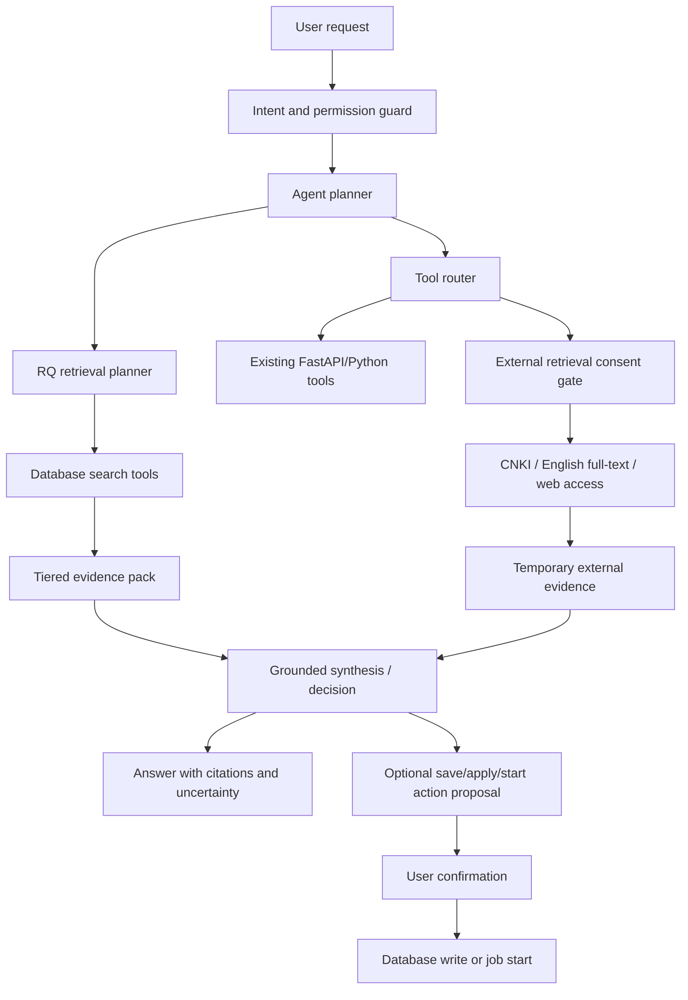

# Research Agent Upgrade Plan

> Last rewritten: 2026-05-28
> Branch: `codex/deepreading-empty-postgres-deploy`
> Scope: 基于当前已实现的 Research Agent 基础能力，重写一版以 `runtime-first` 为核心的整改与升级方案。本文是设计与实施规划，不是完成记录；除非单独在实现文档中确认，否则均视为未完成。
> Related docs:
> - [RESEARCH_AGENT_IMPLEMENTATION.md](RESEARCH_AGENT_IMPLEMENTATION.md)
> - [TECHNICAL_OVERVIEW.md](TECHNICAL_OVERVIEW.md)
> - [STATE_AND_API_MAP.md](STATE_AND_API_MAP.md)

---

## 1. 文档目标

本文档用于替换旧版“Research Agent Upgrade Plan”的主规划角色，目标不是继续堆工具，而是围绕当前线上真实问题，重新定义下一代研究助手智能体的整改路线。

重点解决的问题包括：

- 听不懂用户真实意图，尤其是跨轮追问、代词承接、结果集延续。
- 幻觉参数、幻觉对象和幻觉结论较多，容易把不存在的 entry_id、标题集合、结果范围当成真实对象继续检索。
- 工具调用预算缺乏治理，容易在错误路径上反复空转，消耗轮次却拿不到结果。
- 外部检索工具目前偏“检索入口生成器”，还不是完整、可控、可解释的外部证据工作流。
- 会话虽然已持久化，但缺少结构化工作记忆，导致“刚才那 11 篇”“上一轮这些文献”这类常见研究工作台语言无法稳定承接。
- 运行时安全边界和授权边界主要依赖 prompt，而不是依赖 runtime 层的硬约束。

本文会结合已实现能力和当前缺口，给出一版更适合作为后续实施主路线的总方案，并把原方案中较薄弱的 Phase 2 彻底重写并扩展为真正的运行时规划层。

---

## 2. 执行摘要

### 2.1 核心结论

当前系统已经完成了三块重要基础设施：

- 工具注册表已经建立，工具权限和 proposal 元数据已经成型。
- 本地分层检索已经建立，P0/P1/P2/P3 证据模型已经能够工作。
- proposal-first 执行模式已经建立，写操作与读操作已经开始分离。

但当前 Research Agent 仍然没有完成从“会 function calling 的聊天模型”到“可控研究执行器”的关键跃迁。真正缺少的不是更多工具，而是一个明确的运行时中枢：

- 负责理解任务，而不是把理解完全交给 prompt。
- 负责决定先检索什么、何时停止、何时联网、何时请求确认。
- 负责保存结构化工作记忆，而不是只保存消息文本。
- 负责治理工具预算，而不是仅靠 `MAX_TOOL_ROUNDS` 硬截断。
- 负责约束联网和写库行为，而不是只靠模型遵守系统提示。

### 2.2 本次重写后的总方向

后续升级应从“tool-first”改为“runtime-first”，以 `Research Agent Runtime` 为中心，构建如下能力：

1. `Task Frame`：把用户输入先转成结构化任务对象。
2. `State Machine`：把多轮执行过程变成显式状态迁移，而不是自由循环 tool calling。
3. `Sufficiency Engine`：先判断本地证据是否足够，再决定是否继续检索或申请联网。
4. `Session Working Memory`：把结果集、证据包、待确认 proposal、外部授权票据都对象化保存。
5. `Budget Policy`：从“总轮次上限”升级为“按工具、按阶段、按分支”的预算治理。
6. `Consent Gate`：把外部检索和外部写入从 prompt 规则升级为 runtime 硬门禁。

### 2.3 推荐实施顺序

推荐优先级不是“继续补 API wrapper”，而是：

1. 先补运行稳定性与 provider 可观测性。
2. 再补 Runtime 规划层。
3. 再补结构化工作记忆和跨轮承接。
4. 再补联网授权和外部证据体系。
5. 最后再继续扩展 compare/translation/reference/cards 等更多工具覆盖。

---

## 3. 当前基线与已实现能力

本节只描述当前已实现基础，详细函数级索引和测试清单请看 [RESEARCH_AGENT_IMPLEMENTATION.md](RESEARCH_AGENT_IMPLEMENTATION.md)。

### 3.1 已有的 Agent 基础设施

当前 `backend/routers/agent.py` 已经具备：

- `AgentSession` / `AgentMessage` / `AgentActionProposal` 这一整套持久会话和执行确认模型。
- SSE 流式对话主入口 `POST /api/agent/chat`。
- 统一工具分发器 `execute_tool(...)`。
- proposal-first 执行模式：`start_reading`、`start_batch_reading`、`import_folder_and_start_reading` 不直接执行。
- 已有的 session 存档与恢复能力。

### 3.2 已有的研究检索基础

当前 `backend/services/research_retrieval.py` 已经实现：

- `ResearchQuery` 结构。
- P0/P1/P2/P3 分层证据模型。
- 基于 SQL/ILIKE 的无向量检索。
- `research_search` / `get_evidence_pack` / `get_source_windows`。
- `limit_entries=0` 搜索全库的机制。
- 基础 tier 排序和字段权重排序。

### 3.3 已有的外部检索基础

当前 `backend/services/agent_external_retrieval.py` 已经实现：

- `search_cnki`：生成 CNKI 题名检索 URL，返回 `open_urls`。
- `lookup_english_fulltext`：基于 OpenAlex、Unpaywall、Semantic Scholar、Google PDF、working paper 索引返回全文候选。

这些能力已经足够作为外部检索的第一层，但还不足以构成完整的“外部证据工作流”。

### 3.4 当前最关键的架构缺口

尽管基础能力已经具备，但目前仍然缺少以下关键层：

- 没有独立的 `research_agent_runtime.py` 作为中控编排层。
- 没有显式状态机，仍然主要依赖 “LLM 决定 tool_calls”。
- 没有结构化工作记忆对象，只有消息历史。
- 没有 sufficiency 判定引擎。
- 没有工具预算治理器。
- 没有运行时级别的联网授权门。
- 没有“结果集对象”来支撑跨轮代词承接和集合引用。

---

## 4. 线上问题与根因归类

本节不是事件复盘，而是为整改路线提供问题分层。

### 4.1 P0 问题：运行稳定性不足

现阶段线上真实体验中，Agent 的失败不全是“模型差”，而是包含明显的链路稳定性问题：

- LLM 上游 provider 可能出现 401、500、502、超时、空 content、仅 tool_calls 等多种非业务性异常。
- `/api/agent/chat` 与 `/api/agent/inbox/upload-folder` 这类关键入口，一旦失败，用户体感会直接变成“什么都做不出来”。
- 当前错误语义仍然偏粗，用户和开发都很难从前端快速分辨是 provider、runtime、数据库还是文件上传链路的问题。

### 4.2 P1 问题：意图理解与任务建模缺失

典型表现：

- 用户说“看看库里已经精读了哪些论文”，系统可能误把 `*` 当成普通 query，而不是正确的全量检索语义。
- 用户说“根据上一轮这些文献再写一个综述”，系统没有可靠的对象化 result set，只能凭文本上下文猜测。
- 用户说“逐一搜这几篇文献的精读结果”，系统可能退化为对每个标题做串行模糊搜索，而不是直接复用现有 entry_ids。

根因是当前系统缺少显式的任务建模层，导致以下责任被错误地交给 prompt：

- 识别任务类型。
- 识别当前轮是否在承接上一轮结果。
- 决定应先走本地检索还是直接回答。
- 决定应生成 answer、proposal 还是 consent 请求。

### 4.3 P1 问题：结构化工作记忆缺失

现有 session 可以保存 `message`、`tool_call`、`tool_result`、`proposal`，但还没有形成稳定的“工作记忆模型”。

缺失的典型对象包括：

- `result_set`：上一轮检索出的文献集合。
- `selected_entries`：用户当前正在讨论的文献子集。
- `evidence_pack_ref`：上一轮回答所依据的证据包引用。
- `analysis_cache`：上一轮批量分析后留下的论文级标注缓存，可直接继续筛子集。
- `pending_external_consent`：等待授权的联网请求。
- `budget_snapshot`：本轮已经消耗的预算。

没有这些对象时，多轮研究型追问只能退化为“读取文本 -> LLM 猜测 -> 再调用工具”，这是当前幻觉和错搜的关键来源。

### 4.4 P1 问题：工具预算缺乏治理

当前虽然有 `MAX_TOOL_ROUNDS`，但它只是一个总开关，不是治理策略。

缺少的能力包括：

- 相似参数重复调用检测。
- 连续空结果调用熔断。
- 同一轮工具种类配额。
- 复杂问题的阶段预算控制。
- 预算耗尽后的结构化降级输出。

结果就是：

- 系统可能把大量预算花在低价值的串行 `search_library` 上。
- 系统无法主动判断“这条路已经错了，应该换策略”。
- 用户只能看到“工具调用轮次已达上限”，却不知道 Agent 已经做了什么、为什么停下。

### 4.5 P2 问题：外部检索能力定义不清

当前外部检索工具更多是“候选入口提供器”，而不是完整研究工作流的一部分。

现状问题：

- `search_cnki` 当前本质上只是生成链接，不是结构化结果抓取工具。
- `lookup_english_fulltext` 返回候选和 open URLs，但没有明确的“临时证据容器”和“后续保存/绑定”工作流。
- consent 仍主要依赖 prompt 层约束，没有 runtime gate。
- 外部 evidence 默认是临时的，但 UI 没有充分强调这一点。

---

## 5. 不可妥协的产品规则

这些规则不是实现建议，而是必须贯彻到 runtime、tool policy、UI 和文档中的产品约束。

### 5.1 证据优先级必须显式存在

所有研究型回答都必须以分层证据为基础，层级如下：

| 层级 | 含义 | 典型来源 | 使用原则 |
|---|---|---|---|
| P0 | 原始来源与原始元数据 | 原文窗口、题录摘要、DOI、标题、作者、期刊、参考文献原文、引用原文 | 最高权威；事实判断优先使用 |
| P1 | 用户或人工编辑内容 | `user_note`、人工注释、`reading_item_edits`、卡片笔记 | 次高权威；用于解释、研究意图、人工判断 |
| P2 | AI 生成内容 | `reading_items`、AI 总结、synthesis artifact、AI annotation | 可辅助导航与压缩，但不能覆盖 P0/P1 |
| P3 | 外部临时线索 | CNKI、OpenAlex、Unpaywall、Semantic Scholar、Google/Scholar、web access | 临时证据，默认不入库 |

冲突规则：

- P0 与 P1/P2 冲突时，以 P0 为准，并显式指出冲突。
- P1 与 P2 冲突时，以 P1 为准，并标记 P2 可能过期。
- P3 不得无提示地覆盖本地知识库结论。

### 5.2 本地优先，联网后置

默认策略：

- 先检索用户自己的数据库和已上传文件。
- 只有在本地证据不足时，才进入是否联网的判定。
- 用户未授权时，绝不执行外部检索。

### 5.3 外部结果默认不落库

默认规则：

- 外部结果只进入临时 evidence 容器。
- 只有用户显式要求时，才允许：
- 保存为笔记
- 应用 metadata match
- 绑定 PDF
- 保存 external note/card/comment

### 5.4 写操作必须 proposal-first

所有会写数据库、会启动长任务、会修改用户数据的动作，统一遵守：

- 先形成 proposal
- 明确展示影响对象和影响范围
- 用户确认后执行
- 执行结果进入 session 状态

### 5.5 无向量原则不变

继续坚持：

- 不引入 embedding table。
- 不引入向量数据库。
- 不引入 opaque semantic index。

允许使用：

- SQL/ILIKE
- SQLite FTS5/BM25
- PostgreSQL full text search
- lexical chunk retrieval
- deterministic reranking

---

## 6. 目标架构：从 Tool-Calling Assistant 到 Runtime-Driven Research Agent

### 6.1 总体思路

后续升级不应再围绕“继续加工具”组织，而应围绕一个中控运行时组织。目标架构是：

```text
用户请求
  -> Task Frame 建模
  -> Context/ResultSet 解析
  -> Local Retrieval
  -> Sufficiency Assessment
  -> (必要时) External Consent
  -> (必要时) External Retrieval
  -> Grounded Synthesis / Proposal
  -> Session State Update
```

### 6.2 目标模块图

建议的后端模块划分如下：

| 模块 | 建议文件 | 责任 |
|---|---|---|
| Task Frame | `backend/services/research_task_frame.py` | 把用户输入转成结构化任务对象 |
| Runtime | `backend/services/research_agent_runtime.py` | 统一 orchestrator，驱动状态机 |
| Session State | `backend/services/research_session_state.py` | 管理结构化工作记忆 |
| Sufficiency | `backend/services/research_sufficiency.py` | 判断证据是否足够 |
| Budget Policy | `backend/services/tool_budget_policy.py` | 控制工具预算、熔断重复空查 |
| External Policy | `backend/services/external_retrieval_policy.py` | 授权门、临时 evidence、保存规则 |
| Retrieval | `backend/services/research_retrieval.py` | 本地分层检索与证据包构建 |
| Tool Registry | `backend/services/agent_tool_registry.py` | 工具元数据、权限、schema、分发 |

### 6.3 设计原则

- `router` 尽量薄：只处理 API 和 session 持久化入口。
- `runtime` 负责执行逻辑，不让 prompt 直接承担编排责任。
- `retrieval` 只管取证，不负责决定下一步动作。
- `policy` 负责边界，不让边界逻辑散落在 prompt 和前端中。
- `UI` 负责可解释性，不只是展示聊天文本。

---

## 7. 核心重写：Phase 2 运行时规划层

本节是本次重写的中心。旧版规划中的 Phase 2 过于轻量，只相当于“继续加 prompt 规则”。新版将其升级为一个完整的 Research Agent Runtime 设计。

### 7.1 Phase 2 的目标

Phase 2 的目标不是“让模型更会调工具”，而是让系统能够回答以下问题：

- 当前用户到底想做什么？
- 这轮是不是在承接上一轮结果？
- 现在应该先检索、先澄清，还是直接回答？
- 本地证据是否已经足够？
- 是否真的需要联网？
- 如果需要联网，用户是否已经明确授权？
- 如果要执行写操作，当前 proposal 是否已经完整？
- 当前预算还够不够继续试？

### 7.2 Phase 2 的四个子阶段

建议将原本单薄的 Phase 2 拆成 4 个连续子阶段：

#### Phase 2A：Task Frame 建模

新增 `TaskFrame` 对象，作为每轮对话的第一产物。建议字段如下：

| 字段 | 含义 |
|---|---|
| `turn_id` | 当前轮唯一标识 |
| `session_id` | 所属会话 |
| `raw_user_message` | 原始用户输入 |
| `intent` | 主意图，如 `library_lookup`、`summarize_topic`、`find_fulltext`、`start_job` |
| `requested_operation` | 本轮想做的具体动作 |
| `scope_type` | 单篇、多篇、结果集、全库、外部检索 |
| `continuation_ref` | 是否在引用上一轮对象 |
| `target_entry_ids` | 已解析出的具体文献 |
| `target_result_set_id` | 已解析出的结果集 |
| `keywords` | 检索关键词 |
| `requires_local_search` | 是否必须先走本地检索 |
| `requires_external_search` | 是否可能需要联网 |
| `requires_write_proposal` | 是否必须生成 proposal |
| `ambiguities` | 当前无法确认的歧义点 |

Task Frame 的作用：

- 替代“直接把用户消息扔给 LLM 决定下一步”。
- 让运行时能在检索前就知道当前任务类型。
- 为跨轮追问提供稳定的结构化入口。

#### Phase 2B：显式状态机

引入 runtime 状态机，建议状态如下：

| 状态 | 作用 | 典型出口 |
|---|---|---|
| `understand` | 基于 Task Frame 确认任务类型 | 进入 `resolve_context_refs` 或 `retrieve_local` |
| `resolve_context_refs` | 解析“上一轮这些文献”“刚才那 11 篇”等引用 | 成功后进入检索；失败则澄清 |
| `retrieve_local` | 执行本地检索与 evidence pack 构建 | 进入 `assess_sufficiency` |
| `assess_sufficiency` | 判断证据是否够回答 | 回答 / 澄清 / 请求联网 |
| `ask_clarification` | 用户输入不够明确时询问 | 等待用户下一轮 |
| `request_external_consent` | 外部检索前询问授权 | 用户确认后进入外部检索 |
| `retrieve_external` | 执行外部工具并形成临时 evidence | 进入 `merge_evidence` |
| `merge_evidence` | 合并本地与外部证据 | 进入 `synthesize_answer` |
| `synthesize_answer` | 生成 grounded answer | 结束 |
| `prepare_proposal` | 准备写操作或长任务 proposal | 等待用户确认 |
| `execute_confirmed_action` | 执行已确认 proposal | 返回结果并结束 |

这一步的本质是：把当前“单个大循环”变成“可解释的阶段执行”。

#### Phase 2C：Sufficiency Engine

新增 sufficiency 判定器，用于在 retrieval 之后决定下一步，而不是继续盲目 tool loop。

建议判断维度：

- `evidence_count`：命中证据数量。
- `entry_coverage`：覆盖到多少篇文献。
- `tier_distribution`：P0/P1/P2 分布情况。
- `question_type`：事实、解释、比较、综述、决策建议。
- `conflict_level`：不同 tier 是否冲突。
- `scope_confidence`：当前 result set 是否可靠。

建议输出状态：

- `sufficient`
- `partially_sufficient`
- `insufficient`
- `conflicted`
- `needs_user_choice`

示例规则：

- 对事实问答，至少应有 P0 或高质量 P1 支撑。
- 对研究综述，至少应覆盖多篇 entry，并有可解释的 evidence pack。
- 如果只有 P2 支撑，应明确说明“目前主要依据 AI 笔记”。
- 如果本地证据明显不足且用户未提联网，应进入“是否联网”提问，而不是直接联网。

#### Phase 2D：Budget Policy

将当前粗粒度的 `MAX_TOOL_ROUNDS` 扩展为分层预算策略。

建议引入：

| 预算 | 含义 |
|---|---|
| `planner_budget` | 本轮允许的规划/决策轮数 |
| `local_search_budget` | 本轮允许的本地检索次数 |
| `external_budget` | 本轮允许的外部检索次数 |
| `proposal_budget` | 本轮允许的 proposal 次数 |
| `duplicate_call_guard` | 防止相同参数重复空查 |

具体治理规则建议：

- 同一工具 + 相似参数连续 2 次空结果，标记为重复空查。
- 同一轮 `search_library` 连续空查超过 3 次，必须熔断并改走：
  - `research_search`
  - 或 `resolve_context_refs`
  - 或要求用户澄清
- 外部检索默认一轮只允许开启一个分支。
- proposal 每轮最多一个主 proposal，避免同时生成多个待确认动作。
- 预算耗尽时，返回结构化说明：
  - 已尝试哪些路径
  - 哪些命中为空
  - 为什么停止
  - 下一步需要用户补什么

### 7.3 Phase 2 的验收标准

Phase 2 完成后，至少应满足：

- 用户说“刚才那组文献”时，不再伪造 entry_ids。
- 用户说“继续基于上一轮结果”时，优先复用 result set，而不是重新自然语言搜库。
- 同一轮内不会对明显错误路径连续空转十几次。
- 本地证据不足时，系统会明确说明“不足在哪里”，而不是假装知道。
- 联网请求一定要先经过 consent gate，而不是仅凭 prompt 守规矩。

---

## 8. 结构化工作记忆设计

### 8.1 为什么现有 message history 不够

现有持久消息历史适合回放，不适合执行。消息历史解决的是“发生过什么”，但研究智能体真正需要的是“当前手上有哪些对象可以继续操作”。

缺失的能力包括：

- 对结果集进行命名和引用。
- 对证据包进行持久化引用。
- 对当前任务作用域进行显式保存。
- 对外部授权状态进行短期票据化管理。

### 8.2 建议的 Session Working State 结构

建议在 `AgentSession.last_state_json` 中引入更完整的工作记忆结构：

```json
{
  "active_task_frame": {},
  "analysis_cache": {},
  "last_result_set": {},
  "named_result_sets": [],
  "selected_entries": [],
  "last_evidence_pack": {},
  "pending_external_consent": null,
  "pending_proposal": null,
  "recent_tool_trace": [],
  "budget_snapshot": {}
}
```

### 8.3 Analysis Cache 对象

针对“先全量分类，再继续只看顶刊/某主题/有全文子集”的真实研究场景，建议把批量分析结果沉淀成独立的 `analysis_cache` 对象，而不是只保留自然语言总结。

建议字段：

| 字段 | 含义 |
|---|---|
| `cache_id` | 当前缓存唯一标识 |
| `topic` | 本轮分析主题摘要 |
| `query` | 触发本轮分析时的库查询条件 |
| `reading_status` | 本轮分析时使用的阅读状态过滤 |
| `source_scope` | `full_library_analysis` 或 `analysis_cache_subset` |
| `entry_count` | 当前缓存内论文数量 |
| `entries` | 论文级标注结果，如 cluster/journal tier/fulltext/priority |
| `reused_from_cache_id` | 本轮是否复用了上一轮缓存 |
| `parent_cache_id` | 当前缓存的父缓存，用于追踪多轮缩 scope |

设计原则：

- `analysis_cache` 不是最终回答文本，而是可继续操作的论文级工作对象。
- 用户未清空会话、且未明确要求“重新全量”时，后续“专注看/只看/聚焦/顶刊/有全文”类问题默认优先复用该缓存。
- 每次子集过滤后应生成新的 `analysis_cache_subset`，保留父子链路，避免反复从全库重跑。

### 8.4 Result Set 对象

建议引入稳定的结果集对象模型：

| 字段 | 含义 |
|---|---|
| `result_set_id` | 唯一标识 |
| `source_tool` | 由哪个工具产生 |
| `query_summary` | 简短检索描述 |
| `entry_ids` | 结果文献 ID 列表 |
| `titles` | 标题快照 |
| `count` | 文献数量 |
| `scope_label` | 如“生态产品价值实现相关已精读文献” |
| `created_at` | 生成时间 |
| `expires_at` | 过期时间 |

用户说“刚才那 11 篇”“上面筛出来的生态产品那组”时，运行时应优先从 `result_set_id` 做映射，而不是交给 LLM 猜测。

### 8.5 Evidence Pack 引用

不建议把完整 evidence pack 全量注入 prompt。建议只保存引用和摘要：

| 字段 | 含义 |
|---|---|
| `evidence_pack_id` | 唯一标识 |
| `question` | 生成该 evidence pack 的问题 |
| `entry_ids` | 涉及文献 |
| `coverage_summary` | 覆盖情况 |
| `tier_summary` | P0/P1/P2/P3 分布 |
| `conflict_summary` | 是否存在冲突 |
| `top_evidence_refs` | 核心证据引用 |

### 8.6 Continuation Resolver

新增上下文承接解析器，专门处理以下语言现象：

- “刚才那些”
- “上一轮这几篇”
- “第一个分类里的文献”
- “上面提到的 11 篇”
- “已经精读的那组”

解析顺序建议为：

1. `analysis_cache`
2. `selected_entries`
3. `last_result_set`
4. `named_result_sets`
5. `last_evidence_pack`
5. 若仍无法解析，进入澄清状态

原则：宁可要求用户澄清，也不要凭上下文猜对象。

---

## 9. 本地检索整改方案

### 9.1 检索策略应从“自由尝试”改为“固定套路”

本地检索最常见的低效表现，是把“已知结果集的问题”退化成“重新搜标题”的问题。整改方向是让 Runtime 统一执行检索套路。

### 9.2 推荐的本地检索套路

#### 场景 A：查库里有什么

执行路径：

1. `search_library`
2. 形成 `result_set`
3. 如需深入，再 `research_search`

适用问题：

- “我库里有哪些……”
- “列出已经精读的……”
- “找和某主题相关的文献”

#### 场景 B：基于已知文献回答

执行路径：

1. `resolve_context_refs`
2. `get_evidence_pack` 或 `get_reading_context`
3. `assess_sufficiency`
4. `synthesize_answer`

适用问题：

- “根据上一轮这些文献，再写一个综述”
- “重点分析刚才那几篇的理论差异”

#### 场景 C：分类与归组

执行路径：

1. 解析已有 `result_set`
2. 调用分析层对结果集分类
3. 需要时再补一次 retrieval

适用问题：

- “把这些文献按主题分类”
- “把结果按理论 / 方法 / 实证对象分组”

#### 场景 D：综述与总结

执行路径：

1. 解析目标文献集合
2. `get_evidence_pack`
3. 判断 coverage 与 tier 分布
4. synthesize grounded summary

### 9.3 wildcard 语义统一

当前系统对 `*` 的解释在不同工具间不一致。整改要求如下：

- 仅在明确支持“全部”的工具中保留 `*` 语义。
- `search_library` 这类普通库检索工具中，`*` 不再作为普通 query 传给 SQL。
- 对不支持 `*` 的工具，adapter 必须在运行时归一化，而不是把责任留给 prompt。

### 9.4 大库检索与多轮检索策略

原方案中的“Remove 50-Paper Limit”应整合为本地检索治理的一部分，而不是附录问题。

建议：

- `limit_entries=0` 保留为“搜索全库”。
- 当总候选量较大时，先构建轻量 result set，再按需展开 evidence，而不是直接对全量 entry 做重 evidence 收集。
- Runtime 层应优先做“scope narrowing”，而不是一上来就对大集合做重型 evidence pack。

这意味着：

- Phase 1 的检索层负责“支持搜索全库”。
- Phase 2 的 runtime 负责“决定什么时候真的值得对全库做重检索”。

---

## 10. 外部检索与联网授权整改方案

### 10.1 外部检索的重新定义

外部检索必须被定义为：

- 一种“补充线索获取”能力，
- 而不是一种默认回答能力，
- 更不是一种静默改库能力。

### 10.2 三层外部能力模型

建议把外部检索拆成三层：

| 层级 | 含义 | 示例 |
|---|---|---|
| L1 | 检索入口层 | 生成 CNKI URL、Google Scholar 查询、working paper 搜索链接 |
| L2 | 候选抓取层 | 获取 OpenAlex/Unpaywall/S2 返回的候选 PDF/landing page |
| L3 | 落地动作层 | 保存 external note、绑定 PDF、应用 metadata match |

规则：

- L1/L2 默认为临时 evidence。
- L3 必须 proposal-first。

### 10.3 Consent Gate 设计

必须新增真正的 runtime 授权票据，而不是仅仅通过 prompt 约束。

建议对象：`external_consent_ticket`

| 字段 | 含义 |
|---|---|
| `ticket_id` | 唯一标识 |
| `allowed_tools` | 允许执行的外部工具 |
| `allowed_query` | 授权的查询范围 |
| `allowed_entry_ids` | 可作用的文献对象 |
| `created_at` | 生成时间 |
| `expires_at` | 失效时间 |
| `scope` | 本轮/本任务范围 |

运行规则：

- 无授权票据，不得执行任何 `external_read`。
- 票据过期后必须重新确认。
- 用户授权一次，不等于后续所有外部行为都默认允许。

### 10.4 CNKI 工具升级路线

当前 `search_cnki` 保留，但后续建议分三步增强：

1. 当前阶段：保留 URL 生成能力。
2. 下一阶段：在授权后支持结构化抓取检索结果页。
3. 后续阶段：用户选中结果后，才允许 proposal-first 保存相关信息。

### 10.5 英文全文检索升级路线

建议把现有能力拆成两个明确动作：

- `lookup_fulltext_candidates`
- `attach_fulltext_candidate`

原则：

- 查候选不等于绑定到库。
- 查看候选不等于自动下载。
- 自动 attach 行为不得出现在 Agent 默认路径中。

---

## 11. 工具体系重组建议

### 11.1 不再继续“平铺式加工具”

后续工具扩展应该围绕 runtime 的执行阶段组织，而不是按接口清单平铺暴露。

### 11.2 三类工具

#### A. Retrieval Tools

负责读本地数据库与源文件：

- `search_library`
- `research_search`
- `get_evidence_pack`
- `get_source_windows`
- `get_entry_detail`
- `get_reading_context`
- `get_job_status`

#### B. Analysis Tools

负责在已检索对象上做分析，而不是重新找对象：

- `classify_result_set`
- `compare_entries_by_question`
- `summarize_evidence_pack`
- `assess_retrieval_sufficiency`

这些工具可以先不以独立 HTTP 接口形式存在，但在 runtime 中应作为明确阶段存在。

#### C. Action Tools

负责 proposal-first 的修改和长任务：

- `start_reading`
- `start_batch_reading`
- `start_translation`
- `start_reference_trace`
- `start_compare_or_synthesis`
- `apply_online_metadata_match`
- `save_external_note`
- `attach_fulltext_candidate`

### 11.3 Tool Adapter 层

每个工具应通过 adapter 统一处理：

- 参数归一化
- wildcard 修正
- 默认值治理
- permission 检查
- consent 检查
- budget 计数
- duplicate 检查
- 结果压缩与摘要

目的：

- 不把这些机械治理逻辑继续交给 LLM。
- 降低 prompt 复杂度。
- 提高不同 provider 间的一致性。

---

## 12. 前端与交互整改方案

### 12.1 当前 UI 的问题

当前 Agent UI 已具备：

- 会话恢复
- proposal 确认
- 工具调用折叠
- Markdown 回答展示

但仍缺少研究工作台级别的可解释性展示，尤其缺少：

- 当前结果集展示
- 当前证据层级展示
- 为什么停下、为什么要联网、为什么要 proposal 的解释
- 当前 provider 是否可用

### 12.2 建议新增的 UI 单元

| UI 单元 | 作用 |
|---|---|
| Result Set Card | 展示当前文献集合、篇数、标题、可继续引用 |
| Evidence Pack Table | 展示证据来源、tier、quote、score、冲突 |
| Tier Badge | 标示 P0/P1/P2/P3 |
| External Consent Panel | 展示为什么需要联网、准备访问什么 |
| Proposal Preview Panel | 展示即将写库/启动的对象和影响 |
| Budget Stop Summary | 展示本轮为什么停止以及下一步建议 |
| Provider Status Badge | 展示当前 key/provider 是否连通 |

### 12.3 API Key / Provider UX 整改

这部分虽然不是 Research Agent 的核心算法问题，但会直接影响用户体感。

建议：

- 保存 key 前增加 provider 测试按钮。
- 允许用户明确看到当前 provider 类型。
- 对 `sk-` 增加 provider 识别提示，不让“有 key 但 provider 选错”继续制造假问题。
- 当 provider 上游 500/502 时，在前端明确展示为“上游模型服务异常”，不要笼统归为 Agent 失败。

---

## 13. 可靠性、观测与降级策略

### 13.1 错误分类

建议至少区分以下错误：

- `provider_auth_error`
- `provider_upstream_5xx`
- `provider_timeout`
- `agent_runtime_error`
- `tool_execution_error`
- `db_error`
- `upload_error`
- `consent_missing`
- `budget_exhausted`
- `context_resolution_failed`

### 13.2 降级策略

当 provider 不可用时：

- 只读工具仍可正常运行。
- UI 仍可查看历史 result set 和 evidence。
- Agent 应说明当前失败的是推理层，而不是文献库或会话层。

当 upload/inbox 不可用时：

- 应明确提示上传链路异常，而不是误导成“当前没有文件”。

当预算耗尽时：

- 不能只说“轮次已达上限”。
- 应同时输出：
  - 已做哪些检索
  - 哪些为空
  - 为什么停止
  - 推荐用户如何缩小范围继续

### 13.3 建议新增观测指标

| 指标 | 意义 |
|---|---|
| 每轮工具调用数 | 衡量复杂度 |
| 重复调用率 | 识别空转 |
| 空结果率 | 识别检索路径是否不合理 |
| result_set 复用率 | 衡量多轮承接是否改善 |
| 外部检索触发率 | 衡量联网依赖程度 |
| proposal 转化率 | 衡量执行意图质量 |
| provider 失败率 | 区分模型上游问题 |

---

## 14. 重写后的分期实施路线图

### Phase 0：运行稳定性与可观测性补强

目标：先让线上关键链路可诊断、可降级、可解释。

任务：

1. 梳理 `/api/agent/chat` 错误分层。
2. 梳理 `/api/agent/inbox/upload-folder` 错误链路。
3. 为 provider 增加连接验证与错误分类。
4. 为 tool trace 增加更完整的日志摘要。
5. 在前端展示 provider/error 状态，而不是统一归类为“AI 助手异常”。

验收标准：

- 用户能分辨是 key/provider 错误、上游 5xx、runtime 问题还是上传问题。
- 出现 provider 异常时，系统能保留本地只读能力而不是整体瘫痪。

### Phase 1：本地检索与 Result Set 基础设施

目标：把现有本地 retrieval 能力固化成可复用的工作对象。

任务：

1. 引入 `result_set` 对象。
2. 统一 wildcard 语义。
3. 规范 `search_library` 与 `research_search` 的分工。
4. 将“搜索全库”策略和“先缩 scope 后重检索”策略纳入运行时约束。
5. 强化 `get_evidence_pack` 的引用输出格式。

验收标准：

- 用户能在多轮中稳定引用上一轮结果集。
- 本地问答不再频繁回退到自然语言逐标题串行搜索。

### Phase 2：Research Agent Runtime 重构

目标：上线真正的运行时中控层。

任务：

1. 新增 `TaskFrame`。
2. 新增状态机执行器。
3. 新增 `Sufficiency Engine`。
4. 新增 `Budget Policy`。
5. 新增 `Continuation Resolver`。
6. 新增会话级 `analysis_cache`，支持上一轮批量分析结果的持久化与子集复用。
7. 保持现有 SSE 事件模型兼容，但事件内容更结构化。

验收标准：

- 同类问题的工具路径明显更稳定。
- 不再伪造 entry_ids、结果集或对象引用。
- “只看顶刊/某主题/有全文”这类续问默认复用上一轮 `analysis_cache`，而不是重新扫全库。
- 重复空查显著下降。
- 预算耗尽时有结构化解释。

### Phase 3：工具覆盖扩展

目标：把 compare、reference、translation、cards 等已存在能力纳入统一 runtime。

读工具优先纳入：

- compare reading data
- library reader
- cards/annotations
- references summary/citations
- translation result
- prompt catalog
- dimensions

写工具后续纳入：

- start compare/synthesis
- start translation
- start reference trace
- save note/card/annotation
- update reading item edits
- apply metadata match

验收标准：

- 用户常见研究工作流可以在一个 agent runtime 中连续完成，而不是在多个分散助手之间跳转。

### Phase 4：联网授权与外部证据体系

目标：让外部检索安全、可控、可解释。

任务：

1. 新增 `external_consent_ticket`。
2. 为外部工具加入 runtime gate。
3. 把 external evidence 与本地 evidence 清晰区分。
4. 实现 `save_external_note` 与 `attach_fulltext_candidate` 的 proposal 流。
5. 将当前 `search_cnki` 从“只返回 URL”升级到“可结构化结果抓取”的后续路线。

验收标准：

- 无授权时，外部检索工具无法真正执行。
- 外部结果默认不入库。
- 用户能清楚知道哪些结论来自 P3。

### Phase 5：前端研究工作台 UI 升级

目标：让用户看懂 Agent 的工作过程和证据基础。

任务：

1. Result Set UI。
2. Evidence Pack Table。
3. Tier Badge。
4. External Consent Panel。
5. Proposal Preview Panel。
6. Budget Stop Summary。
7. Provider 状态和测试入口。

验收标准：

- 用户能理解“系统当前基于哪组文献、哪层证据、为什么需要下一步确认”。

### Phase 6：性能与索引增强

目标：在不引入向量的前提下提升大库检索与原文窗口检索性能。

任务：

1. 评估是否需要 `source_text_chunks` 与 FTS5/BM25。
2. 若需要，引入可重建的 lexical chunk index。
3. 保持 owner_user_id 隔离和可移植性设计。
4. 如果 chunk 表只是缓存，则不纳入 `.dra` 导出；若视为工作区数据，再补 portability 支持。

验收标准：

- 大库 evidence 检索成本下降。
- 多轮 source windows 查询明显提速。
- 仍然不使用 embedding/vector 方案。

---

## 15. 验收清单

在本方案可以视为“实施完成”之前，至少应满足以下条件：

- [ ] 本地检索问题默认优先走本地，不因 prompt 偏差直接误触外部检索。
- [ ] 用户说“上一轮这些文献”时，系统能够稳定解析到 result set 或 selected entries。
- [ ] 研究型回答能明确说明依据了哪些 tier。
- [ ] 仅凭 P2 回答时，系统会显式说明依据主要是 AI 笔记。
- [ ] 重复空查会被 runtime 熔断，而不是一直试错到轮次耗尽。
- [ ] 联网检索没有授权票据时无法执行。
- [ ] 外部结果不会默认写入数据库。
- [ ] 所有写操作和长任务都继续遵守 proposal-first。
- [ ] provider 异常、runtime 异常、upload 异常能够在前端区分展示。
- [ ] compare/translation/reference/cards 等后续工具扩展不会绕过 Runtime 直接变成新的自由工具入口。

---

## 16. 推荐的第一实施里程碑

如果只能先做一轮高价值整改，推荐首个里程碑不是继续加工具，而是：

1. 完成 Phase 0。
2. 完成 Phase 1 的 result_set 基础设施。
3. 完成 Phase 2 的 `TaskFrame + State Machine + Sufficiency + Budget Policy` 最小闭环。

这个里程碑完成后，系统就会从“工具很多但容易乱”变成“工具还不算全，但已明显更像一个研究执行器”。

也就是说，第一阶段的成功标准不是“功能更多”，而是：

- 更会听话
- 更少幻觉
- 更省轮次
- 更会承接上下文

这比继续平铺式扩充 API wrapper 更有价值。

---

## 17. 与现有实现文档的关系

本文是整改与升级规划，主要回答“下一步应该怎么改”。

建议的文档职责分工如下：

- [RESEARCH_AGENT_IMPLEMENTATION.md](RESEARCH_AGENT_IMPLEMENTATION.md)：记录当前已经实现了什么、具体在哪些文件、哪些测试已完成。
- 本文：定义“为什么要改、按什么原则改、先改什么、如何验收”。

后续每当 Phase 0-6 中某个阶段落地后：

- 先更新实现文档，确认“已做了什么”。
- 再回到本文，把对应阶段状态从规划变成“已完成 / 部分完成 / 延后”。

在没有真实实现、测试和用户验证之前，不应把本文中的任何内容写成“已完成”。

Key tables:

| Table | Relevant fields | Proposed source tier |
|---|---|---|
| `bib_entries` | title, authors, year, journal, DOI, keywords, abstract, user_note, source_file_id, markdown_source_file_id, reading_status | P0 for metadata/abstract; P1 for user_note |
| `files` | original_name, file_type, storage_path, md5 | P0 pointer to original PDF/Markdown |
| `reading_items` | mode, item_key, item_label, content | P2 |
| `reading_item_edits` | edited_content | P1, overrides related `reading_items.content` |
| `annotations` | selected_text, note, is_ai_generated, source_type, source_id, bib_entry_id | P1 if human, P2 if AI |
| `card_notes` | selected_text, body_markdown, summary, tags_json | P1 by default unless future field marks AI-only generation |
| `artifacts` | artifact_type, storage_path | P2 for generated outputs; P0 only if artifact contains derived original text with traceable source |
| `bib_references` | raw_text, title, DOI, matched_bib_entry_id | P0/P2 mixed: raw reference list extracted from source is evidence, parsed fields may be AI-assisted |
| `bib_reference_citations` | quote_text, excerpt, page/section labels | P0 if quote is traced to source; P2 for AI-generated Chinese paraphrase |
| `agent_sessions/messages/proposals` | conversation memory | Session memory, not literature evidence unless user saves it |

## 4. Target Architecture

### 4.1 High-Level Flow



### 4.2 Proposed Backend Modules

| File | Responsibility |
|---|---|
| `backend/services/agent_tool_registry.py` | Central registry of agent-callable tools, schemas, permissions, risk level, consent requirement, and dispatcher |
| `backend/services/research_retrieval.py` | RQ retrieval over database and source files; returns tiered evidence packs |
| `backend/services/evidence_ranker.py` | Deterministic source-tier ranking, conflict detection, deduplication, snippet trimming |
| `backend/services/research_agent_runtime.py` | Planner-executor loop, tool round control, consent/proposal handling, final answer assembly |
| `backend/services/external_retrieval_policy.py` | Internet consent state, temporary evidence handling, save-to-note rules |
| `backend/routers/agent.py` | Thin route layer; keeps session/proposal endpoints, delegates tool execution to services |
| `backend/routers/agent_tools.py` or current `agent.py` extension | Optional endpoint to list tool capability matrix for debugging/admin |
| `backend/tests/test_research_retrieval.py` | Unit tests for tiered retrieval and ranking |
| `backend/tests/test_agent_tool_registry.py` | Unit tests for schemas, permission classes, and dispatch |
| `backend/tests/test_external_retrieval_policy.py` | Tests for internet consent and no-save-by-default rule |

### 4.3 RQ Retrieval Model

RQ should be a deterministic retrieval pipeline:

1. Parse user request into structured query intent:
   - topic keywords
   - paper scope
   - fields requested
   - desired operations: search, compare, decide, start job, fetch external info
2. Search database by field:
   - title exact/fuzzy
   - author
   - year
   - DOI
   - journal
   - abstract
   - keywords/tags
   - user notes
   - edited reading items
   - AI reading items
   - card notes and annotations
   - citation quotes
3. Build candidate paper set.
4. Expand candidates through relationships:
   - same job/batch
   - references cited by selected papers
   - incoming citations already in library
   - same tags/dimensions
5. Fetch evidence snippets by tier.
6. Rank by:
   - source tier P0 > P1 > P2 > P3
   - exact DOI/title match
   - field match weight
   - query term coverage
   - recency of user edits
   - reading status
7. Return evidence pack with citations to table/row/source.

Suggested search weights:

| Match source | Base weight | Tier |
|---|---:|---|
| DOI exact | 100 | P0 |
| title exact/near exact | 90 | P0 |
| abstract term match | 75 | P0 |
| original full-text window match | 80 | P0 |
| user note match | 70 | P1 |
| edited reading item match | 68 | P1 |
| card note/annotation match | 65 | P1 |
| AI reading item match | 45 | P2 |
| synthesis/report artifact match | 35 | P2 |
| external temporary result | 25 | P3 |

### 4.4 Original Text Retrieval Without Embeddings

For PDFs:

- If a Markdown original is already bound (`markdown_source_file_id`), search it directly.
- If only PDF is present, extract text on demand with existing PDF extraction utilities and cache a plain-text artifact or source-text table only after planning.
- Keep page labels when possible.
- Use chunked lexical search, not embeddings.

For Markdown:

- Strip YAML frontmatter for body search.
- Preserve heading path for citations.
- Return windows around keyword hits.

Optional schema addition:

```sql
CREATE TABLE source_text_chunks (
    id INTEGER PRIMARY KEY AUTOINCREMENT,
    owner_user_id INTEGER NOT NULL REFERENCES users(id) ON DELETE CASCADE,
    bib_entry_id TEXT NOT NULL REFERENCES bib_entries(id) ON DELETE CASCADE,
    file_id TEXT NOT NULL REFERENCES files(id) ON DELETE CASCADE,
    source_version TEXT NOT NULL CHECK (source_version IN ('original','translated')),
    page_label TEXT,
    heading_path TEXT,
    chunk_index INTEGER NOT NULL,
    char_start INTEGER,
    char_end INTEGER,
    text TEXT NOT NULL,
    created_at DATETIME NOT NULL DEFAULT (datetime('now')),
    expires_at DATETIME
);
```

Then add an FTS5 table:

```sql
CREATE VIRTUAL TABLE source_text_chunks_fts
USING fts5(
    text,
    heading_path,
    content='source_text_chunks',
    content_rowid='id',
    tokenize='unicode61'
);
```

This is still not vector embedding. It is lexical full-text retrieval with BM25.

For first implementation, the schema can be avoided by doing on-demand file search for a small candidate set. Add the chunk table only if performance becomes a problem.

## 5. Tool Design

### 5.1 Tool Permission Classes

| Class | Meaning | Examples | Execution rule |
|---|---|---|---|
| `read_local` | Reads user-owned DB/files only | Search library, get entry detail, get source snippets, get job status | Can run directly |
| `analyze_local` | Calls LLM using user key but no DB write | Query planning, relevance classification, report draft | Can run directly if key is present |
| `propose_write` | Would write DB or start long job | Start reading, apply metadata, save note, attach PDF | Must create proposal |
| `external_read` | Accesses internet | CNKI, full-text lookup, web access | Must ask user consent first |
| `external_write` | Saves external info to DB | Save web note, attach downloaded PDF, apply online metadata | Must have consent and proposal |
| `admin` | Admin-only actions | User management, feedback admin, deploy | Do not expose to normal research agent by default |

### 5.2 Core New Tools

| Tool | Permission | Purpose |
|---|---|---|
| `research_search` | `read_local` | Search tiered knowledge base across metadata, abstracts, source text, user notes, edited notes, AI notes |
| `get_evidence_pack` | `read_local` | Return P0/P1/P2 evidence for selected entries and question |
| `get_source_windows` | `read_local` | Fetch original PDF/Markdown text windows with page/heading references |
| `compare_evidence` | `analyze_local` | Ask LLM to compare selected evidence only after retrieval |
| `make_research_decision` | `analyze_local` | Decide next action: answer, ask clarification, propose reading job, propose web retrieval |
| `request_external_retrieval` | `external_read` gate | Create a consent prompt before internet search |
| `search_cnki` | `external_read` | Generate or run CNKI search for Chinese papers |
| `lookup_english_fulltext` | `external_read` | Wrap existing full-text lookup endpoint with consent |
| `web_access_search` | `external_read` | Reuse web access for broader internet search |
| `save_external_note` | `external_write` | Save user-approved internet info as annotation/card/library note |
| `apply_online_metadata_match` | `external_write` | Apply user-approved online metadata candidate |
| `start_reference_trace` | `propose_write` | Call reference extraction/trace |
| `start_translation` | `propose_write` | Call full-text translation |
| `start_compare_or_synthesis` | `propose_write` | Call compare/synthesis APIs |

### 5.3 Existing API Wrappers

Do not let the LLM call arbitrary Python functions. Wrap existing endpoints as typed internal tools.

Example registry entry:

```python
AgentTool(
    name="lookup_english_fulltext",
    permission="external_read",
    consent_required=True,
    callable=tool_lookup_english_fulltext,
    schema={...},
)
```

Execution policy:

- The LLM can request the tool.
- The runtime checks permission class.
- If `external_read` and no consent for this turn, return a consent proposal instead of executing.
- If `propose_write`, create `AgentActionProposal`.
- Only dispatcher functions can call routers/services.

## 6. Agent Decision Policy

The agent should use a simple state machine:

| State | Description | Exit |
|---|---|---|
| `understand` | Parse question and identify intent | Need local search, tool action, or clarification |
| `retrieve_local` | Search DB/files using RQ | Evidence pack ready or insufficient |
| `assess_sufficiency` | Decide if P0/P1/P2 evidence is enough | Answer, ask user, or request internet consent |
| `request_external_consent` | Ask before internet | User approves or declines |
| `retrieve_external` | Run CNKI/full-text/web access | Temporary evidence ready |
| `synthesize` | Produce grounded answer | Include citations and source tiers |
| `propose_action` | For writes/jobs | Wait for user confirmation |
| `execute_confirmed` | Execute approved proposal | Return result/status |

Default behavior:

- For questions about papers already in the library, search local DB first.
- For "find more papers", "查知网", "找英文原文", "去网上搜", ask consent before external tools.
- For ambiguous commands like "帮我完善这篇论文信息", first retrieve local metadata and ask whether to search online.
- For "把结果加入数据库", create a proposal showing exactly what will be saved.

## 7. External Retrieval Rules

### 7.1 CNKI

Current frontend already builds CNKI search URLs in `frontend/src/LibraryTab.tsx`.

Agent tool behavior:

1. User asks for CNKI search.
2. Agent asks: "需要访问知网检索外部信息，是否继续？"
3. If approved:
   - Generate CNKI URL by title/keywords/authors.
   - If browser/web access is available, open/search.
   - Return search leads as temporary evidence.
4. Do not save unless user says to save.

Suggested tool response:

```json
{
  "source": "cnki",
  "status": "temporary_external_evidence",
  "query": "...",
  "results": [
    {"title": "...", "authors": ["..."], "year": 2024, "url": "...", "confidence": 0.82}
  ],
  "save_default": false
}
```

### 7.2 English Full-Text Lookup

Current endpoint may automatically attach a PDF if it can download one. For agent use, split it:

- `lookup_fulltext_candidates`: external read, no attachment.
- `attach_fulltext_candidate`: external write/proposal.

If the current endpoint is reused directly, wrap it with a preview mode first to avoid silent attachment.

Recommended refactor:

| New service function | Behavior |
|---|---|
| `find_fulltext_candidates(entry)` | Query OpenAlex/Unpaywall/Semantic Scholar/Google and return candidates only |
| `download_and_attach_candidate(entry, candidate_url)` | Download and attach PDF after explicit confirmation |

### 7.3 General Web Access

Web access should be a separate external tool with:

- query
- allowed domains if any
- maximum pages
- maximum characters
- whether user requested saving

All results remain temporary unless saved by proposal.

## 8. Current API Endpoint Capability Matrix

Legend:

- `direct`: agent can call directly after wrapper is added.
- `proposal`: agent may create proposal; execution requires confirmation.
- `consent`: internet/external access requires user consent first.
- `no`: should not be exposed to the research agent by default.
- `existing`: already directly exposed through current `backend/routers/agent.py`.

| Method | Path | Handler | Agent access | Notes |
|---|---|---|---|---|
| POST | `/api/auth/register` | `register` | no | Auth UI only |
| POST | `/api/auth/login` | `login` | no | Auth UI only |
| POST | `/api/auth/refresh` | `refresh_token` | no | Frontend auth infrastructure |
| GET | `/api/auth/me` | `me` | no | Frontend auth infrastructure |
| POST | `/api/auth/change_password` | `change_password` | no | User account setting |
| POST | `/api/auth/logout` | `logout` | no | User account setting |
| GET | `/api/admin/users` | `list_users` | no | Admin-only |
| PATCH | `/api/admin/users/{user_id}` | `update_user` | no | Admin-only |
| GET | `/api/admin/invite_codes` | `list_invite_codes` | no | Admin-only |
| POST | `/api/admin/invite_codes` | `create_invite_code` | no | Admin-only |
| DELETE | `/api/admin/invite_codes/{invite_id}` | `delete_invite_code` | no | Admin-only |
| POST | `/api/feedback` | `create_feedback` | no | Product feedback, not research agent |
| GET | `/api/feedback/my` | `list_my_feedback` | no | Product feedback |
| GET | `/api/feedback/admin` | `admin_list_feedback` | no | Admin-only |
| GET | `/api/feedback/admin/{feedback_id}` | `admin_get_feedback` | no | Admin-only |
| PATCH | `/api/feedback/admin/{feedback_id}` | `admin_update_feedback` | no | Admin-only |
| POST | `/api/feedback/admin/{feedback_id}/events` | `admin_add_feedback_event` | no | Admin-only |
| POST | `/api/upload/` | `upload_file` | proposal | File write/import action |
| GET | `/api/upload/{file_id}/info` | `get_file_info` | direct | User-owned file metadata |
| GET | `/api/upload/{file_id}/preview` | `preview_source_file` | direct | P0 source preview |
| GET | `/api/upload/{file_id}/download` | `download_source_file` | no | Avoid agent downloading files unless explicit |
| DELETE | `/api/upload/{file_id}` | `delete_file` | proposal | Destructive |
| POST | `/api/filter/start` | `start_filter` | proposal | Long job |
| GET | `/api/filter/task/{task_id}/status` | `get_task_status` | direct | Job status |
| POST | `/api/filter/task/{task_id}/cancel` | `cancel_task` | proposal | Job mutation |
| POST | `/api/filter/direct-import` | `direct_import` | proposal | DB write |
| POST | `/api/reading/check-conflict` | `check_conflict` | direct | Preflight |
| POST | `/api/reading/long/start` | `start_long_context` | existing/proposal | Already wrapped by `start_reading` |
| POST | `/api/reading/quant/start` | `start_quant` | existing/proposal | Already wrapped by `start_reading` |
| POST | `/api/reading/qual/start` | `start_qual` | existing/proposal | Already wrapped by `start_reading` |
| POST | `/api/reading/batch/check-conflict` | `batch_check_conflict` | direct | Preflight |
| POST | `/api/reading/batch/start` | `start_batch_reading` | existing/proposal | Already wrapped |
| GET | `/api/reading/batch/{batch_id}/status` | `get_batch_status` | direct | Add wrapper |
| GET | `/api/reading/task/{task_id}/status` | `get_task_status` | existing/direct | Existing `get_job_status` partially covers |
| POST | `/api/reading/task/{task_id}/cancel` | `cancel_task` | proposal | Job mutation |
| GET | `/api/prompts/catalog` | `prompt_catalog` | direct | Useful for explaining prompt slots |
| GET | `/api/prompts/item` | `get_prompt_item` | direct | Read prompt |
| PUT | `/api/prompts/my` | `save_my_prompt` | proposal | User prompt write |
| DELETE | `/api/prompts/my` | `reset_my_prompt` | proposal | User prompt reset |
| PUT | `/api/prompts/system` | `save_system_prompt` | no | Admin/system prompt |
| GET | `/api/prompts/` | `get_prompt` | direct | Legacy prompt read |
| PUT | `/api/prompts/` | `update_prompt` | proposal | Legacy prompt write |
| GET | `/api/prompts/list` | `list_prompts` | direct | Prompt inventory |
| GET | `/api/download/{file_path:path}` | `download_file` | no | Raw path download; avoid exposing |
| GET | `/api/history/` | `list_history` | direct | User artifacts/history |
| GET | `/api/history/{filename}/preview` | `preview_file` | direct | Artifact preview if path is validated |
| DELETE | `/api/history/{filename}` | `delete_file` | proposal | Destructive |
| GET | `/api/history/synthesis/` | `list_synthesis` | direct | Synthesis history |
| POST | `/api/history/synthesis/` | `save_synthesis` | proposal | Save output |
| GET | `/api/history/library-chat/` | `list_library_chat` | direct | Existing reports |
| POST | `/api/history/library-chat/` | `save_library_chat_report` | proposal | Save report |
| GET | `/api/compare/reading-data` | `get_reading_data` | direct | Important source for compare agent |
| GET | `/api/compare/jobs/{job_id}/structured` | `get_structured_reading` | direct | Structured reading |
| POST | `/api/compare/analyze` | `analyze_comparison` | proposal | LLM job |
| POST | `/api/compare/analyze_long` | `analyze_long_comparison` | proposal | LLM job |
| POST | `/api/compare/synthesis` | `synthesize_dimensions` | proposal | LLM job |
| POST | `/api/compare/synthesis-stream` | `synthesis_stream` | proposal | LLM streaming job |
| POST | `/api/compare/synthesis_long` | `synthesize_long_dimensions` | proposal | LLM job |
| PUT | `/api/compare/reading-items/{item_id}/edit` | `save_reading_item_edit` | proposal | P1 edited AI note |
| DELETE | `/api/compare/reading-items/{item_id}/edit` | `delete_reading_item_edit` | proposal | Deletes P1 edit |
| POST | `/api/compare/annotations` | `create_annotation` | proposal | User note write |
| GET | `/api/compare/annotations` | `list_annotations` | direct | P1/P2 note retrieval |
| PUT | `/api/compare/annotations/{ann_id}` | `update_annotation` | proposal | Note edit |
| DELETE | `/api/compare/annotations/{ann_id}` | `delete_annotation` | proposal | Destructive |
| POST | `/api/compare/ai-summary` | `ai_summary` | proposal | LLM-generated P2 |
| GET | `/api/library/tags` | `list_tags` | direct | Library search facet |
| POST | `/api/library/entries/batch-delete` | `batch_delete_entries` | proposal | Destructive |
| POST | `/api/library/entries/batch-tags` | `batch_update_tags` | proposal | User metadata write |
| GET | `/api/library/entries` | `list_entries` | direct | Core library search |
| POST | `/api/library/entries/by-ids` | `list_entries_by_ids` | direct | Batch detail |
| GET | `/api/library/entries/{entry_id}` | `get_entry_detail` | existing/direct | Already wrapped partially |
| PATCH | `/api/library/entries/{entry_id}` | `update_entry` | proposal | User metadata/note write |
| POST | `/api/library/entries/{entry_id}/markdown` | `upload_entry_markdown` | proposal | Adds P0 Markdown |
| POST | `/api/library/entries/{entry_id}/fulltext-search` | `search_entry_fulltext` | consent + proposal | External lookup; current endpoint may attach PDF |
| GET | `/api/library/entries/{entry_id}/reader` | `get_entry_reader` | direct | P0 source/translation reader |
| PATCH | `/api/library/ai-comments/{comment_id}` | `update_ai_comment` | proposal | Note write |
| DELETE | `/api/library/ai-comments/{comment_id}` | `delete_ai_comment` | proposal | Destructive |
| POST | `/api/library/entries/batch-translate-abstracts` | `batch_translate_abstracts` | proposal | LLM job |
| GET | `/api/library/translate-job/{job_id}/status` | `get_translate_job_status` | direct | Job status |
| POST | `/api/library/entries/{entry_id}/match-online` | `match_online` | consent | External metadata retrieval |
| POST | `/api/library/entries/{entry_id}/apply-match` | `apply_match` | consent + proposal | Applies external/local metadata candidate |
| POST | `/api/cards/from-selection` | `create_card_from_selection` | proposal | P1 note creation |
| GET | `/api/cards` | `list_cards` | direct | P1 note retrieval |
| GET | `/api/cards/export/obsidian` | `export_cards` | proposal | Export/download action |
| GET | `/api/cards/{card_id}` | `get_card` | direct | P1 note detail |
| PATCH | `/api/cards/{card_id}` | `update_card` | proposal | P1 note edit |
| DELETE | `/api/cards/{card_id}` | `delete_card` | proposal | Destructive |
| GET | `/api/references/entries` | `list_reference_trace_entries` | direct | Reference-capable entries |
| POST | `/api/references/entries/{entry_id}/trace` | `start_reference_trace` | proposal | LLM/reference job |
| GET | `/api/references/task/{task_id}/status` | `get_reference_task_status` | direct | Job status |
| GET | `/api/references/entries/{entry_id}/summary` | `get_reference_trace_summary` | direct | Citation evidence summary |
| GET | `/api/references/entries/{entry_id}/references` | `list_references_for_entry` | direct | Outgoing reference graph |
| GET | `/api/references/references/{reference_id}/citations` | `list_reference_citations` | direct | P0/P2 citation evidence |
| POST | `/api/references/references/{reference_id}/import` | `import_reference_to_library` | proposal | DB write |
| PUT | `/api/references/references/{reference_id}` | `update_reference` | proposal | Reference metadata edit |
| POST | `/api/data/export` | `export_data` | proposal | Heavy export |
| POST | `/api/data/import/chunk/init` | `import_chunk_init` | no | Data portability UI only |
| POST | `/api/data/import/chunk` | `import_chunk_upload` | no | Data portability UI only |
| POST | `/api/data/import/chunk/complete` | `import_chunk_complete` | no | Data portability UI only |
| POST | `/api/data/import` | `import_data` | no | Risky bulk overwrite |
| POST | `/api/data/import/start` | `import_data_start` | no | Risky bulk import |
| GET | `/api/data/import/{job_id}/status` | `import_data_status` | no | Data import UI |
| GET | `/api/dimensions/sets` | `list_sets` | direct | Reading dimension inventory |
| POST | `/api/dimensions/sets` | `create_set` | proposal | User config write |
| PUT | `/api/dimensions/sets/{set_id}` | `update_set` | proposal | User config write |
| PATCH | `/api/dimensions/sets/{set_id}/reading-availability` | `update_reading_availability` | proposal | User config write |
| DELETE | `/api/dimensions/sets/{set_id}` | `delete_set` | proposal | Destructive |
| PATCH | `/api/dimensions/sets/{set_id}/share` | `toggle_share` | proposal | Sharing state |
| GET | `/api/dimensions/shared` | `list_shared` | direct | Template discovery |
| POST | `/api/dimensions/shared/{set_id}/import` | `import_shared` | proposal | User config write |
| POST | `/api/dimensions/sets/{set_id}/activate` | `activate_set` | proposal | User config write |
| POST | `/api/dimensions/sets/{set_id}/reset` | `reset_set` | proposal | User config mutation |
| POST | `/api/dimensions/sets/{set_id}/clone` | `clone_set` | proposal | User config write |
| GET | `/api/dimensions/sets/{set_id}/items` | `list_items` | direct | Dimension detail |
| POST | `/api/dimensions/sets/{set_id}/items` | `create_item` | proposal | User config write |
| PUT | `/api/dimensions/sets/{set_id}/items/{item_id}` | `update_item` | proposal | User config write |
| DELETE | `/api/dimensions/sets/{set_id}/items/{item_id}` | `delete_item` | proposal | Destructive |
| POST | `/api/dimensions/sets/{set_id}/items/reorder` | `reorder_items` | proposal | User config write |
| GET | `/api/dimensions/templates` | `list_templates` | direct | Template discovery |
| GET | `/api/dimensions/templates/{template_id}` | `get_template_detail` | direct | Template detail |
| POST | `/api/dimensions/templates/{template_id}/import` | `import_template` | proposal | User config write |
| POST | `/api/dimensions/generate` | `generate_template` | proposal | LLM job/output |
| POST | `/api/dimensions/generate/save` | `save_generated_template` | proposal | User config write |
| POST | `/api/dimensions/import/preview` | `preview_import` | direct | Preflight |
| POST | `/api/dimensions/import/confirm` | `confirm_import` | proposal | User config write |
| GET | `/api/translation/translatable` | `list_translatable` | direct | Translation candidates |
| POST | `/api/translation/bind-upload` | `bind_translation_upload` | proposal | File binding write |
| POST | `/api/translation/start` | `start_translation` | proposal | Long LLM job |
| GET | `/api/translation/{job_id}/status` | `get_translation_status` | direct | Job status |
| GET | `/api/translation/{job_id}/result` | `get_translation_result` | direct | Translation artifact |
| POST | `/api/translation/cancel/{job_id}` | `cancel_translation` | proposal | Job mutation |
| GET | `/api/agent/settings` | `get_agent_settings` | existing/direct | Current agent config |
| PUT | `/api/agent/settings` | `update_agent_settings` | proposal | Agent config write |
| POST | `/api/agent/inbox/upload-folder` | `upload_agent_inbox_folder` | proposal | File write/import |
| GET | `/api/agent/sessions` | `list_agent_sessions` | direct | Agent memory |
| POST | `/api/agent/sessions` | `create_agent_session` | direct | Session creation |
| GET | `/api/agent/sessions/{session_id}` | `get_agent_session` | direct | Agent memory |
| PATCH | `/api/agent/sessions/{session_id}/archive` | `archive_agent_session` | direct/proposal | Low-risk session state |
| POST | `/api/agent/proposals/{proposal_id}/confirm` | `confirm_agent_proposal` | user action | Frontend confirmation |
| POST | `/api/agent/proposals/{proposal_id}/reject` | `reject_agent_proposal` | user action | Frontend rejection |
| POST | `/api/agent/chat` | `agent_chat` | existing | Main runtime |
| POST | `/api/deploy/` | `deploy` | no | Deployment/admin |
| GET | `/api/deploy/runtime` | `runtime_info` | no | Deployment/admin |
| POST | `/api/deploy/shutdown` | `shutdown_app` | no | Dangerous |
| POST | `/api/library/chat` | `library_chat` | direct/analyze | Should become agent sub-tool |
| POST | `/api/library/chat/comments` | `save_library_chat_comments` | proposal | Save notes |
| GET | `/api/ref-format/presets` | `list_presets` | direct | Format presets |
| POST | `/api/ref-format/presets` | `create_preset` | proposal | User config write |
| PUT | `/api/ref-format/presets/{preset_id}` | `update_preset` | proposal | User config write |
| DELETE | `/api/ref-format/presets/{preset_id}` | `delete_preset` | proposal | Destructive |
| POST | `/api/ref-format/analyze` | `analyze_format` | proposal | LLM analysis |
| POST | `/api/ref-format/generate` | `generate_reference_list` | proposal | LLM generation |
| GET | `/health` | `health_check` | direct | Diagnostics |
| GET | `/` | `root` | no | Frontend/API root |
| GET | `/{full_path:path}` | `serve_frontend` | no | Static frontend |

## 9. DeepSeek and MiMo Tool-Calling Test Report

The user provided one DeepSeek key and one MiMo key for testing. The keys were used only for transient API calls and were not written into code or this document.

Test command behavior:

- Used OpenAI-compatible `chat.completions.create`.
- Registered one minimal `search_library` function tool.
- Prompted the model to call the tool for a literature database question.
- Disabled thinking with `extra_body={"thinking": {"type": "disabled"}}`, matching existing project practice.

Results:

| Provider | Base URL | Model used | Result | Observed tool call |
|---|---|---|---|---|
| DeepSeek | `https://api.deepseek.com` | `deepseek-v4-flash` | Success | Returned `finish_reason="tool_calls"` and called `search_library` with `{"query":"digital governance","limit":20}` |
| MiMo pay-as-you-go | `https://api.xiaomimimo.com/v1` | `mimo-v2.5-pro` | Success | Returned `finish_reason="tool_calls"` and called `search_library` with `{"query":"digital governance"}` |

Implications:

- The existing `backend/utils/llm_provider.py` provider abstraction is suitable for the upgraded agent.
- Tool schemas should remain OpenAI-compatible.
- DeepSeek may return content and tool calls together; MiMo may return tool calls with empty content. The runtime must handle both.
- The runtime should not rely on natural-language content being present when `tool_calls` exists.

## 10. Detailed Implementation Plan

### Phase 0: Guardrails and Inventory

Goal: make the current agent surface inspectable before adding more power.

Tasks:

1. Add a tool metadata structure with fields:
   - `name`
   - `description`
   - `permission`
   - `consent_required`
   - `proposal_required`
   - `writes_database`
   - `uses_internet`
   - `handler`
2. Move current `TOOL_SCHEMAS` and `execute_tool` into `backend/services/agent_tool_registry.py`.
3. Keep `backend/routers/agent.py` API-compatible.
4. Add `GET /api/agent/tool-capabilities` for admin/debug output, or include it only in tests if no public endpoint is desired.
5. Test that current eight tools still work and proposal tools still do not execute directly.

Verification:

```powershell
python -m py_compile backend\routers\agent.py backend\services\agent_tool_registry.py
python -m unittest backend.tests.test_queue_manager
```

### Phase 1: Tiered Local Knowledge Retrieval

Goal: build `research_search` and `get_evidence_pack`.

Tasks:

1. Create `backend/services/research_retrieval.py`.
2. Implement `ResearchQuery`:
   - `question`
   - `entry_ids`
   - `keywords`
   - `include_source_text`
   - `include_user_notes`
   - `include_ai_notes`
   - `limit_entries`
   - `limit_evidence_per_entry`
3. Implement retrieval functions:
   - search `bib_entries` metadata and abstract as P0.
   - search `bib_entries.user_note` as P1.
   - search `reading_item_edits` joined to `reading_items` as P1.
   - search `annotations` and `card_notes` as P1/P2 depending on AI flag.
   - search `reading_items` as P2.
   - search references/citations as P0/P2 according to field.
4. Implement source windows:
   - for Markdown: direct text window search.
   - for PDF: use existing extracted Markdown if available; otherwise return "source text unavailable; run extraction/translation/reading first" for phase 1.
5. Add deterministic ranking and conflict flags.
6. Add agent tools:
   - `research_search`
   - `get_evidence_pack`
   - `get_source_windows`

Testing focus:

- P0 abstract outranks P2 reading note.
- P1 edited note outranks original P2 reading item.
- User note appears before AI summary when both match.
- No results from other users leak across `owner_user_id`.

### Phase 2: Agent Planning and Decision Layer

Goal: make the agent decide when to search, when to answer, when to propose a job, and when to request internet consent.

Tasks:

1. Add `backend/services/research_agent_runtime.py`.
2. Keep `MAX_TOOL_ROUNDS`, but add state checks:
   - no external calls without consent.
   - no DB writes without proposal.
   - no arbitrary file paths.
3. Update system prompt:
   - local DB first.
   - answer only from retrieved evidence.
   - cite source tiers.
   - ask before internet.
   - never save internet info without explicit request.
4. Add "sufficiency" instruction:
   - If P0/P1 evidence is enough, answer.
   - If only P2 evidence exists, say "目前依据主要来自 AI 笔记" and suggest checking original.
   - If local evidence is insufficient and user did not ask internet, ask whether to search online.
5. Preserve current SSE events:
   - `tool_call`
   - `tool_result`
   - `proposal`
   - `answer`
   - `error`
   - `done`

### Phase 3: Existing API Tool Coverage

Goal: expose all appropriate current API capabilities through safe wrappers.

Add wrappers for read-only tools:

- library entry list/detail/reader.
- card list/detail.
- annotations.
- reading batch status.
- compare reading data.
- reference summaries/citations.
- translation result.
- prompt catalog.
- dimension sets/items/templates.

Add proposal wrappers for write/job tools:

- upload/import.
- start filter.
- start reading.
- start compare/synthesis.
- start reference trace.
- start translation.
- create/update notes/cards/annotations.
- update reading item edits.
- apply metadata match.

Do not expose:

- auth.
- admin.
- deploy/shutdown.
- raw download by path.
- bulk data import.
- destructive delete without a specialized proposal preview.

### Phase 4: Internet Tools and Consent

Goal: make CNKI, English full-text lookup, and web access available safely.

Tasks:

1. Add consent state to `AgentSession.last_state_json`, for example:

```json
{
  "external_consent": {
    "turn_id": "...",
    "allowed_tools": ["search_cnki", "lookup_english_fulltext"],
    "allowed_query": "...",
    "expires_at": "2026-05-27T12:00:00"
  }
}
```

2. Add consent proposal event type or reuse `AgentActionProposal` with `action_type="external_retrieval_consent"`.
3. Split full-text lookup into candidate-only and attach-confirmed operations.
4. Add CNKI search wrapper:
   - build query URL.
   - optionally invoke browser/web access.
   - return temporary results.
5. Add web access wrapper:
   - only after user approval.
   - bounded by `max_pages` and `max_chars`.
   - returns temporary evidence.
6. Add `save_external_note` proposal:
   - user selects entry and note body.
   - save as annotation/card/library note only after confirmation.

### Phase 5: UI Changes

Goal: make agent actions understandable and confirmable.

Frontend changes in `frontend/src/App.tsx` or a split `AgentTab` component:

1. Show source tier badges:
   - P0 原文/摘要
   - P1 用户笔记/人工编辑
   - P2 AI笔记
   - P3 临时联网结果
2. Show "需要联网检索" confirmation panel.
3. Show "保存到数据库" preview panel.
4. Render evidence packs as tables instead of raw JSON.
5. Add filters for:
   - only original evidence
   - include user notes
   - include AI notes
   - include internet temporary evidence
6. Keep current proposal confirmation pattern.

### Phase 6: Database and Portability

If new tables are added, update all required files:

- `backend/db/models.py`
- Alembic migration
- `docs/DATABASE_SCHEMA.md`
- `backend/services/data_portability.py`

For `source_text_chunks`, add it to `.dra` export/import only if it is treated as user workspace data. If chunks are purely rebuildable cache, exclude it and document why.

Recommendation:

- Phase 1 should avoid schema changes by doing on-demand retrieval.
- Add `source_text_chunks` only after confirming performance or repeated source-window lookup needs.

## 11. Proposed Evidence Pack Format

```json
{
  "question": "哪些论文讨论数字治理中的平台责任？",
  "entries": [
    {
      "entry_id": "...",
      "title": "...",
      "evidence": [
        {
          "source_tier": "P0",
          "source_kind": "abstract",
          "table": "bib_entries",
          "row_id": "...",
          "quote": "...",
          "score": 87.5
        },
        {
          "source_tier": "P1",
          "source_kind": "user_note",
          "table": "bib_entries",
          "field": "user_note",
          "quote": "...",
          "score": 71.2
        },
        {
          "source_tier": "P2",
          "source_kind": "reading_item",
          "table": "reading_items",
          "row_id": 123,
          "item_label": "理论框架",
          "quote": "...",
          "score": 46.0
        }
      ],
      "conflicts": []
    }
  ],
  "external_evidence": [],
  "limitations": ["未检索互联网；若需要最新论文，需要用户授权联网检索。"]
}
```

## 12. Answering Standard

Every substantive research answer should include:

- What the agent searched.
- Which sources were used by priority.
- Main conclusion.
- Evidence references by paper/title and source tier.
- Limitations.
- Whether internet search was not performed because consent was not granted.

Example:

```text
我先检索了你的文献库中的题录摘要、用户笔记、人工编辑后的精读笔记和 AI 精读条目。这个回答主要依据 P0 摘要和 P1 用户笔记；没有联网检索。
```

## 13. Security and Privacy

Rules:

- API keys stay in frontend localStorage/request body only; do not store in DB.
- Never log raw API keys.
- Do not include API keys in `AgentMessage.payload_json`.
- Tool call payloads should redact sensitive fields before persistence.
- All database queries must filter by `owner_user_id`.
- External retrieval results should include URL/source/time but remain temporary unless saved.
- Normal user expiry must apply to any new user workspace data.

## 14. Risks

| Risk | Why it matters | Mitigation |
|---|---|---|
| Agent calls too many heavy tools | Expensive LLM/API usage | `MAX_TOOL_ROUNDS`, per-tool budgets, ask before long jobs |
| External lookup silently mutates DB | Violates user rule | Split lookup and attach/apply operations |
| AI notes treated as facts | Research hallucination risk | Tier badges and P0/P1 override rule |
| Full-text PDF extraction slow | Poor UX | Start with metadata/Markdown; cache chunks only when needed |
| Tool registry becomes too broad | Safety risk | Permission classes and explicit no-expose list |
| Existing routers are large | Editing risk | Keep wrappers small; avoid large router rewrites |
| Dirty deployed DB schema | Migration risk | Update models/migrations/schema/portability together |

## 15. Recommended First Milestone

Build only local tiered retrieval first:

1. `research_search`
2. `get_evidence_pack`
3. source-tier ranking
4. agent prompt update
5. tests for P0/P1/P2 precedence

Do not add internet tools in the first milestone. Once local grounding is reliable, add consent-gated CNKI/full-text/web tools.

This milestone can be verified without network access and without changing database schema.

## 16. Validation Checklist

Before considering the upgrade complete:

- [ ] Current eight agent tools still work.
- [ ] DeepSeek and MiMo both trigger tool calls in the upgraded runtime.
- [ ] Local library search never returns another user's data.
- [ ] P0 abstract/source text outranks P1/P2.
- [ ] P1 edited reading item overrides P2 original AI reading item.
- [ ] Internet retrieval cannot execute without consent.
- [ ] Internet evidence is not saved unless user explicitly asks.
- [ ] Write/start-job tools create proposals before execution.
- [ ] Full-text lookup does not auto-attach PDFs in agent flow without confirmation.
- [ ] API capability matrix is kept in sync when routes change.

## 17. Implementation Progress

> Last updated: 2026-05-27

### Phase 0: Guardrails and Inventory — ✅ Done

- `backend/services/agent_tool_registry.py` created with `AgentTool` dataclass, `AGENT_TOOLS` list, `TOOL_MAP`, `TOOL_SCHEMAS`, `get_tool()`, `list_tool_capabilities()`.
- 12 tools registered: `research_search`, `get_evidence_pack`, `get_source_windows`, `search_cnki`, `lookup_english_fulltext`, `search_library`, `get_entry_detail`, `get_reading_context`, `start_reading`, `start_batch_reading`, `scan_input_folder`, `import_folder_and_start_reading`, `get_job_status`.
- Each tool has `permission`, `consent_required`, `proposal_required`, `writes_database`, `uses_internet` metadata.
- `GET /api/agent/tool-capabilities` endpoint added (admin-only).
- `backend/tests/test_agent_tool_registry.py` passes.

### Phase 1: Tiered Local Knowledge Retrieval — ✅ Done

- `backend/services/research_retrieval.py` created with:
  - `ResearchQuery` dataclass.
  - P0/P1/P2/P3 tier scoring with `TIER_BASE_SCORE` and `FIELD_WEIGHTS`.
  - `_load_entries`: searches bib_entries metadata, then expands via reading_items, reading_item_edits, annotations, card_notes, bib_references, bib_reference_citations.
  - `_collect_entry_evidence`: collects per-entry evidence across all tiers.
  - `get_source_windows`: searches Markdown source text windows.
  - `get_evidence_pack`: returns ranked evidence packs.
  - `research_search`: thin wrapper returning count + entries + limitations.
- `backend/tests/test_research_retrieval.py` passes (tier ordering, user data isolation, edited > AI preference).

### Phase 4 (partial): External Retrieval — ✅ Done

- `backend/services/agent_external_retrieval.py` created with:
  - `tool_search_cnki`: builds CNKI search URLs, returns `open_urls` for frontend batch-open.
  - `tool_lookup_english_fulltext`: wraps `lookup_fulltext`, returns candidates only, does NOT auto-attach PDFs.
- Both registered as `permission="external_read"`, `consent_required=True`, `uses_internet=True`.
- Runtime enforcement relies on system prompt instructions (no runtime consent gate yet).

### Agent Router — ✅ Updated

- `backend/routers/agent.py`:
  - Imports from `agent_tool_registry`, `research_retrieval`, `agent_external_retrieval`.
  - `execute_tool` dispatches all 12 registered tools.
  - `build_messages` includes P0/P1/P2 evidence tier rules, internet consent rules, proposal-only write rules.
  - Proposal flow preserved for `start_reading`, `start_batch_reading`, `import_folder_and_start_reading`.

### Phase 2: Agent Planning and Decision Layer — ⬜ Not Started

Missing:
- `backend/services/research_agent_runtime.py` — planner-executor loop with state machine (understand → retrieve_local → assess_sufficiency → request_external_consent → synthesize → propose_action → execute_confirmed).
- Structured sufficiency assessment (when to answer vs. ask for internet consent).
- Source-tier citation formatting in answers.

### Phase 3: Full API Tool Coverage — ⬜ Not Started

Missing read-only wrappers:
- Library entry list/reader, card list/detail, annotations, compare reading data, reference summaries/citations, translation result, prompt catalog, dimension sets/items/templates.

Missing proposal wrappers:
- Start compare/synthesis, start reference trace, start translation, create/update notes/cards/annotations, update reading item edits, apply metadata match.

### Phase 4 (complete): Consent State Machine — ⬜ Not Started

Missing:
- Consent state persistence in `AgentSession.last_state_json`.
- `external_retrieval_consent` proposal type.
- `save_external_note` proposal.
- Runtime interception (currently only prompt-level guard).

### Phase 5: UI Changes — ⬜ Not Started

Missing:
- Source tier badges (P0/P1/P2/P3).
- "需要联网检索" confirmation panel.
- "保存到数据库" preview panel.
- Evidence pack table rendering instead of raw JSON.

### Phase 6: Database and Portability — ⬜ Not Started

- `source_text_chunks` table not added (deferred per plan recommendation).
- No new migrations needed yet.

### Tests — ⬜ Partial

- `backend/tests/test_agent_tool_registry.py` ✅
- `backend/tests/test_research_retrieval.py` ✅
- `backend/tests/test_external_retrieval_policy.py` ⬜ not created

## 18. Remove 50-Paper Limit — Multi-Round Retrieval Plan

### Problem

Current `research_retrieval.py:_load_entries` (line 169) hard-caps at 50 entries:

```python
limit = max(1, min(int(query.limit_entries or 10), 50))
```

`agent_tool_registry.py` schema also caps `limit_entries` maximum at 50.

When a user has hundreds of papers, the agent cannot search across all of them in one call.

### Target Behavior

- Remove the 50-entry hard cap from `research_search` and `get_evidence_pack`.
- When the candidate set exceeds 100 entries, switch to **multi-round batched processing** that iterates through all matching entries in chunks of 100.
- The agent tool schema `limit_entries` maximum should be removed or raised to a high number (e.g., 9999).
- The LLM tool call can request `limit_entries=0` or omit it to mean "search all."

### Design: Multi-Round Batched Retrieval

```
User query → _terms() → candidate SQL (no LIMIT) → count total
                                                       │
                        ┌──────────────────────────────┘
                        ▼
              total ≤ 100? ──yes──► single round: collect evidence, return
                        │
                       no
                        ▼
              batch loop (chunk_size=100):
                for offset in range(0, total, 100):
                    entries_batch = query LIMIT 100 OFFSET offset
                    evidence_batch = _collect_entry_evidence(batch)
                    merge into results
                return all results
```

### Files to Change

| File | Change |
|------|--------|
| `backend/services/research_retrieval.py` | Remove 50 cap in `_load_entries`; add `_load_all_entries` that paginates through all matching entries in batches of 100; update `get_evidence_pack` to use batched retrieval when `limit_entries=0` or count > 100 |
| `backend/services/agent_tool_registry.py` | Remove `maximum: 50` from `limit_entries` schema in `research_search` and `get_evidence_pack` tools |
| `backend/routers/agent.py` | Update `_research_query_from_args` to allow `limit_entries=0` (meaning "all") instead of clamping to 50 |

### Detailed Implementation Steps

#### Step 1: `agent_tool_registry.py` — Remove schema cap

Change `research_search` and `get_evidence_pack` tool schemas:

```python
# Before
"limit_entries": {"type": "integer", "minimum": 1, "maximum": 50},

# After — allow 0 to mean "all entries"
"limit_entries": {"type": "integer", "minimum": 0},
```

#### Step 2: `research_retrieval.py` — Add paginated loading

Add new function `_load_all_entries` that:
1. Runs the candidate SQL without LIMIT to get total count.
2. If count ≤ `batch_size` (default 100), loads all at once.
3. If count > `batch_size`, iterates with `LIMIT batch_size OFFSET offset`.
4. Returns full list of `BibEntry` objects.

```python
BATCH_SIZE = 100

async def _load_all_entries(
    db: AsyncSession,
    owner_user_id: int,
    query: ResearchQuery,
    terms: list[str],
) -> list[BibEntry]:
    """Load all matching entries, paginating in batches of BATCH_SIZE."""
    stmt = select(BibEntry).where(BibEntry.owner_user_id == owner_user_id)
    if query.entry_ids:
        stmt = stmt.where(BibEntry.id.in_(query.entry_ids))
    elif terms:
        likes = [f"%{term}%" for term in terms]
        stmt = stmt.where(
            or_(
                *[BibEntry.title.ilike(like) for like in likes],
                *[BibEntry.abstract.ilike(like) for like in likes],
                # ... same filters as _load_entries
            )
        )

    # Count total candidates
    count_stmt = select(func.count()).select_from(stmt.subquery())
    total = (await db.execute(count_stmt)).scalar_one()

    if total <= BATCH_SIZE:
        return list((await db.execute(stmt.order_by(BibEntry.updated_at.desc()))).scalars().all())

    # Paginate
    all_entries: list[BibEntry] = []
    for offset in range(0, total, BATCH_SIZE):
        batch = (
            await db.execute(stmt.order_by(BibEntry.updated_at.desc()).offset(offset).limit(BATCH_SIZE))
        ).scalars().all()
        all_entries.extend(batch)
    return all_entries
```

#### Step 3: `research_retrieval.py` — Update `get_evidence_pack`

In `get_evidence_pack`, when `limit_entries == 0` or the initial count exceeds 100, use `_load_all_entries` instead of `_load_entries`.

```python
async def get_evidence_pack(db, *, owner_user_id, query):
    terms = _terms(query)
    if query.limit_entries == 0:
        # "Search all" mode
        entries = await _load_all_entries(db, owner_user_id, query, terms)
    else:
        entries = await _load_entries(db, owner_user_id, query, terms)
    # ... rest unchanged, but result_entries limit also respects limit_entries=0
```

#### Step 4: `agent.py` — Update `_research_query_from_args`

```python
# Before
limit_entries=max(1, min(int(args.get("limit_entries") or 10), 50)),

# After — 0 means "all", otherwise clamp to reasonable range
raw_limit = int(args.get("limit_entries") or 10)
limit_entries = 0 if raw_limit == 0 else max(1, raw_limit)
```

#### Step 5: Update system prompt

In `build_messages`, add instruction:

```
如果用户的文献库很大（超过100篇），调用 research_search 时设置 limit_entries=0 以搜索全部文献。
默认 limit_entries=10 搜索最近匹配的10篇；limit_entries=0 表示不限数量。
```

### Performance Considerations

- Each batch of 100 entries runs `_collect_entry_evidence` which does per-entry DB queries (reading_items, annotations, cards, references, citations, source windows).
- For 500 entries with 5 batches, this means ~5 × 100 × 7 queries = ~3500 queries per call.
- Mitigation: the agent should first do a fast `search_library` to narrow scope, then use `research_search` with specific `entry_ids` for detailed evidence.
- If performance becomes a problem, Phase 6's `source_text_chunks` + FTS5 table would reduce query count.

### Verification

```powershell
python -m py_compile backend\services\agent_tool_registry.py backend\services\research_retrieval.py backend\routers\agent.py
python -m unittest backend.tests.test_research_retrieval backend.tests.test_agent_tool_registry
```
