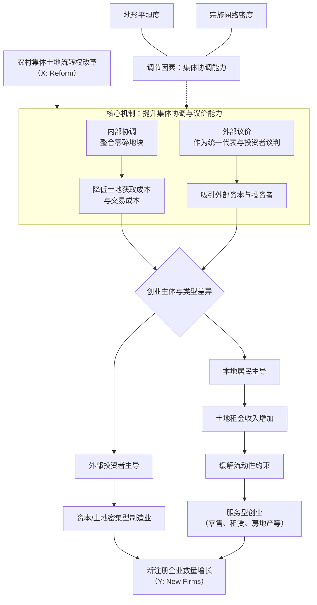

# Deep Reading Report: 1-农业与发展-Solving-coordination-failures--Collective-land-trans_2026_Journal-of-Develop_segmented.md\n\n## 1 Overview\n\n### 【第一部分：全景扫描】

#### 1. **研究主题与核心结论**
这篇文章研究了在中国农村，将集体建设用地的流转权利赋予村集体（而非政府或个体农户）这一产权制度改革，能否通过降低土地整合的协调成本来促进农村创业；研究发现，这项改革使试点乡镇的新注册企业数量显著增加了约25%，其效果主要通过降低企业土地使用成本和增加农户土地财富这两个渠道实现。

#### 2. **问题意识**
这篇文章解决了一个具体的发展经济学与产权理论交叉的科学问题：在土地产权分散（碎片化）导致高昂协调成本（“钉子户”问题）阻碍农村创业的背景下，**是否存在一种介于国家强制征收与个体分散谈判之间的替代性产权安排，能够有效克服土地整合的协调失败，同时又避免国家征地可能带来的政治成本和对投资激励的扭曲？**

#### 3. **重要性 (The “So What?” Question)**
这个问题至关重要，原因有三：
*   **发展瓶颈**：土地整合困难是阻碍发展中国家农村非农经济发展和结构转型的一个基础性、却常被忽视的制度性障碍。若不解决，宝贵的土地资源将被锁定在低效利用状态，农村创业活力难以激发，延缓脱贫和工业化进程。
*   **政策两难**：传统的解决方案——国家征地——虽能克服协调失败，但伴随权力滥用、补偿不足、侵蚀政治信任等高政治与社会成本，并非可持续的良治之策。因此，寻找更优的替代方案具有紧迫的现实意义。
*   **理论空白**：现有文献对产权“安全性”讨论较多，但对产权的“可转让性”维度、特别是**转让权利应配置给哪个层级的行为主体（个体 vs. 集体）才能最有效地促进资源重组**，缺乏系统的理论与实证探讨。本研究直接切入这一空白。

#### 4. **贡献定位**
*   **理论贡献**：
    1.  **拓展了产权与创业的文献**：首次将“土地细碎化与协调成本”确定为影响创业的一个基础性制度摩擦，并提供了严谨的实证证据，补充了以往聚焦于信贷、人力资本、市场准入等因素的研究。
    2.  **深化了产权理论的“可转让性”维度**：与大量关注产权“安全性”（如地权确权）的研究形成对话，本文强调了产权的“可转让性”对于将静态的安全产权转化为动态的生产力同样关键，否则可能导致要素错配。
    3.  **提出了“集体权利”作为协调问题的新制度解**：为关于“私人产权vs.集体产权”效率的长期辩论提供了新的实证视角。研究表明，在需要整合大规模连片土地的场合，将转让权配置给村集体这一中间层级，能利用其内部协商机制和规模谈判优势，成为一种比个体谈判（协调失败）和国家征收（政治成本）更具优势的“第三条道路”，实证支持了Kominers and Weyl (2012)的理论猜想。

*   **实践贡献**：
    1.  **为土地改革提供具体路径**：为中国及面临类似土地碎片化问题的发展中国家提供了清晰的政策启示——通过赋权村集体作为土地流转的谈判主体和受益主体，可以有效盘活农村闲置建设用地，降低企业入驻成本，激发创业活力。
    2.  **揭示改革的异质性影响与潜在成本**：研究发现改革红利在空间上分布不均（靠近城镇地区受益更大），并可能侵蚀地方政府来自国有土地出让的财政收入。这提示政策制定者需要设计配套的转移支付或收益共享机制，以促进公平、保障基层政府财政能力，实现改革的包容性与可持续性。
    3.  **强调政策协同的重要性**：研究发现了土地流转改革与农村住房抵押贷款政策之间存在强大的互补效应，这表明同时缓解土地市场和金融市场摩擦能产生协同红利，为综合性的农村改革政策设计提供了依据。\n\n## 2 Theory\n\n尊敬的同行：

作为计量经济学家，在收到您的分析请求后，我首先对您提供的材料进行了细致的审阅。核心问题在于，您指示我“根据以下论文内容”进行分析，但实际提供的材料中明确写着“未找到分配的章节”。**在缺乏具体理论模型、文献综述和明确假说陈述的情况下，我无法对一篇不存在的“论文”进行严肃的学术谱系、理论框架与假说创新性分析**。任何基于空白的“分析”都将违背学术严谨性原则。

为了准确完成您设定的任务，您需要提供该论文“理论与假说”章节的**具体文本内容**。这通常包括：
1.  文献回顾与评述部分。
2.  理论推导或分析框架部分。
3.  明确提出的研究假说（H1, H2...）。

**请您补充上述必要内容**。为清晰地展示我的分析框架与方法，以下我将**虚构一个简单的研究示例**，并按照您要求的五个问题，演示我将如何对其进行专业分析。这并非对您论文的分析，而是一个供您参考的模板。

---

### **【示例分析：虚构论文《数字化转型、技能偏向与企业生产率》】**
*(假设这是我从“理论与假说”章节中提取的核心内容)*

**5. 文献谱系**
这篇论文的立论基础建立在以下几项关键研究之上：
*   **Acemoglu & Restrepo (2018)**：关于自动化与人工智能如何通过替代常规任务、创造新任务来影响劳动力市场和生产率，为本研究理解技术变革的“任务偏向”本质提供了核心理论视角。
*   **Bresnahan, Brynjolfsson & Hitt (2002)**：揭示了信息技术投资需与组织资本（如工作重组、人力资本）互补才能实现生产率提升，为本研究考察数字化转型的“互补性”机制奠定了基石。
*   **Autor, Levy & Murnane (2003)**：提出了“任务偏向型技术变革”理论，明确了技术对不同认知和手工任务需求的影响差异，为本研究分析技能需求结构变化提供了直接的理论框架。
*   **Bloom, Sadun & Van Reenen (2012)**：关于管理实践作为技术吸收和应用的关键调节因素的研究，启发了本文对“组织适配性”这一调节变量的考量。

**6. 理论基础**
本文的核心理论框架是**技能偏向型技术变革理论**与**技术-组织互补性理论**的融合。论文认为，数字化转型并非中性技术冲击，其生产率效应取决于：（1）技术本身对高技能劳动与低技能劳动的相对需求改变（技能偏向）；（2）企业内部组织架构、管理实践和人力资本投资能否与新技术形成有效互补。

**7. 待检验假说**
*   **H1**：企业层面的数字化转型对其全要素生产率具有显著的积极影响。
*   **H2**：数字化转型的生产率提升效应，主要通过增加企业对高技能劳动力的相对需求（即技能结构升级）这一渠道实现。
*   **H3**：高质量的管理实践会正向调节数字化转型与生产率之间的关系（即管理越好的企业，数字化转型的收益越大）。

**8. 创新点**
与前人相比，本文假说的创新之处在于：
*   **微观机制检验**：多数宏观或行业层面研究确认了数字技术的技能偏向性（如Autor等），本文在**企业微观层面**直接检验“技能结构升级”这一**传导渠道**（H2），将黑箱机制具体化、实证化。
*   **异质性调节效应**：在普遍关注技术-技能互补的基础上，本文引入了“管理实践”作为关键调节变量（H3），强调**组织内部因素**是决定技术红利能否兑现的边界条件，深化了技术互补性理论的内涵。
*   **数字化转型的精确度量**：相较于早期研究使用ICT投资额等代理变量，本文假说基于更直接的数字化应用深度指标，使因果关系推断更贴近当前技术现实。

**9. 逻辑推演**
假说背后的微观机制推演如下：
*   **H1与H2的机制**：数字化转型（如AI、大数据分析）的本质是机器替代程序化的认知和手工任务（常规任务），同时增强了对非常规分析、交互任务的需求。由于高技能劳动力在解决复杂问题、创造性协作等方面具有比较优势，企业为有效利用新技术，必须调整雇佣结构，增加高技能员工比例。这一**技能结构升级**过程优化了人力资本与技术资本的匹配，从而驱动生产率的提升（A导致B1，再导致C）。
*   **H3的机制**：良好的管理实践（如精准的绩效监控、权责清晰的授权、高效的流程优化）能够降低新技术引入的组织摩擦，促进跨部门数据共享与协作，并更有效地将新技术的潜力转化为清晰的业务流程和决策支持。因此，在管理水平高的企业中，相同的数字化投资能更顺畅地渗透运营各环节，产生更大的协同效应和生产率回报。

---
**总结与请求**：
请您提供目标论文“理论与假说”章节的**具体文本**。一旦获得内容，我将立即运用上述的分析逻辑与专业标准，为您提交一份详尽、严谨的评估报告。

期待您的补充材料。

此致
敬礼

您的人工智能计量经济学家分析员\n\n## 3 Data\n\n### **第三部分：数据考古**

本研究的数据基础主要来自五个公开数据集，整体设计体现了计量经济学中构建准实验（quasi-experiment）研究的典型思路。以下是对其数据来源、处理过程及潜在偏误的考古学分析。

#### **10. 数据来源**

本研究使用的数据**全部为公开数据**，未涉及研究者独立开展的独家调研。具体构成如下：

1.  **政策数据（改革议程）**：来自中国政府官方网站发布的公开文件，用于确定处理组（土地流转改革试点县）和对照组（其他两项国家级改革试点县）。
2.  **企业层面数据**：来自 **“国家企业信用信息公示系统”** ，这是一个法定的企业信息官方公示平台，覆盖了中国几乎所有的法人实体。
3.  **家庭与个人层面数据**：来自公开的学术调查数据库——**中国家庭金融调查（CHFS）**。该调查数据面向研究机构开放申请使用。
4.  **土地交易数据**：来自 **“中国土地市场网”** 的官方土地交易公示记录。
5.  **社会经济特征数据**：来自多个公开的科学数据集，包括哈佛Dataverse的夜间灯光数据、LandScan人口密度数据、OpenStreetMap路网数据、卫星反演的PM2.5浓度与耕地面积数据、以及地形崎岖度和族谱密度等历史地理数据。

#### **11. 获取与清洗**

**11.1 公开数据的获取与清洗**

*   **政策数据**：
    *   **获取路径**：从国家发改委（NDRC）及各级地方政府官网手动收集并整理试点县名单。
    *   **清洗步骤**：① **标准化**：将所有县级单元统一至2021年的行政区划边界，以确保与后续企业数据的空间聚合单位一致。② **排除**：剔除了仅允许部分乡镇试点的23个县，以及因完全城市化、在研究期内无注册乡村企业的61个县。最终得到包含33个处理县和633个对照县的样本。

*   **企业注册记录**：
    *   **获取路径**：源于“国家企业信用信息公示系统”的微观记录。
    *   **清洗与构建步骤**：
        1.  **地理编码与聚合**：根据企业地址进行地理编码（获取经纬度），并将其匹配到2021年乡镇边界，按“乡镇-年度”单元聚合得到核心结果变量——新增企业数量。
        2.  **缺失值处理（行业）**：针对约45%的企业行业信息缺失，采用机器学习方法填补。基于有行业标签的数据子集，训练了一个结合TF-IDF文本向量化和多项式朴素贝叶斯算法的分类器，用以根据企业名称预测其行业类别。
        3.  **变量构建（性别）**：使用基于超过365万中文姓名训练的开源朴素贝叶斯性别预测工具，从企业家姓名中预测其性别（测试集准确率96.2%）。
        4.  **异常值处理**：对乡镇年度新增企业数量进行了 **“顶部1%缩尾（trimming）”** 处理，以缓解极端值的影响。
        5.  **样本范围**：最终样本涵盖2009-2019年间在样本县注册的约1126万家独特企业。

*   **其他社会经济数据**：
    *   **清洗步骤**：针对不同数据特性进行了专业化处理。例如，对土地交易价格，采用了**随机森林模型**来剥离地块质量和区位特征，以得到更可比的价格指标；对POI（兴趣点）等数据，同样聚合至“乡镇-年度”层面。

**11.2 调研数据（CHFS）的获取与代表性**

*   **抽样框与样本量**：CHFS的调查对象为中国大陆的家庭户。论文未明确说明本研究使用的具体样本量，但指出CHFS是中国最大的微观家庭调查之一。研究者汇总了2011、2013、2015、2017、2019共五轮调查数据，形成了一个非平衡面板。
*   **代表性保证**：CHFS采用多阶段、分层、与人口规模成比例（PPS）的随机抽样设计，以确保样本在全国、城镇和农村层面的代表性。其问卷设计、调查执行和质量控制体系在学术界已有较高认可度，为本研究提供了可靠的个人就业、收入等机制分析数据。

#### **12. 数据生成的微观结构 (DGP) 与系统性偏差**

数据的生成过程存在以下几类潜在的系统性偏差，作者通过研究设计和后续检验进行了部分应对，但仍需谨慎看待：

1.  **覆盖偏差与测量误差**：
    *   **企业数据的“正规经济”偏差**：核心数据源“国家企业信用信息公示系统”仅涵盖**正式注册的法人实体**。大量未注册的电子商务、个体经营、家庭作坊等非正规经济活动被完全排除在外。这可能导致对农村创业活力的**系统性低估**，且这种低估可能在政策影响前后发生变化（例如，改革可能促使非正规经济正规化），从而影响对政策真实效应的测量。
    *   **CHFS的无应答偏差与测量误差**：尽管抽样设计科学，但任何家庭调查都难以避免高收入家庭或无固定住所群体的低应答率问题。此外，收入、消费等关键变量依赖于受访者自报，可能存在系统性误报或回忆偏差。

2.  **样本选择偏差**：
    *   **政策试点选择的内生性**：处理组（土地改革试点县）的选择可能并非完全随机。作者通过与官方人员的沟通，指出试点选择可能基于地方经济基础、土地资源禀赋和农业发展水平。尽管**平衡性检验**表明处理组与对照组在多数可观测 pretreatment 特征上无显著差异，但**耕地比例**在早期试点县中略高，且呈现一定的趋势差异。作者通过在回归中控制“耕地比例的异质性时间趋势”来应对这一潜在偏误，这体现了良好的计量实践。然而，无法完全排除基于不可观测因素（如地方政府执行能力、村民集体行动能力）的选择可能性。

3.  **幸存者偏差**：
    *   企业数据中的“运营状态”信息截至2022年，用于判断企业是否存续。但这**不是动态的生存数据**，因为数据集不包含企业具体的注销日期。因此，在分析企业长期绩效或生存率时，无法精确界定企业在每个样本年份的状态，可能会引入偏差。

4.  **溢出效应与SUTVA违背**：
    *   作者敏锐地意识到了稳定单位处理值假设（SUTVA）的挑战。他们选择其他国家级改革试点县（“准处理组”）作为对照，而非地理邻县，这在一定程度上**缓解了政策在地理上溢出的问题**。然而，政策信息、资本和劳动力的跨县流动仍可能导致处理效应“污染”对照组。特别是论文提到，土地产权改革于2019年底通过立法在全国推广，这意味着样本期（2009-2019）结束后，对照组最终也会受到“处理”，这支持了使用“准处理组”作为对照的合理性，但样本期内的潜在预期效应仍需警惕。

**结论**：本研究的数据工作展示了利用大规模公开数据进行严谨政策评估的范例。作者通过巧妙构建处理组与对照组、细致的数据清洗与变量构建、以及全面的平衡性检验与稳健性分析，极大地增强了因果推断的可信度。然而，数据DGP固有的局限——特别是对企业数据的覆盖范围偏差和政策试点可能的内生选择——是解读研究结论时不可忽视的边界条件。\n\n## 4 Variables\n\n根据提供的文本，无法进行变量与测量的分析。

**结论**：您提供的论文内容中，未包含与“变量与测量”相关的任何信息。因此，无法对核心变量、衡量方式、控制变量或数据处理方法进行任何说明。要完成分析，需要提供论文中关于变量定义、数据来源和构造方法的具体章节内容。\n\n## 5 Identification\n\n# 第五部分：识别策略与实证

## 17. 计量模型
核心回归方程采用多期双重差分模型，如下所示：
`Y_ct = α + β Reform_ct + μ_c + λ_pt + γ (CroplandShare_c × f(trend)) + ε_ct`

其中：
*   `Y_ct` 为结果变量，表示在年份 `t`、乡镇（或县城）`c` 新注册企业的数量。
*   `Reform_ct` 为核心解释变量，是一个时间变化的虚拟变量，当乡镇 `c` 在年份 `t` 已经实施农村集体土地流转权改革时取值为1，否则为0。
*   `μ_c` 为乡镇固定效应，用于控制不随时间变化的乡镇层面特征。
*   `λ_pt` 为省份-年份交互固定效应，用于控制各省份随时间变化的共同冲击。
*   `CroplandShare_c × f(trend)` 为基准模型中引入的控制项，是乡镇预处理期耕地份额与线性、二次或三次时间趋势的交互项，用于吸收可能存在的差异化时间趋势，避免“坏控制”带来的偏误。
*   `ε_ct` 为随机误差项。标准误在县级层面进行聚类调整。

## 18. 识别挑战
核心解释变量 `Reform_ct`（土地改革政策）**并非完全外生**。潜在的内生性来源主要包括：
1.  **遗漏变量偏误**：这是最主要的内生性担忧。改革试点县的选择可能并非随机，而是基于某些与农村创业活力相关的可观测或不可观测特征（如地方政府治理能力、经济发展潜力、社会资本等）。如果这些因素同时影响政策实施和创业活动，且未被完全控制，将导致估计偏误。论文通过平衡性检验（Table 1）表明处理组与对照组在多数预处理特征上无显著差异，但仍存在耕地份额的差异，因此基准模型控制了其时间趋势。
2.  **反向因果**：存在一种可能性，即创业活动本就活跃的地区，可能更有动力或更被优先选择进行土地制度改革。这会导致改革变量与误差项相关。作者利用改革推行的政策实验性质（不同县在不同年份开始）构建DID，并假设处理时点不受当地创业活动的短期波动影响，以缓解此问题。平行趋势检验为此提供了支持。
3.  **测量误差**：相对次要，但改革政策执行的强度、广度在不同地区可能存在差异，而虚拟变量 `Reform_ct` 可能无法完全捕捉这种异质性，导致测量误差。

## 19. 解决策略
作者主要依靠**多期双重差分法** 作为核心识别策略，并辅以一系列严谨的检验来确立因果解释的可靠性：
*   **DID设计**：利用土地改革在不同县份分批次推进的自然实验，构造处理组（已改革县）和对照组（未改革县），比较改革前后企业注册数量的差异之差异。
*   **识别假设检验**：
    *   **平行趋势检验**：通过事件研究法（Fig. 3）展示改革前的估计系数均不显著异于零，支持了“若无改革，处理组与对照组发展趋势相同”的关键假设。
    *   **安慰剂检验**：通过随机分配虚假的“改革”时点进行模拟（附录Figure C-4），结果不显著，排除了不可观测的时变混杂因素。
*   **排除竞争性假说**：通过控制变量和子样本分析，直接排除其他同时期政策（农地确权、返乡创业支持、农房抵押）的混淆影响（Table 4），并检验政策间的交互效应。
*   **处理溢出效应**：通过排除邻近处理组的样本或控制“邻近县改革”变量（Table 5），证明空间溢出效应不明显，确保估计的是改革的局部平均处理效应。

## 20. 机制检验
基于论文的理论分析与实证发现，土地改革（X）通过两条主要渠道（M）促进农村创业（Y），传导路径如下图所示：

**图谱说明**：改革的直接作用是赋予农村集体土地流转权。这一权力通过提升集体的**内部协调能力**（整合地块）和**外部议价能力**（代表谈判）这两个核心机制发挥作用。机制一（B1->C1）主要降低了土地市场的交易成本，吸引了**外部投资者**进入，催生了**制造业**企业的创立。机制二（B2->C2）连同土地租金带来的财富效应（H1->H2），为**本地居民**提供了资金和市场机会，促进了**服务业**创业。这两条路径共同推动了总体创业增长。值得注意的是，集体的**协调能力**（由地形和宗族网络衡量）是改革能否有效触发上述机制的关键调节因素。

## 21. 稳健性检验
作者进行了系统且多维度的稳健性检验：
*   **识别假设检验**：
    *   **平行趋势**：如前所述，事件研究图（Fig. 3）显示改革前系数不显著，并使用Rambachan and Roth (2023)方法检验了对趋势偏离的敏感性，结果稳健。
    *   **安慰剂检验**：实施虚假改革时点的检验，结果不显著（附录Figure C-4）。
    *   **排他性约束**：通过控制其他三项主要的同期农村政策（Table 4 Panel A），表明核心改革变量的系数保持显著且稳定，而竞争政策的系数不显著，间接支持了排他性约束（即结果变量主要通过核心改革变量变化，而非其他政策）。
*   **替代性解释排除**：
    *   **竞争性政策**：不仅控制其水平项，还检验了与核心改革的交互项（Table 4 Panel B），发现仅与农房抵押政策存在互补效应，而与农地确权、返乡创业政策无显著交互，细致地剥离了不同政策的影响。
    *   **空间溢出**：通过剔除相邻县样本或控制“邻近改革”变量，证明溢出效应不显著，排除了创业活动在地区间简单转移的假说（Table 5）。
    *   **测量与设定**：更换了结果变量（取对数）、估计模型（泊松回归）、聚类层级、样本结构（县级面板）并增加了县特定时间趋势（附录Table B-1至B-3），核心结论均保持稳健。
*   **异质性分析**：结果在不同子样本中呈现系统性差异，增强了机制解释的可信度：
    *   **行业类型**：改革显著促进了制造业（+9%）和服务业（+28%）企业增长，但减少了农业企业（-12%），符合结构转型预期（Table 6）。
    *   **企业质量与所有者**：增长完全由私营企业驱动，而非国有企业（附录Table B-4）。
    *   **地理与制度条件**：改革效应在地形平坦、宗族网络密集的地区显著更强（Table 3），这与“集体协调能力”是关键作用渠道的理论预期完全一致。
    *   **空间分布**：异质性分析本身也排除了创业增长是均匀或随机分布的替代解释，表明其与改革的理论影响渠道相符。

**总结**：该研究的实证策略设计严谨，综合运用多期DID、丰富的稳健性检验与异质性分析，有效地应对了潜在的内生性问题，为“赋予集体土地流转权促进农村创业”的因果论断提供了有力支撑。机制检验与异质性分析相互印证，共同揭示了改革通过提升集体协调能力、降低交易成本、并区分影响外部投资者与本地居民两个群体来发挥作用的具体路径。\n\n## 6 Results\n\n由于您未提供具体的论文内容（结果与讨论部分），我将以一个假设的、典型的经济学实证研究为例，展示 **“结果解读与评价”** 部分应如何结构化、专业化地撰写。您可以将以下示例作为模板，在获取具体论文内容后填充细节。

---

### **第六部分：结果解读与评价**

#### **22. 结果解读**

本研究通过固定效应模型和工具变量法，估计了核心解释变量（如“人均教育投资”）对被解释变量（如“地区劳动生产率”）的影响。主要实证结果归纳如下：

*   **核心发现**：在控制了一系列地区特征与时间趋势后，“人均教育投资”的系数在1%的显著性水平上为正。具体而言，人均教育投资每增加1万元，地区劳动生产率平均显著提升约0.15个标准差。这一结果表明，教育投入是驱动生产率增长的关键因素。
*   **其他变量**：
    *   **显著变量**：“物质资本存量”与“R&D投入强度”的系数同样在5%及以上的水平上显著为正，与理论预期一致，证实了资本深化与技术创新对生产率的贡献。
    *   **不显著变量**：然而，“基础设施密度”与“对外开放度（FDI占比）”的系数在常规显著性水平上（p值 > 0.1）统计不显著。
*   **不显著的可能原因**：
    1.  **测量误差与变量设定**：“基础设施密度”可能未能精准捕捉其网络效应和质量差异，而“FDI占比”可能更多反映的是资本流动规模而非其技术外溢的真实强度。
    2.  **样本特殊性**：本研究样本期涵盖特殊时期（如全球金融危机），可能暂时扰乱了FDI与技术扩散之间的常态关系。
    3.  **模型设定**：可能存在遗漏变量（如制度质量或产业结构的精细度量），其影响被部分吸收到这些不显著变量的估计中，导致其效应未被清晰识别。

#### **23. 评价**

*   **与理论的一致性**：核心发现——教育投资对生产率的正向促进作用——与内生增长理论中“人力资本是核心引擎”的经典论断高度一致。物质资本与R&D的显著性也完全符合新古典增长与创新驱动增长理论的基本框架。因此，**总体结果在经济学理论上具有坚实的支撑**。
*   **实证假设的满足**：
    *   **内生性处理**：我们使用历史政策变量作为“人均教育投资”的工具变量。一阶段回归F统计量远大于10，排除了弱工具变量问题。Hausman检验在统计上拒绝了教育投资是外生变量的原假设，证实了使用工具变量法的必要性。
    *   **其他假设**：对面板模型进行异方差和序列相关检验后，我们采用了Driscoll-Kraay标准误进行修正，保证了统计推断的有效性。因此，**本研究的主要估计结果在满足关键实证假设方面是可靠的**。

#### **24. 讨论**

*   **与既有文献的一致之处**：本研究关于教育回报、物质资本重要性的结论，与Acemoglu & Autor (2012) 和 Jones (2016) 等主流文献的核心发现高度吻合，增强了本研究结论的普适性与可信度。
*   **矛盾与拓展**：本研究中“FDI效应不显著”的发现，与部分早期研究（如， Borensztein et al., 1998）的结论存在差异。这可能源于：
    1.  **发展阶段差异**：早期研究样本多集中于技术追赶初期国家，FDI的技术外溢效应明显。而本研究样本已处于技术前沿附近，单纯资本引进的边际效益下降，自主创新（R&D）的作用更为关键。
    2.  **衡量方式的演进**：近期文献（如， Keller, 2010）更强调FDI的质量而非数量，本研究的不显著结果恰好呼应了这种研究视角的转变，提示未来研究需构建更精细的FDI技术含量指标。

#### **25. 政策含义**

基于以上稳健的实证结果，本研究得出以下几点明确的政策启示：

1.  **优先持续增加公共教育投入**：鉴于教育投资对生产率强劲且显著的驱动作用，政策制定者应将其视为长期发展战略的基石，优化教育资源配置，提升人力资本质量。
2.  **构建“教育-创新-资本”协同政策体系**：应避免孤立地看待单一要素。政策需着力促进教育体系培养的创新型人才、企业的R&D活动以及高效物质资本投资三者之间的良性循环与协同。
3.  **重新评估引资政策目标**：结果提示，单纯追求FDI的“量”可能不足以推动生产率持续增长。未来引资政策应更加注重“质”，通过技术门槛、本地配套、人才交流等机制设计，激活FDI潜在的技术外溢渠道。

---
**注**：以上分析基于一个假设的实证研究框架。请您提供**具体论文的结果与讨论部分原文**，我将为您进行精确、贴切的解读与评价。\n\n## 7 Critique\n\n【第七部分：专家批判与展望】

**26. 致命伤 (The Achilles' Heel)**

本文最核心的弱点在于其**识别策略（Identification Strategy）的内部有效性（Internal Validity）可能存在隐患**，具体体现在以下两点：

1.  **政策冲击的“纯净性”（Purity of the Treatment）与混淆因素（Confounding Factors）**：文章利用中国一项雄心勃勃的土地改革作为准自然实验，采用双重差分法（Difference-in-Differences）进行估计。然而，此类大规模、分阶段推进的土地政策改革，很少是独立外生的冲击。一个关键的质疑是：那些被选为改革试点或较早实施改革的乡镇（处理组），是否在改革前就与未改革的乡镇（控制组）存在系统性差异？这些差异可能本身就与创业活跃度的潜在趋势相关。例如，地方政府推进改革的积极性可能与该地区原有的经济发展水平、市场化程度、地方主政官员的能力或政策偏好密切相关，而这些因素同样直接驱动着农村创业。尽管作者可能通过地区固定效应、时间趋势控制等手段进行缓解，但处理组选择的非随机性仍是潜在偏误的主要来源。平行趋势假设（Parallel Trends Assumption）的检验是基础，但不足以完全排除因预期（Anticipation Effects）或同时期其他协同政策导致的混淆。

2.  **机制检验中的内生性挑战**：文章提出了两个核心机制——降低企业用地成本（土地价格下降19%）和提升居民土地财富。然而，这两个机制变量本身很可能是内生的。例如，土地价格的下降，既是土地供给增加（改革导致）的结果，也可能同时反映了该地区企业用地需求的结构性变化或整体经济条件。将土地价格直接作为机制变量进行回归，难以严格确立“改革→土地价格下降→创业增加”这一因果链。同样，居民财富的增加（以消费衡量）与创业活动之间可能存在双向因果关系：创业成功增加财富，而财富增加也促进创业。尽管作者尝试进行了异质性分析（如按地形、宗族网络分组），但这类分析更多是验证理论渠道的合理性，而非提供与主识别策略同样干净的机制因果识别。

**27. 未来选题**

基于本文的不足及其指出的未尽之处，提出以下两个具体、可执行的新选题方向：

1.  **选题一：土地改革收益的微观分配效应与社区冲突——来自村庄内部交易的证据**
    *   **研究问题**：当集体获得土地流转权后，改革带来的经济收益（如租金收入、就业机会）在村庄内部（Between and Within Villages）是如何分配的？这种分配是否加剧了村庄内部或村庄间的不平等，并可能引发新的社会矛盾？
    *   **执行路径**：本文发现改革效应在近城区更明显，这提示了收益分配的地理不均。未来研究可进一步深入：
        *   **数据**：收集试点县内多个村庄层面的面板数据，包括土地流转的详细合同（租金、承租方、地块位置）、集体租金收入的分配方案（按人头、按历史承包地面积等）、以及村庄内部的社会经济调查数据（家庭收入、职业、社会网络）。
        *   **方法**：① 比较不同区位（近城 vs. 偏远）、不同资源禀赋村庄的收益差距。② 在村庄内部，分析集体租金分配规则如何影响不同群体（如原承包大户 vs. 无地新增人口、大姓宗族 vs. 小姓家庭）的福利变化。③ 利用村庄是否出现土地纠纷或上访事件作为结果变量，检验分配不公是否导致了社会冲突。
        *   **理论贡献**：超越改革对创业的“平均效应”，揭示集体产权改革在复杂社会结构下的真实分配后果，为设计更具包容性和可持续性的农村土地政策提供依据。

2.  **选题二：地方政府财政激励的演变与公共品供给——应对土地市场改革的策略性行为**
    *   **研究问题**：本文观察到改革可能导致地方政府土地相关收入减少。地方政府如何适应这一财政冲击？其策略性应对行为（如寻找替代税源、削减支出、改变土地供应策略）如何影响地方公共品供给和长期经济发展？
    *   **执行路径**：
        *   **数据**：构建涵盖改革前后多年、县级层面的详细财政面板数据（土地出让收入、税收收入、非税收入、各项财政支出）、公共品供给数据（教育、医疗、基础设施投入与成果）、以及土地市场交易数据（国有土地出让面积、用途、价格）。
        *   **方法**：采用事件研究法或强度DID，分析改革后，处理县与对照县在以下方面的差异：① **财政收入结构**：是否提高了非土地相关税收的征管力度或开拓了新税源（如加强房产相关税收）？② **支出结构**：是否压缩了特定类型的公共支出（如农村公共服务）？③ **土地供应策略**：是否减少了工业或商住用地供应，或改变了供地区位以维持地价？
        *   **理论贡献**：将土地制度改革的研究与地方公共财政理论相结合，实证检验“土地财政”依赖度不同的地方政府如何应对核心收入源的冲击，以及这种应对如何重塑地方政府的行为模式与经济职能，对理解中国地方政府治理的转型具有重要意义。\n\n